# TeensyAmp R1.0

by [Stefan Mucha](https://github.com/muchaste)

with support by [Avner Wallach](https://github.com/avner-wallach) and
[Jan Benda](https://github.com/janscience).

- [EAGLE circuit board](teensy_amp_loads_of_switches.brd)
- [EAGLE design rule](teensy_amp_loads_of_switches.dru)
- [EAGLE schematics file](teensy_amp_loads_of_switches.sch)
- [EAGLE autorouter statistics](teensy_amp_loads_of_switches.pro)

The input signals are processed in the following way:

- simple RC high-pass filtering, cutoff frequencies selectable via
  S1/S2 switches (0.1Hz, 100Hz, 300Hz)

- amplification ([Analog devices
  AD8224HACPZ-WP](https://www.analog.com/media/en/technical-documentation/data-sheets/AD8224.pdf)),
  gain selectable via S3/S4 switches (x5, x30, x180)

- low-pass filtering ([Analog devices
  OP2177ARZ](https://www.analog.com/media/en/technical-documentation/data-sheets/op1177_2177_4177.pdf)),
  cutoff frequencies selectable via S5/S6 switches (10kHz, 33kHz)

- a voltage-divider generates the 1.66V reference/ground potential ([Analog devices OP1177R](https://www.analog.com/media/en/technical-documentation/data-sheets/op1177_2177_4177.pdf))


## Circuit

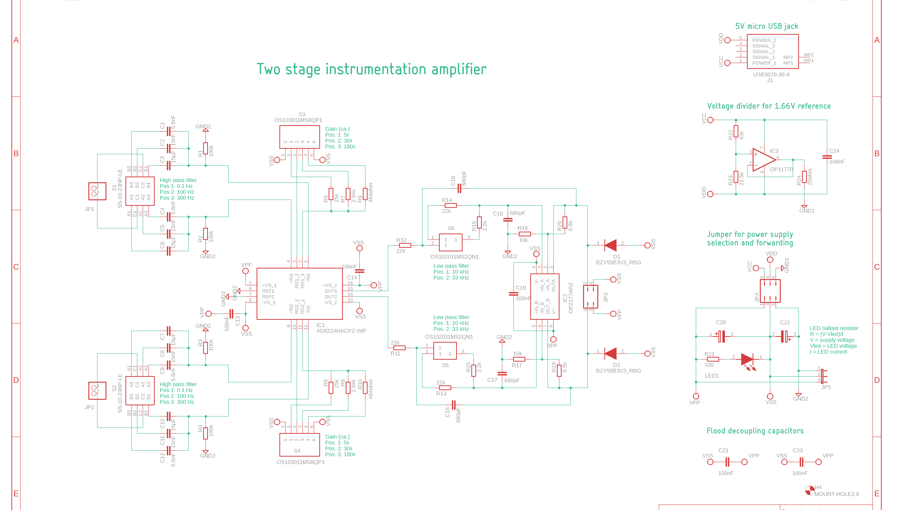

- VCC: 5V
- VDD: 0V
- GND1: 1.66V

- VPP: 5V
- VSS: 0V
- GND2: 1.66V

## Pins

Input pins to the left, "TeensyAmp R1.0" bottom right.

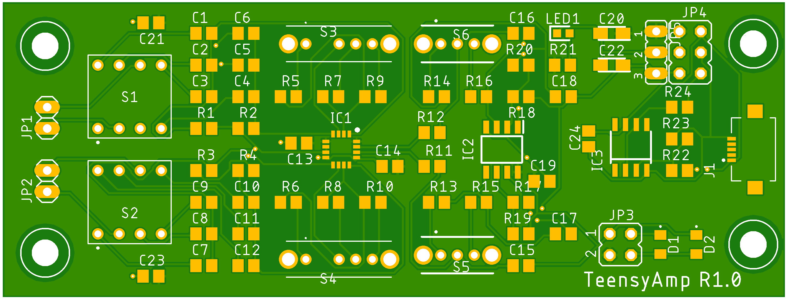

### JP1: differential input signal 1

- 1 IN+ (bottom)
- 2 IN- (top)

### JP2: differential input signal 2

- 1 IN+ (bottom)
- 2 IN- (top)

### JP3: output signals and power fowarding

top row:
- 1 (left):  OUTB (JP2)
- 2 (right): OUTA (JP1)

bottom row (you might power the Teensy from these two pins):
- 3 (left):  VPP  5V
- 4 (right): VSS  0V -> this does not need to be connected to AGND or GND!

### JP4: power and reference input and forwarding

- 1, 2 (top):    VCC
- 3, 4 (center): VDD
- 5, 6 (bottom): GND1

left column: connected to JP5

right column: VCC and VDD is used to create GND1 (1.6V)

### JP5: power for voltage divider

- 1 (top):     VPP = VCC
- 2 (center):  VSS = VDD
- 3 (bottom):  GND2 = GND1


## Filter

### High-pass filter

| S1/S2 switch/jumper position | R1      | Ci    | tau    | fcutoff |
| :--------------------------- | ------: | ----: | -----: | ------: |
| p1 (upper jumper right)      | 100kOhm | 15uF  | 1.5s   | 0.1Hz   |
| p2 (upper jumper left)       | 100kOhm | 15nF  | 1.5ms  | 106Hz   |
| p3 (upper jumper cable left) | 100kOhm | 5.6nF | 0.56ms | 283Hz   |

WARNING: in AmplifierConfiguration2021-10-25.pdf 100Hz and 300Hz
high-pass filter are switched!


### Low-pass filter

| S5/S6 switch position | fcutoff |
| :-------------------- | ------: |
| p1 (left)             |  7kHz   |
| p2 (right)            | 33kHz   |


### Filter tests

In files [`tests/filter-*.wav`](tests) a 23mV signal was sampled with
100kHz and its frequency was increased as follows: 10Hz, 12.5Hz, 16Hz,
20Hz, 25Hz, 31.5Hz, 40Hz, 50Hz, 63Hz, 80Hz, 100Hz, 125Hz, 160Hz,
200Hz, 250Hz, 315Hz, 400Hz, 500Hz, 630Hz, 800Hz, 1000Hz, 1250Hz,
1600Hz, 2000Hz, 2500Hz, 3150Hz, 4000Hz, 5000Hz, 6300Hz, 8000Hz,
10kHz, 12.5kHz, 16kHz, 20kHz.

100Hz high-pass, 7kHz low-pass:

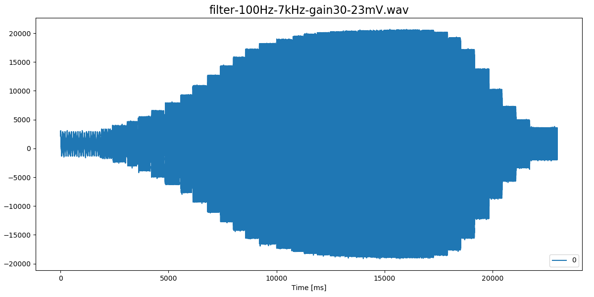

100Hz high-pass, 33kHz low-pass:

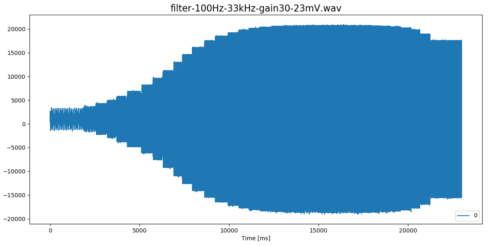

0.1Hz high-pass, 33kHz low-pass:

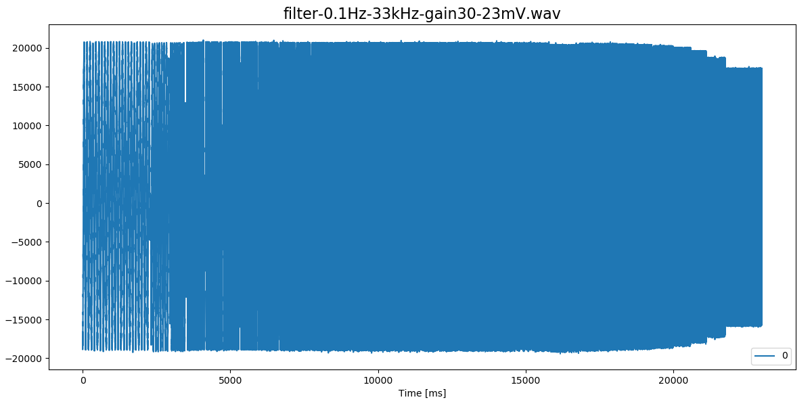

These plots were generated via
```
python3 ~/Arduino/libraries/TeeRec/extras/viewwave.py -s -c 0 -t 23 -a ../tests/filter-0.1Hz-33kHz-gain30-23mV.wav
```

## Gains and clipping

| S3/S4 switch position | gain |
| :-------------------- | ---: |
| p1 (left)             |   x5 |
| p2 (center)           |  x30 |
| p3 (right)            | x180 |

### Gain tests

To be done.

### Clipping tests

In files [`tests/clipping-gain*-*mV-step*mV.wav`](tests) the amplitude
of a 630Hz signal was increased from a start voltage in steps as
specified in the file name.

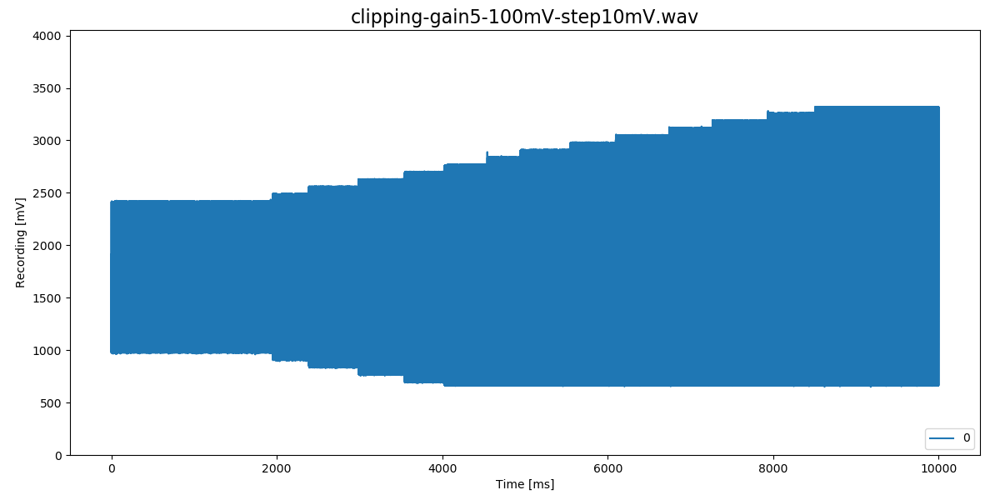

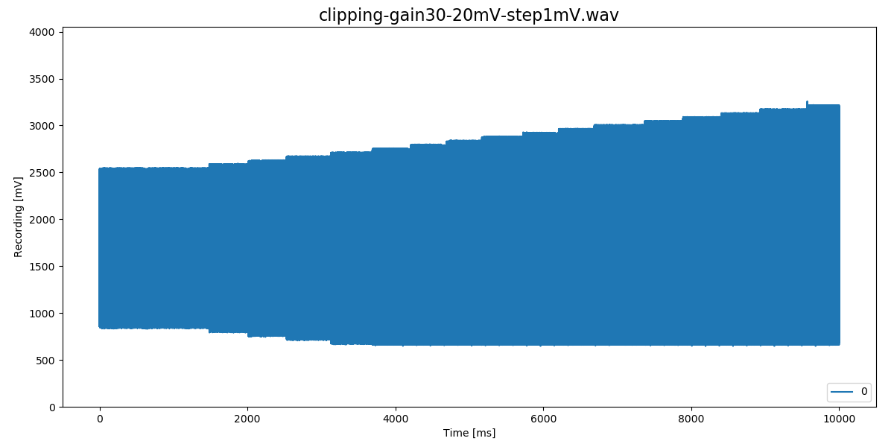

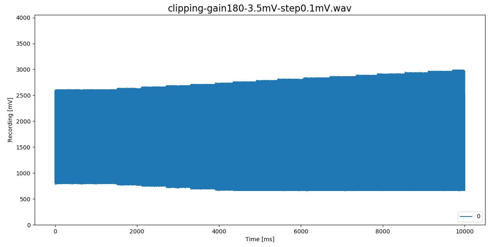

These plots were generated via
```
python3 ~/Arduino/libraries/TeeRec/extras/viewwave.py -s -c 0 -t 10 ../tests/clipping-gain30-20mV-step1mV.wav
```

*The signals are clipped at the bottom!* This looks the same for all
channels and gains. Also, it does not matter whether the amplifier is
powered by 5V or 3.3V. Why?


## Power consumption

### Powered by 5V (power bank)

| Configuration     | Voltage | Current | Power | Runtime |
| :---------------- | ------: | ------: | ----: | ------: |
| Amplifier         | 5V      | 11.4mA  | 57mW  | 877h    |
| Teensy 3.5        | 5V      | 75mA    | 370mW | 133h    |
| Teensy + SD       | 5V      | 103mA   | 515mW | 97h     |
| Teensy + Amp      | 5V      | 87mA    | 433mW | 115h    |
| Teensy + Amp + SD | 5V      | 115mA   | 575mW | 87h     |

The last colum is the run time to be expected for a 10Ah battery (10Ah
divided by current).

The amplifier takes just 11.5mA (57mW).

The Teensy consumes about seven to ten (with SD card writes) times
more power than the amplifier.

If we want to cut power consumption, we need to cut it on the Teensy!


### Powered by 3.3V

| Configuration     | Voltage | Current | Power | Runtime |
| :---------------- | ------: | ------: | ----: | ------: |
| Amplifier         | 3.3V    | 6.5mA   | 21mW  | 1588h   |
| Teensy 3.5        | 3.3V    | 68mA    | 225mW | 147h    |
| Teensy + SD       | 3.3V    | 96mA    | 315mW | 104h    |
| Teensy + Amp      | 3.3V    | 75mA    | 249mW | 133h    |
| Teensy + Amp + SD | 3.3V    | 102mA   | 336mW | 98h     |


## Noise

Standard deviations in raw integers for each channel.

### 100kHz sampling rate, 12bit, 100Hz high-pass, 7kHz low pass, x30 gain

| convers  | sampling | avrg |   A1 |   A2 |
| :------- | :------- | ---: | ---: | ---: |
| veryhigh | veryhigh |    1 |  3.0 |  2.9 |
| veryhigh | veryhigh |    4 |  6.6 |  6.8 |
| veryhigh | veryhigh |    8 |  2.1 |  2.3 |
| veryhigh | high     |    1 |  4.5 |  4.4 |
| veryhigh | high     |    4 |  1.7 |  3.1 |
| veryhigh | high     |    8 |  5.4 |  5.8 |
| veryhigh | med      |    1 |  2.5 |  2.2 |
| veryhigh | med      |    4 |  3.3 |  3.5 |
| veryhigh | med      |    8 |  2.5 |  2.9 |
| veryhigh | low      |    1 |  5.9 |  5.9 |
| veryhigh | low      |    4 |  3.0 |  3.0 |
| veryhigh | low      |    8 |  4.6 |  4.6 |
| veryhigh | verylow  |    1 |  3.5 |  3.1 |
| veryhigh | verylow  |    4 |  1.9 |  1.8 |
| high     | veryhigh |    1 |  6.2 |  6.2 |
| high     | veryhigh |    4 |  4.8 |  4.9 |
| high     | high     |    1 |  6.1 |  6.0 |
| high     | high     |    4 |  1.6 |  1.6 |
| high     | med      |    1 |  2.8 |  2.7 |
| high     | med      |    4 |  4.2 |  4.3 |
| high     | low      |    1 |  4.9 |  4.8 |
| high     | low      |    4 |  1.7 |  1.7 |
| high     | verylow  |    1 |  4.0 |  4.0 |
| med      | veryhigh |    1 |  5.8 |  5.9 |
| med      | high     |    1 |  2.9 |  3.0 |
| med      | med      |    1 |  4.5 |  4.6 |
| med      | low      |    1 |  2.8 |  2.7 |
| med      | verylow  |    1 |  4.7 |  4.8 |

A good setting:

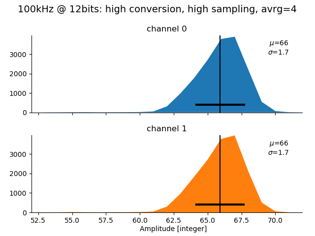

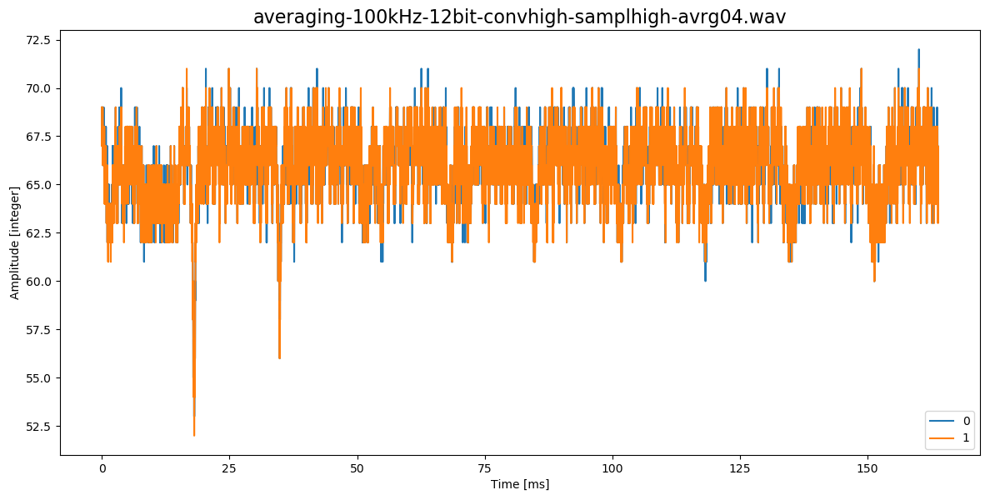

A bad setting:

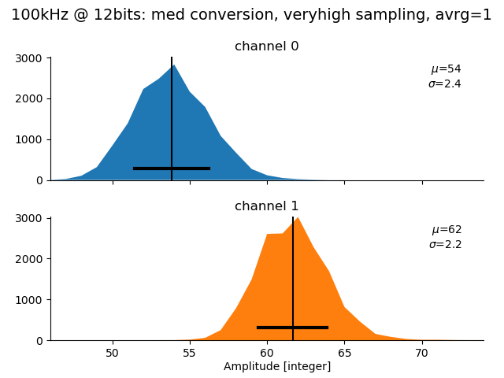

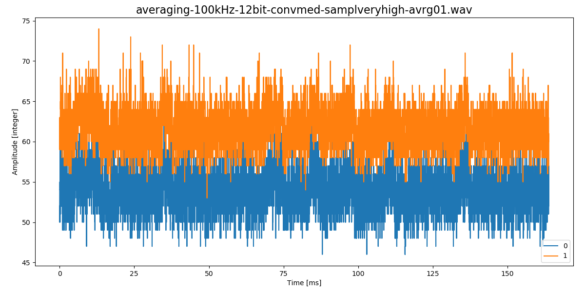


### 20kHz sampling rate, 12bit, 100Hz high-pass, 7kHz low pass, x30 gain

| convers  | sampling | avrg |   A1 |   A2 |
| :------- | :------- | ---: | ---: | ---: |
| veryhigh | veryhigh |    1 |  3.3 |  3.3 |
| veryhigh | veryhigh |    4 |  4.2 |  3.1 |
| veryhigh | veryhigh |    8 |  1.9 |  1.9 |
| veryhigh | veryhigh |   16 |  3.5 |  3.8 |
| veryhigh | veryhigh |   32 |  1.9 |  1.8 |
| veryhigh | high     |    1 |  3.1 |  3.1 |
| veryhigh | high     |    4 |  2.5 |  2.4 |
| veryhigh | high     |    8 |  2.4 |  2.3 |
| veryhigh | high     |   16 |  2.8 |  1.9 |
| veryhigh | high     |   32 |  1.7 |  2.8 |
| veryhigh | med      |    1 |  3.4 |  3.5 |
| veryhigh | med      |    4 |  2.3 |  2.0 |
| veryhigh | med      |    8 |  1.7 |  1.5 |
| veryhigh | med      |   16 |  3.0 |  2.9 |
| veryhigh | med      |   32 |  1.9 |  2.0 |
| veryhigh | low      |    1 |  2.7 |  2.8 |
| veryhigh | low      |    4 |  2.0 |  2.0 |
| veryhigh | low      |    8 |  4.0 |  4.0 |
| veryhigh | low      |   16 |  1.4 |  1.3 |
| veryhigh | low      |   32 |  1.3 |  1.4 |
| veryhigh | verylow  |    1 |  3.3 |  3.1 |
| veryhigh | verylow  |    4 |  2.0 |  2.0 |
| veryhigh | verylow  |    8 |  1.4 |  1.4 |
| veryhigh | verylow  |   16 |  1.8 |  1.8 |
| veryhigh | verylow  |   32 |  2.7 |  2.1 |
| high     | veryhigh |    1 |  3.1 |  2.7 |
| high     | veryhigh |    4 |  2.1 |  2.0 |
| high     | veryhigh |    8 |  2.5 |  2.5 |
| high     | veryhigh |   16 |  1.4 |  1.4 |
| high     | veryhigh |   32 |  3.0 |  2.7 |
| high     | high     |    1 |  3.6 |  3.2 |
| high     | high     |    4 |  2.3 |  2.2 |
| high     | high     |    8 |  1.4 |  1.3 |
| high     | high     |   16 |  2.0 |  2.0 |
| high     | med      |    1 |  3.3 |  3.1 |
| high     | med      |    4 |  2.0 |  2.0 |
| high     | med      |    8 |  1.4 |  1.4 |
| high     | med      |   16 |  1.7 |  1.8 |
| high     | low      |    1 |  6.1 |  6.1 |
| high     | low      |    4 |  1.5 |  1.5 |
| high     | low      |    8 |  2.2 |  2.1 |
| high     | low      |   16 |  3.0 |  2.8 |
| high     | verylow  |    1 |  3.3 |  3.1 |
| high     | verylow  |    4 |  1.9 |  1.9 |
| high     | verylow  |    8 |  2.2 |  2.2 |
| high     | verylow  |   16 |  2.3 |  2.3 |
| med      | veryhigh |    1 |  2.4 |  2.3 |
| med      | veryhigh |    4 |  2.3 |  2.3 |
| med      | veryhigh |    8 |  2.1 |  2.1 |
| med      | veryhigh |   16 |  1.2 |  1.2 |
| med      | high     |    1 |  3.2 |  2.9 |
| med      | high     |    4 |  2.4 |  2.3 |
| med      | high     |    8 |  1.5 |  1.4 |
| med      | high     |   16 |  2.2 |  2.2 |
| med      | med      |    1 |  3.1 |  3.1 |
| med      | med      |    4 |  6.4 |  6.4 |
| med      | med      |    8 |  1.5 |  1.5 |
| med      | low      |    1 |  3.4 |  3.2 |
| med      | low      |    4 |  3.6 |  2.8 |
| med      | low      |    8 |  1.3 |  1.3 |
| med      | verylow  |    1 |  2.5 |  2.4 |
| med      | verylow  |    4 |  2.1 |  2.1 |
| med      | verylow  |    8 |  2.0 |  2.0 |


A good setting:

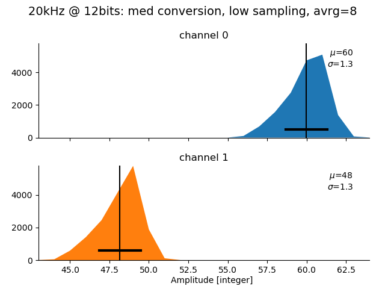

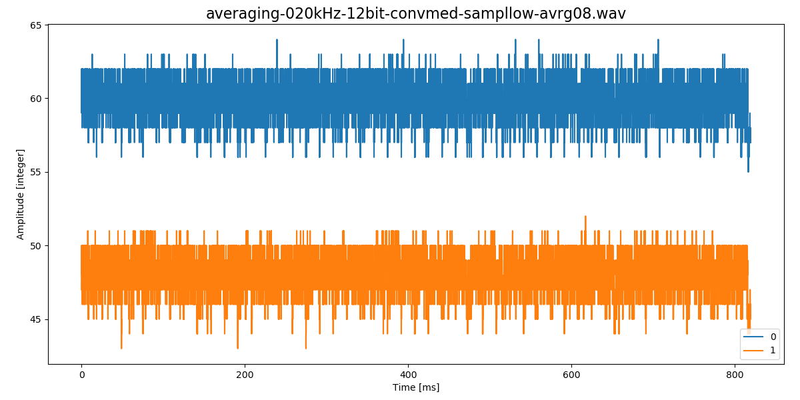

A bad setting:

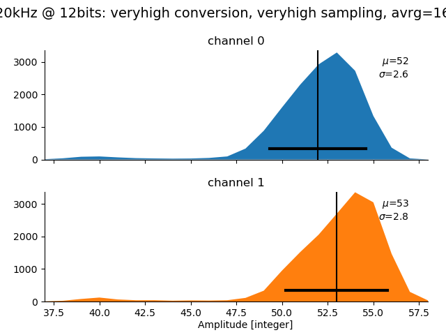

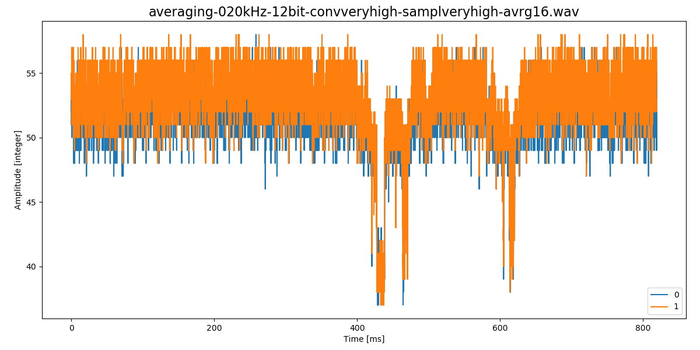
