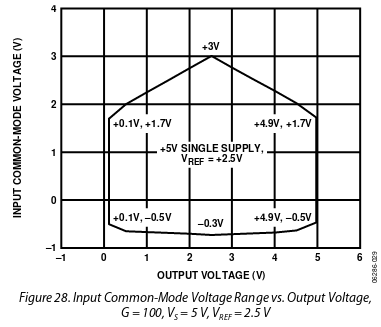

# TeensyAmp R2.0

Based on the experiences with [TeensyAmp R1.0](../R1.0) we are
developing an improved version.

## Clipping

The signal is clipped at the bottom at ca. 680mV above Teensy
0V. Independent of gain.  Independent of whether the supply is 5 or
3.3V.

See [AD8224 data
  sheet](https://www.analog.com/media/en/technical-documentation/data-sheets/AD8224.pdf),
figures 25-28, in particular Fig 28:

When operated with +5V single supply (as we do it), and using a
reference of 2.5V, the lowest voltage the AD8224 puts out is 100mV,
not 0V. So there is some minor clipping occuring.

We need to test, how the AD8224 behaves with a 1.6V reference. Maybe
this gets larger.

Or it happens at later stages.

Culprit could be the diodes D1/D2. We actually do not need them. The
AD8224 will not provide voltages outside VSS and VPP.

## 3.3V

- Power supply down to 3.3V! But the AD8224 does not support this. We
  need to replace the OP amps by some low power versions.

- No USB input needed. The Teensy provides up to 250mA on the 3.3V
  pin. This enough for powering 35 amplifiers!

- The amplifier should simply generate 1.6V, given the 3.3 V input
  from the Teensy.

## Filter and gain settings

- High-pass filters: 10Hz, 100Hz, 300Hz What about OS203011MS1QP1
  (DP3T) as a switch to selectthe filter settings (same as for gain)?
  This one is not so wide!

- Low-pass filters: 7kHz, 15kHz, 33kHz for sampling rates of 20kHz,
  44kHz, 100kHz.

## Form factor

- Make it smaller!

- Use connectors that do not need that much room on the top?
  Make sure pins on the right (power and output) are on 2.54 raster.
  In a smart way! So that the amps can be easily soldered and connected
  to a base pcb, or directly on the Teensy! Like the Audio shield.
  Consider two use cases: (i) single amp directly soldered to Teensy,
  (ii) several amps not soldered directly on Teensy.

- Screw terminals for inputs? Yes! Then one can easily combine the
  references or have them separated. And we do cut down on hight.

- Do we really need an USB connector? No! See above.

- Do we really need the bottom row of JP3? No!

## Further issues

- LED less bright!

- Annotate all jumper pins on the PCB.
