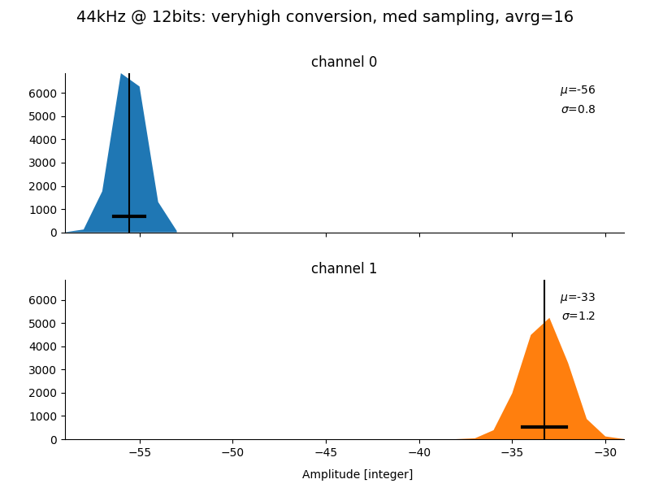
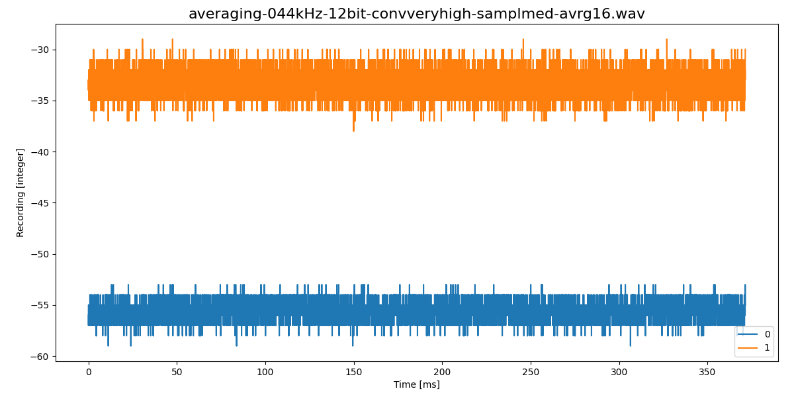
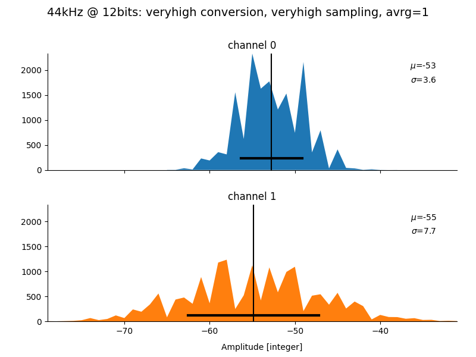
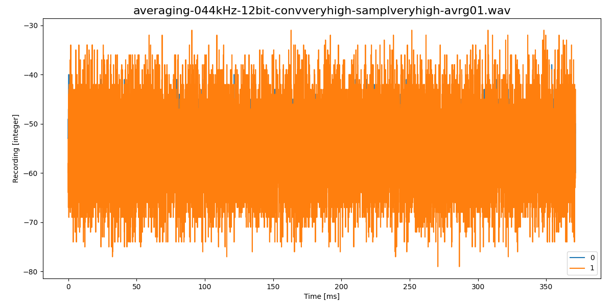

# TeensyAmp R3.0

## Gain

Gain is given by

where *R1 = RGAIN1* and *R2 = R9 = 100*kOhm.

| RGAIN1  | Gain |
| ------: | ---: |
|   1MOhm |  5.5 |
| 100kOhm |   10 |
| 5.6kOhm |   94 |
| 2.2kOhm |  232 |
|   1kOhm |  505 |

## Filter

### High-pass filter

| R1-R4   | CHP1A-CHP2B | tau    | fcutoff |
| ------: | ----------: | -----: | ------: |
| 100kOhm | 150nF       | 15ms   | 10.6Hz  |
| 100kOhm | 15nF        | 1.5ms  | 106Hz   |
| 100kOhm | 5.6nF       | 0.56ms | 283Hz   |

### Low-pass filter

C = 820pF
R = RTP1 + 4.5kOhm

| RTP1, RTP2 | fcutoff | sampling rate |
| ---------: | ------: | ------------: |
| 27kOhm     |  7kHz   | 20kHz         |
| 13kOhm     | 15kHz   | 44kHz         |
| 1.5kOhm    | 33kHz   | 100kHz        |

## Noise

For a gain of XXX and a sampling rate of 44.1kHz, the [averaging
sketch](https://github.com/janscience/TeeRec/tree/main/examples/averaging)
reports:

| convers  | sampling | avrg |   A5 |  A10 |
| :------- | :------- | ---: | ---: | ---: |
| veryhigh | veryhigh |    1 |  3.6 |  7.6 |
| veryhigh | veryhigh |    4 |  2.2 |  5.4 |
| veryhigh | veryhigh |    8 |  1.8 |  4.6 |
| veryhigh | veryhigh |   16 |  1.8 |  4.1 |
| veryhigh | high     |    1 |  3.2 |  8.1 |
| veryhigh | high     |    4 |  1.4 |  2.6 |
| veryhigh | high     |    8 |  1.0 |  1.4 |
| veryhigh | high     |   16 |  0.9 |  1.1 |
| veryhigh | med      |    1 |  3.1 |  7.5 |
| veryhigh | med      |    4 |  1.4 |  2.7 |
| veryhigh | med      |    8 |  1.0 |  1.8 |
| veryhigh | med      |   16 |  0.8 |  1.2 |
| veryhigh | low      |    1 |  3.7 |  7.6 |
| veryhigh | low      |    4 |  1.3 |  2.1 |
| veryhigh | low      |    8 |  0.9 |  1.3 |
| veryhigh | low      |   16 |  1.0 |  1.1 |
| veryhigh | verylow  |    1 |  3.1 |  8.2 |
| veryhigh | verylow  |    4 |  1.2 |  2.3 |
| veryhigh | verylow  |    8 |  1.0 |  1.6 |
| veryhigh | verylow  |   16 |  0.9 |  1.3 |
| high     | veryhigh |    1 |  3.5 |  8.9 |
| high     | veryhigh |    4 |  2.5 |  5.7 |
| high     | veryhigh |    8 |  2.0 |  5.6 |
| high     | high     |    1 |  4.0 |  7.9 |
| high     | high     |    4 |  1.5 |  3.4 |
| high     | high     |    8 |  1.4 |  3.0 |
| high     | med      |    1 |  3.2 |  7.7 |
| high     | med      |    4 |  1.1 |  2.2 |
| high     | med      |    8 |  0.9 |  1.4 |
| high     | low      |    1 |  3.5 |  8.5 |
| high     | low      |    4 |  1.5 |  3.0 |
| high     | low      |    8 |  1.2 |  2.5 |
| high     | verylow  |    1 |  3.5 |  7.5 |
| high     | verylow  |    4 |  1.2 |  2.2 |
| med      | veryhigh |    1 |  3.0 |  7.6 |
| med      | veryhigh |    4 |  2.4 |  5.4 |
| med      | veryhigh |    8 |  1.4 |  3.6 |
| med      | high     |    1 |  3.0 |  7.9 |
| med      | high     |    4 |  2.3 |  5.4 |
| med      | med      |    1 |  2.8 |  7.4 |
| med      | med      |    4 |  1.3 |  2.7 |
| med      | low      |    1 |  3.1 |  7.0 |
| med      | low      |    4 |  1.6 |  3.1 |
| med      | verylow  |    1 |  2.9 |  7.8 |
| med      | verylow  |    4 |  1.8 |  4.9 |

A good setting:

A bad setting:

