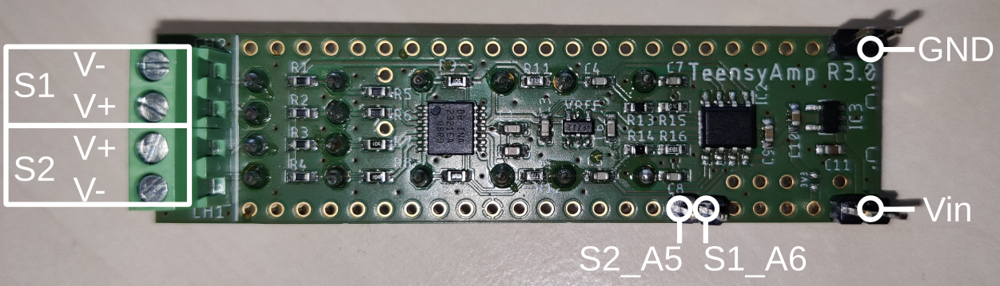
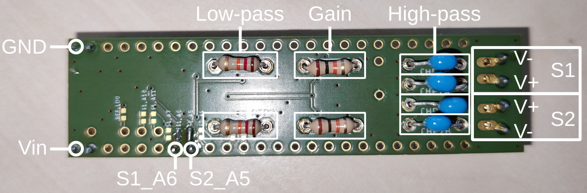
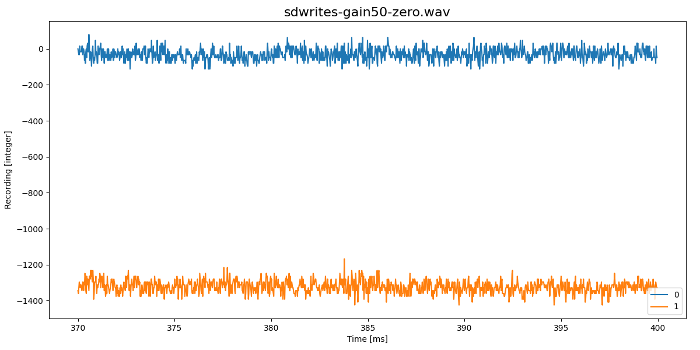
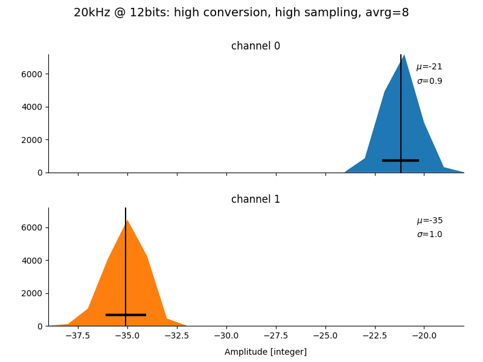
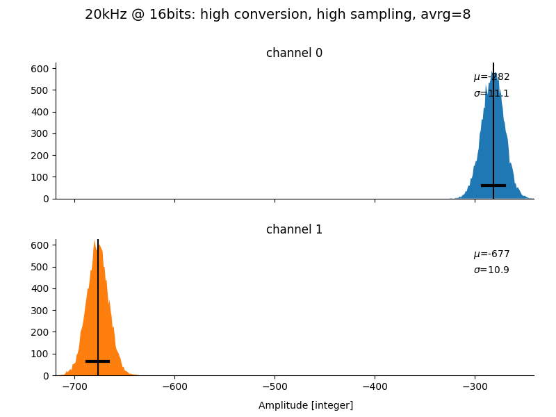

# TeensyAmp R3.0

by [jlm Innovation](https://www.jlm-innovation.de/) and [Jan
Benda](https://github.com/janscience), based on the R2.0 circuit by
[Stefan Mucha](https://github.com/muchaste).

The input signals are processed in the following way:

- simple RC high-pass filtering, cutoff frequencies selectable via
  plug-in capacitors.

- amplification ([Texas Instruments
  INA2321-EA](https://www.ti.com/product/INA2321)),
  gain selectable via plug-in resistances.

- low-pass filtering ([Analog devices
  OP2177ARZ](https://www.analog.com/media/en/technical-documentation/data-sheets/op1177_2177_4177.pdf)),
  cutoff frequencies selectable via plug-in resistances.

- An [Onsemi
  NCP164ASN330](https://www.onsemi.jp/products/power-management/linear-regulators-ldo/ncp164?pdf=Y)
  generates the 3.3V for power and analog reference.

- An LDO, [Analog Devices
  ADR3412](https://www.analog.com/en/products/adr3412.html),
  generatesd the 1.6V reference.
  

## Circuit

- [EAGLE schematics file](teensy_amp_R3b.sch)
- [EAGLE circuit board](teensy_amp_R3b.brd)

## Pins

### Input

The signal to be measured is connected via the screw-terminal block on
the right.

- Channel 1: top two pins.
- Channel 2: bottom two pins.

- The two inner pins are the positive V+ inputs.
- The two outer pins are the negative V- inputs.

### Output

Each of the amplified signals can be assinged to one of four analog
input pins of the Teensy. The following tables also indicate from
which of the two ADCs those pins can be accessed on a Teensy 3.5 or
3.6

Signal 1 (Channel1):

| Pad    | Teensy | ADC0 | ADC1 |
| ------ | ------ | ---- | ---- |
| S1_A10 | A10    | 1    | 1    | 
| S1_A11 | A11    | 0    | 1    | 
| S1_A7  | A7     | 1    | 0    | 
| S1_A6  | A6     | 1    | 0    | 

Signal 2 (Channel2):

| Pad    | Teensy | ADC0 | ADC1 |
| ------ | ------ | ---- | ---- |
| S2_A5  | A5     | 1    | 0    | 
| S2_A4  | A4     | 1    | 0    | 
| S2_A3  | A3     | 1    | 1    | 
| S2_A2  | A2     | 1    | 1    | 

### Power

- Vin: 3.3V - 5V on bottom left pin (Teensy Vin).
- GND: on top left pin (Teensy GND).

## Gain

Gain is given by

where *R1 = RGAIN1* and *R2* = *R9* = 100kOhm.

| RGAIN1  | Gain  |
| ------: | ----: |
|   1MOhm |   5.5 |
| 100kOhm |    10 |
|  47kOhm |    15 |
|  27kOhm |    24 |
|  12kOhm |    47 |
|  10kOhm |    55 |
| 5.6kOhm |    94 |
| 2.2kOhm |   232 |
| 1.5kOhm |   338 |
|   1kOhm |   505 |
|  500Ohm |  1005 |
|  200Ohm |  2505 |
|  100Ohm |  5005 |
|   50Ohm | 10005 |

## Filter

### High-pass filter

| R1-R4   | CHP1A-CHP2B | tau    | fcutoff |
| ------: | ----------: | -----: | ------: |
| 100kOhm | 220nF       | 22ms   |   7.2Hz |
| 100kOhm | 150nF       | 15ms   |  10.6Hz |
| 100kOhm |  22nF       | 2.2ms  |  72Hz   |
| 100kOhm |  15nF       | 1.5ms  | 106Hz   |
| 100kOhm | 5.6nF       | 0.56ms | 283Hz   |
| 100kOhm | 4.7nF       | 0.47ms | 338Hz   |

### Low-pass filter

*C* = 820pF
*R* = RTP1 + 4.5kOhm

*low-pass filter cutoff frequencies need to be measured again!*

| RTP1, RTP2 | fcutoff | sampling rate |
| ---------: | ------: | ------------: |
|  27kOhm    |  7kHz   |  20kHz        |
|  13kOhm    | 15kHz   |  44kHz        |
| 5.6kOhm    | 20kHz   |  60kHz        |
| 2.2kOhm    | 29kHz   |  87kHz        |
| 1.5kOhm    | 33kHz   | 100kHz        |
|   1kOhm    | 35kHz   | 106kHz        |

## SD write artifacts

Much more stable baseline compared to [R1.0](../R1.0):

Gain x15:

Gain x50:

## Noise

For a gain of 24x (27kOhm), highpass filter of 70Hz (22nF), lowpass
filter of 7kHz (27kOhm) and a sampling rate of 20kHz, the [averaging
sketch](https://github.com/janscience/TeeRec/tree/main/examples/averaging)
reports (sampling rate of 100kHz gives similar results):

| convers  | sampling | avrg |   A2 |  A10 |
| :------- | :------- | ---: | ---: | ---: |
| veryhigh | veryhigh |    1 |  1.4 |  1.3 |
| veryhigh | veryhigh |    4 |  0.9 |  0.9 |
| veryhigh | veryhigh |    8 |  0.9 |  0.9 |
| veryhigh | veryhigh |   16 |  0.9 |  0.8 |
| veryhigh | veryhigh |   32 |  0.7 |  0.8 |
| veryhigh | high     |    1 |  1.2 |  1.1 |
| veryhigh | high     |    4 |  0.9 |  0.9 |
| veryhigh | high     |    8 |  0.8 |  0.9 |
| veryhigh | high     |   16 |  0.8 |  0.7 |
| veryhigh | high     |   32 |  0.9 |  0.9 |
| veryhigh | med      |    1 |  1.1 |  1.1 |
| veryhigh | med      |    4 |  0.9 |  0.8 |
| veryhigh | med      |    8 |  0.8 |  0.8 |
| veryhigh | med      |   16 |  0.8 |  0.8 |
| veryhigh | med      |   32 |  0.9 |  1.0 |
| veryhigh | low      |    1 |  1.2 |  1.2 |
| veryhigh | low      |    4 |  0.9 |  0.9 |
| veryhigh | low      |    8 |  0.7 |  0.8 |
| veryhigh | low      |   16 |  0.8 |  0.8 |
| veryhigh | low      |   32 |  0.8 |  0.7 |
| veryhigh | verylow  |    1 |  1.3 |  1.2 |
| veryhigh | verylow  |    4 |  0.8 |  0.9 |
| veryhigh | verylow  |    8 |  0.8 |  0.9 |
| veryhigh | verylow  |   16 |  0.8 |  0.8 |
| veryhigh | verylow  |   32 |  0.8 |  0.7 |
| high     | veryhigh |    1 |  1.1 |  1.4 |
| high     | veryhigh |    4 |  0.8 |  0.9 |
| high     | veryhigh |    8 |  0.8 |  1.0 |
| high     | veryhigh |   16 |  0.8 |  0.9 |
| high     | veryhigh |   32 |  0.7 |  0.7 |
| high     | high     |    1 |  1.1 |  1.2 |
| high     | high     |    4 |  0.9 |  1.0 |
| high     | high     |    8 |  0.9 |  0.9 |
| high     | high     |   16 |  0.8 |  0.7 |
| high     | med      |    1 |  1.1 |  1.1 |
| high     | med      |    4 |  0.9 |  0.8 |
| high     | med      |    8 |  0.8 |  0.8 |
| high     | med      |   16 |  0.8 |  0.8 |
| high     | low      |    1 |  1.1 |  1.0 |
| high     | low      |    4 |  0.9 |  0.8 |
| high     | low      |    8 |  0.8 |  0.8 |
| high     | low      |   16 |  0.8 |  0.7 |
| high     | verylow  |    1 |  1.1 |  1.0 |
| high     | verylow  |    4 |  0.8 |  0.8 |
| high     | verylow  |    8 |  0.8 |  0.8 |
| high     | verylow  |   16 |  0.7 |  0.7 |
| med      | veryhigh |    1 |  1.1 |  1.3 |
| med      | veryhigh |    4 |  0.9 |  0.8 |
| med      | veryhigh |    8 |  0.8 |  0.8 |
| med      | veryhigh |   16 |  0.7 |  0.8 |
| med      | high     |    1 |  1.1 |  1.0 |
| med      | high     |    4 |  0.8 |  0.8 |
| med      | high     |    8 |  0.8 |  0.8 |
| med      | high     |   16 |  0.7 |  0.7 |
| med      | med      |    1 |  1.2 |  1.1 |
| med      | med      |    4 |  0.8 |  0.8 |
| med      | med      |    8 |  0.9 |  0.8 |
| med      | low      |    1 |  1.2 |  1.0 |
| med      | low      |    4 |  0.8 |  0.8 |
| med      | low      |    8 |  0.8 |  0.7 |
| med      | verylow  |    1 |  1.2 |  1.3 |
| med      | verylow  |    4 |  0.9 |  0.9 |
| med      | verylow  |    8 |  0.7 |  0.7 |

A good setting:

With the same settings but with 16bit the results look like this:

| convers  | sampling | avrg |   A2 |  A10 |
| :------- | :------- | ---: | ---: | ---: |
| veryhigh | veryhigh |    1 | 17.4 | 15.7 |
| veryhigh | veryhigh |    4 | 15.1 | 12.7 |
| veryhigh | veryhigh |    8 | 12.5 | 11.4 |
| veryhigh | veryhigh |   16 | 12.3 | 11.7 |
| veryhigh | veryhigh |   32 | 14.9 | 11.0 |
| veryhigh | high     |    1 | 16.5 | 18.3 |
| veryhigh | high     |    4 | 12.8 | 10.8 |
| veryhigh | high     |    8 | 13.4 | 13.0 |
| veryhigh | high     |   16 | 11.8 | 11.4 |
| veryhigh | high     |   32 | 13.4 | 11.8 |
| veryhigh | med      |    1 | 15.7 | 15.3 |
| veryhigh | med      |    4 | 12.5 | 12.7 |
| veryhigh | med      |    8 | 12.3 | 12.2 |
| veryhigh | med      |   16 | 10.8 | 10.7 |
| veryhigh | med      |   32 | 10.5 | 11.5 |
| veryhigh | low      |    1 | 19.7 | 15.1 |
| veryhigh | low      |    4 | 11.7 |  9.1 |
| veryhigh | low      |    8 | 11.7 | 11.8 |
| veryhigh | low      |   16 | 11.8 | 11.5 |
| veryhigh | low      |   32 | 10.2 | 10.2 |
| veryhigh | verylow  |    1 | 17.5 | 15.5 |
| veryhigh | verylow  |    4 | 11.9 | 11.4 |
| veryhigh | verylow  |    8 | 11.4 | 11.2 |
| veryhigh | verylow  |   16 | 11.0 | 11.0 |
| high     | veryhigh |    1 | 16.6 | 14.2 |
| high     | veryhigh |    4 | 11.8 | 11.9 |
| high     | veryhigh |    8 | 11.2 | 11.3 |
| high     | veryhigh |   16 | 10.7 | 11.0 |
| high     | high     |    1 | 15.3 | 14.5 |
| high     | high     |    4 | 12.0 | 11.9 |
| high     | high     |    8 | 11.2 | 11.0 |
| high     | high     |   16 | 11.1 | 11.4 |
| high     | med      |    1 | 15.5 | 15.4 |
| high     | med      |    4 | 12.2 | 11.8 |
| high     | med      |    8 | 11.7 | 12.2 |
| high     | med      |   16 | 10.7 | 11.1 |
| high     | low      |    1 | 16.1 | 14.9 |
| high     | low      |    4 | 12.5 | 12.2 |
| high     | low      |    8 | 11.7 | 10.9 |
| high     | low      |   16 | 11.3 | 10.5 |
| high     | verylow  |    1 | 16.0 | 15.5 |
| high     | verylow  |    4 | 11.5 | 11.6 |
| high     | verylow  |    8 | 11.4 | 10.8 |
| med      | veryhigh |    1 | 17.6 | 14.3 |
| med      | veryhigh |    4 | 12.9 | 11.8 |
| med      | veryhigh |    8 | 11.0 | 10.5 |
| med      | high     |    1 | 15.6 | 15.5 |
| med      | high     |    4 | 11.8 | 11.5 |
| med      | high     |    8 | 11.1 | 11.0 |
| med      | med      |    1 | 17.1 | 15.1 |
| med      | med      |    4 | 13.0 | 11.7 |
| med      | med      |    8 | 11.9 | 11.1 |
| med      | low      |    1 | 16.3 | 13.7 |
| med      | low      |    4 | 12.5 | 12.2 |
| med      | low      |    8 | 11.4 | 12.1 |
| med      | verylow  |    1 | 16.8 | 15.2 |
| med      | verylow  |    4 | 12.4 | 11.4 |
| med      | verylow  |    8 | 10.3 | 10.6 |

A good setting:

