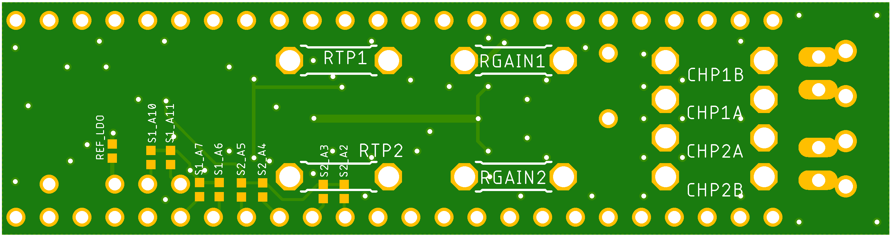

# TeensyAmp R3.0

by [jlm Innovation](https://www.jlm-innovation.de/) and [Jan
Benda](https://github.com/janscience), based on the R2.0 circuit by
[Stefan Mucha](https://github.com/muchaste).

The input signals are processed in the following way:

- simple RC high-pass filtering, cutoff frequencies selectable via
  plug-in capacitors.

- amplification ([Texas Instruments
  INA2321-EA](https://www.ti.com/product/INA2321)),
  gain selectable via plug-in resistances.

- low-pass filtering ([Analog devices
  OP2177ARZ](https://www.analog.com/media/en/technical-documentation/data-sheets/op1177_2177_4177.pdf)),
  cutoff frequencies selectable via plug-in resistances.

- An [Onsemi
  NCP164ASN330](https://www.onsemi.jp/products/power-management/linear-regulators-ldo/ncp164?pdf=Y)
  generates the 3.3V for power and analog reference.

- An LDO, [Analog Devices
  ADR3412](https://www.analog.com/en/products/adr3412.html),
  generatesd the 1.6V reference.
  

## Circuit

- [EAGLE schematics file](teensy_amp_R3b.sch)
- [EAGLE circuit board](teensy_amp_R3b.brd)

## Pins

### Input

The signal to be measured is connected via the screw-terminal block on
the right.

- Channel 1: top two pins.
- Channel 2: bottom two pins.

- The two inner pins are the positive V+ inputs.
- The two outer pins are the negative V- inputs.

### Output

Each of the amplified signals can be assinged to one of four analog
input pins of the Teensy. The following tables also indicate from
which of the two ADCs those pins can be accessed on a Teensy 3.5 or
3.6

Signal 1 (Channel1):

| Pad    | Teensy | ADC0 | ADC1 |
| ------ | ------ | ---- | ---- |
| S1_A10 | A10    | 1    | 1    | 
| S1_A11 | A11    | 0    | 1    | 
| S1_A7  | A7     | 1    | 0    | 
| S1_A6  | A6     | 1    | 0    | 

Signal 2 (Channel2):

| Pad    | Teensy | ADC0 | ADC1 |
| ------ | ------ | ---- | ---- |
| S2_A5  | A5     | 1    | 0    | 
| S2_A4  | A4     | 1    | 0    | 
| S2_A3  | A3     | 1    | 1    | 
| S2_A2  | A2     | 1    | 1    | 

### Power

- Vin: 3.3V - 5V on bottom left pin (Teensy Vin).
- GND: on top left pin (Teensy GND).

## Gain

The gain of the two channels is set by the resistances RGAIN1 and
RGAIN2. The resulting gain is given by

where *R1 = RGAIN1* and *R2 = R9 = 100*kOhm.

| RGAIN1  | Gain |
| ------: | ---: |
|   1MOhm |  5.5 |
| 100kOhm |   10 |
| 5.6kOhm |   94 |
| 2.2kOhm |  232 |
|   1kOhm |  505 |

## Filter

### High-pass filter

The initial high-pass filters are set by capacitances CHP1A, CHP1B,
CHP2A, and CHP2B.

| R1-R4   | CHP1A-CHP2B | tau    | fcutoff |
| ------: | ----------: | -----: | ------: |
| 100kOhm | 150nF       | 15ms   | 10.6Hz  |
| 100kOhm | 15nF        | 1.5ms  | 106Hz   |
| 100kOhm | 5.6nF       | 0.56ms | 283Hz   |

### Low-pass filter

The low-passe filters are set by resistances RTP1 and RTP2 for the two
channels, respectively:

C = 820pF
R = RTP1 + 4.5kOhm

| RTP1, RTP2 | fcutoff | sampling rate |
| ---------: | ------: | ------------: |
| 27kOhm     |  7kHz   | 20kHz         |
| 13kOhm     | 15kHz   | 44kHz         |
| 1.5kOhm    | 33kHz   | 100kHz        |

