# TeensyAmp R4.0

Work in progress.

With digitaly adjustable gain and filter settings.

## Audio chips

- [TI PCM1865](https://www.ti.com/product/PCM1865): 8 input channels (but can only put out 4)
- [TLV320ADC5140](https://www.ti.com/product/TLV320ADC5140), 4 channels and ADCs, can be daisy-chained.

Use I2S or TDM protocol on [Teensy 4.1](https://www.pjrc.com/teensy/pinout.html#Teensy_4.1).

## Teensy libraries

See [Teensy
forum](https://forum.pjrc.com/threads/38753-Discussion-about-a-simple-way-to-change-the-sample-rate/page4)
for dicussions on how to change sampling frequency of I2S bus.
And also [Frank's bat detector](https://forum.pjrc.com/threads/38988-Bat-detector).

See Audio library for input_tdm module.

See [Tympan](https://github.com/Tympan/Tympan_Library) project for
setting sampling rate via their AudioSettings class.

See
[microSoundRecorder](https://github.com/WMXZ-EU/microSoundRecorder)
for variable sampling rates (?), but only Teensy 3.5.

The [Teensy
Batdetector](https://github.com/CorBer/teensy_batdetector/releases/tag/v1.6)
might also have some nice features that are intersiting for us ...

## TI PCM1865

- [web site](https://www.ti.com/product/PCM1865)
- [PCM186x data sheet](https://www.ti.com/lit/gpn/pcm1865)
- [PCM186xEVM evalutation board](https://www.ti.com/lit/pdf/slau615)

### Evalutation board

We use the [PCM186xEVM evalutation
board](https://www.ti.com/lit/pdf/slau615) to figure out how to
control and use the PCM186x chips by a Teensy 4.1:

1. Connect it straight to USB and open PurePath console. On the first
   tab select 'mode=2' for operating the PCM186x in slave mode. Use an
   audio recording software (e.g. audacity) to record the I2S audio
   stream (you need to select the right input source). This way you
   can play around with various input sources, gains, and channel
   configurations. Save register settings.

2. Test BCK input slave PLL mode (section 9.3.9.4.4, Figure 66 in data sheet):
   - Supports only 8, 16, 48, 96, 192kHz (table 11)!
   - Remove R3 on the evaluation board.
   - Set MST_MODE to slave (default anyways).
   - Enable CLKDET_EN ! All clocks and dividers are then automatically
     configured.
   - No need to enable PLL_EN and to set PLL_REF_SEL to BCK.
   - No need to set MST_SCK_SRC etc. (see Figure 33, Master mode only).
   - Check CLK_ERR_STAT and current status registers (section 9.5.2):
     all SCK related indicators report errors.
   - Works!

3. Read I2S stream with Teensy:
   - Remove R20, R21, R22.
   - Replace standoffs by header pins.
   - Connect BCK, LRCK and DOUT to Teensy I2S bus.
   - Only the first two channels are transmitted via DOUT.
   - The last two channels are transmitted via DOUT2, use AudioInputI2CQuad.
   - Works!

5. Control I2C from Teensy:
   - Connect Teensy I2C via J7.
   - Coded in TeeRec::ControlPCM186x
   - See section 9.3.9.8 for how to change sampling rates.
   - Works!

### Pins

See page 11 and Fig 22 in the data sheet and Figure 15 of the
evaluation board manual:

| pin | name        | connects to | Teensy 4.1 pins | Teensy 3.5 pins |
| --: | :---------- | :---------- | --------------: | --------------: |
|  1  | VINL2/VIN1M | SIG 3 / 7   |                 |                 |
|  2  | VINR2/VIN2M | SIG 2 / 6   |                 |                 |
|  3  | VINL1/VIN1P | SIG 1 / 5   |                 |                 |
|  4  | VINR1/VIN2P | SIG 0 / 4   |                 |                 |
|  5  | Mic Bias    | unconnected |                 |                 |
|  6  | VREF        | Connect 1-μF capacitor C5 to AGND |   |   |
|  7  | AGND        | Analog ground to common ground |   |   |
|  8  | AVDD        | 3.3V power supply, Fig 70/71. Connect 0.1-μF and 10-μF capacitors C8, C9, R1 from this pin to AGND. |    |   |
|  9  | XO          | not used, open |   |   |
| 10  | XI          | not used, open |   |   |
| 11  | LDO         | Connect 0.1-μF and 10-μF capacitors from this pin to AGND? |    |   |
| 12  | DGND        | Digital ground connect to common ground |   |   |
| 13  | DVDD        | 3.3V power supply, Fig 70/71. Connect 0.1-μF and 10-μF capacitors from this pin to DGND. |    |   |
| 14  | IOVDD       | 3.3V power supply, tied to DVDD, Fig 70/71.  | From Teensy 3.3V? |   |
| 15  | SCKI        | not used, open |  |   |
| 16  | LRCK        | Audio data world clock (left right clock) input/output. | 20 | 23 |
| 17  | BCK         | Audio data bit clock input/output. | 21 |  9 |
| 18  | DOUT        | Audio data digital output.         |  chip1: 8, chip2: 8 / 9 Jumper | 13 |
| 19  | GPIO3/INTC  | not needed  |  |  |
| 20  | GPIO2/INTB/DMCLK | not needed | chip1: 28 / chip2: 35 | chip1: 28 / chip2: 35 |
| 21  | GPIO1/INTA/DMIN  | not needed | chip2: 29 / chip2: 36 | chip2: 29 / chip2: 36 |
| 22  | MISO/GPIO0/DMIN2 | needed for I2S channels 3 and 4 | chip1: 6, chip2: 32 | 38 |
| 23  | MOSI/SDA    | I2C bus SDA | 18 | 18 |
| 24  | MC/SCL      | I2C bus CLOCK | 19 | 19 |
| 25  | MS/AD       | I2C addres: first chip low, second chip high |  |   |
| 26  | MD0         | tied low for I2C communication |  |   |
| 27  | VINL4/VIN4M | SIGALT 3 / 6 |    |   |
| 28  | VINR4/VIN3M | SIGALT 2 / 5 |    |   |
| 29  | VINL3/VIN4P | SIGALT 1 / 4 |    |   |
| 30  | VINR3/VIN3P | SIGALT 0 / 3 |    |   |

GPIO pins: connect them somehow to pins 34 - 41 of the Teensy,
so that I have access to them.

Additional connections for the Teensy

| Teensy 4.1 pin | Teensy 3.5 pin |             |
| -------------: | -------------: | ----------: |
| 0              | 4              | CAN RX      |
| 1              | 3              | CAN TX      |
| 24             | 24             | I/O         |
| 25             | 25             | I/O         |
| 30             | 30             | Push button |

### Power supply

- LDO to generate 3.3 V on AVDD (see Evaluation board)
- Supply DVDD and IOVDD from Teensy 3.3V.
- What about AGND and DGND? DGND on Teensy, AGND on LDO?

### Signals and input channels

Signal pins VINL2, VINR2, VINL1, VINR1 connect via 100kOhm (R40-R47)
and capacitor (C1-C4, C15-C18: DEFAULT: SMD0805 10uF/16V/X7R ALT:
VSA-10uF/16V/ELECTROLYTIC, see evaluation board) to 4 input signals.

VINL4, VINR4, VINL3, VINR3 are connected to a preamp, see:
- http://realhdaudio.de/wp-content/uploads/2018/12/A0_HSD_TMT2018_realHDaudio_V3.pdf
- https://www.akm.com/content/dam/documents/products/audio/audio-adc/ak5397eq/ak5397eq-en-datasheet.pdf

### Signal-filter

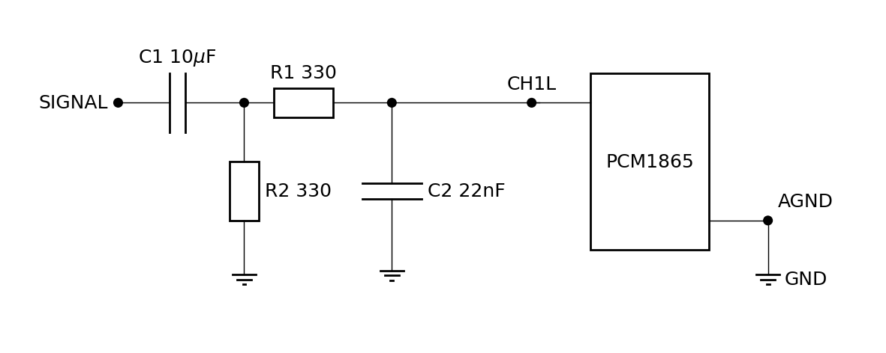

### Pre-amplifier

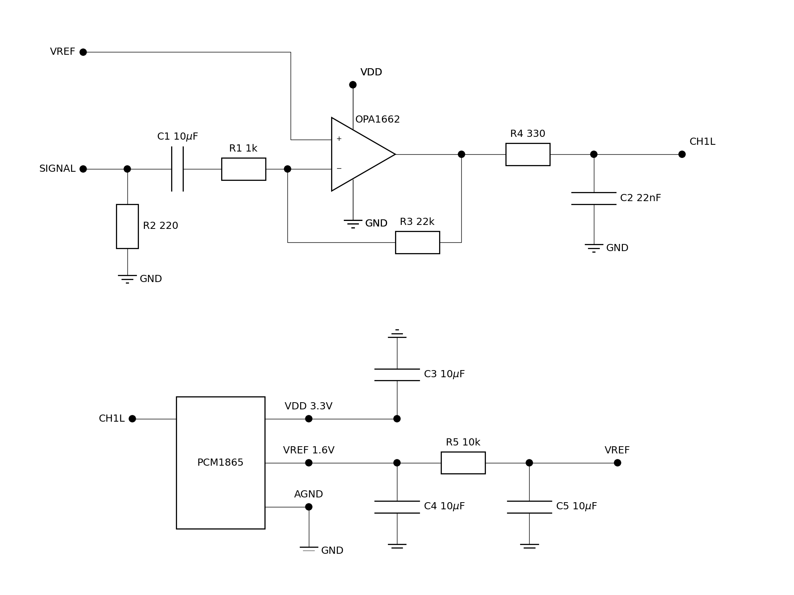

- Cross talk (R1=10k, R3=220k, no low-pass) is at <60dB. Channel 0 got
  1500Hz, channel 1 630Hz, channel 2 is terminated with 50Ohm, channel
  3 is open:
  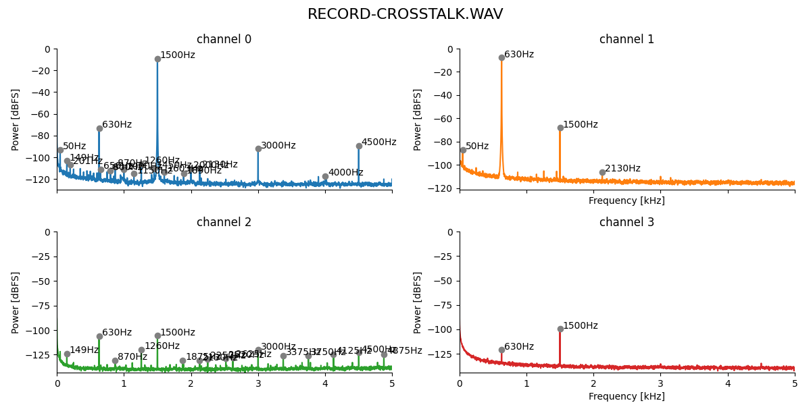

- Both VDD and VREF from PCM1865 via capacitors C3, C4 and C5 with 10uF
  is good (R1=1k, R3=22k):
  

- Ten times larger R1 and R3 are better (R1=10k, R3=220k, even larger is bad):
  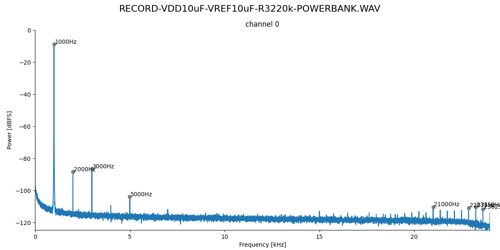

- BUT: at a gain of 40dB, the maximum possible R3 is 47k. Higher
  values result in a recording with very low signal amplitude.

  At both 20x gain (R2 = 2.2k) and 10x gain (R2 = 4.7k), adding the
  low-pass filter (R4 and C2) substantially reduces harmonics:

  20x gain at 40dB without lowpass:
  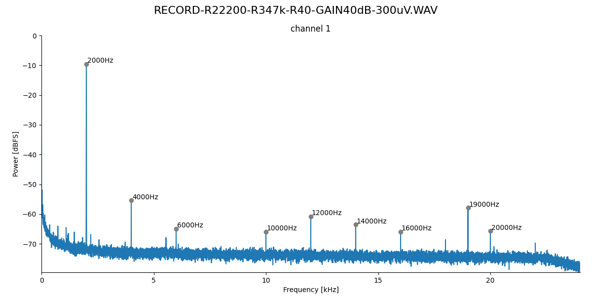
  
  20x gain at 40dB with lowpass:
  

- A smaller resistance R4 for the low pass improves the situation for
  high gains:

  10x gain at 40dB with R4=10 lowpass:
  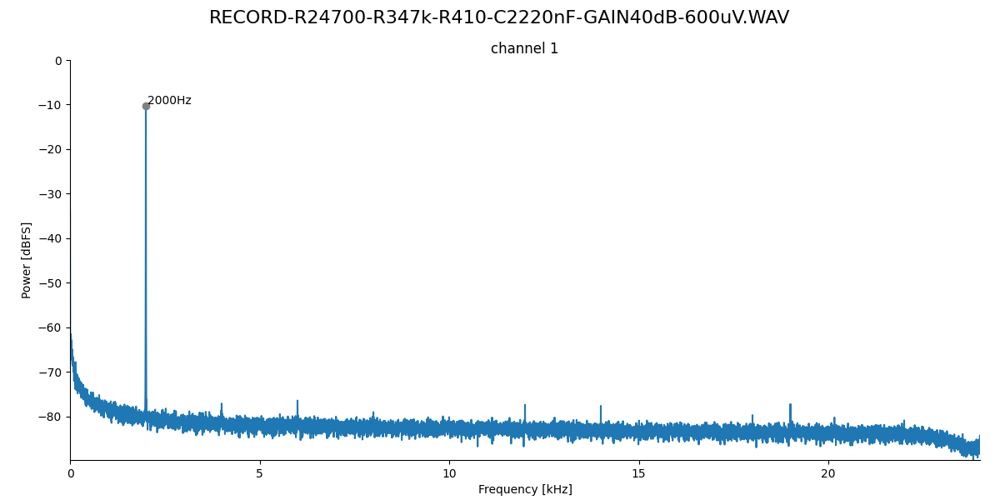

  10x gain at 20dB with R4=10 lowpass:
  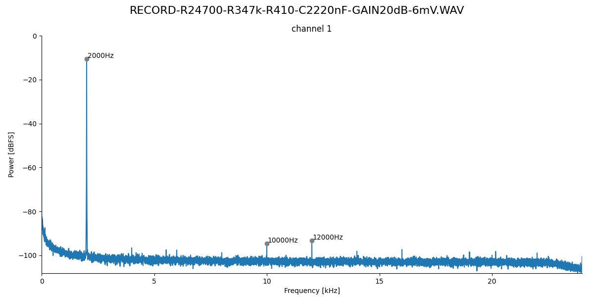

  10x gain at 0dB with R4=10 lowpass:
  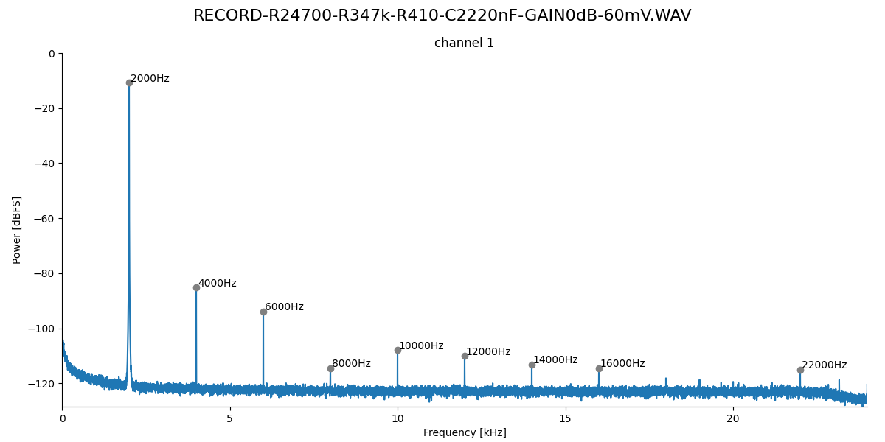

- At low gain, removing the low-pass is better:

  10x gain at 0dB without lowpass:
  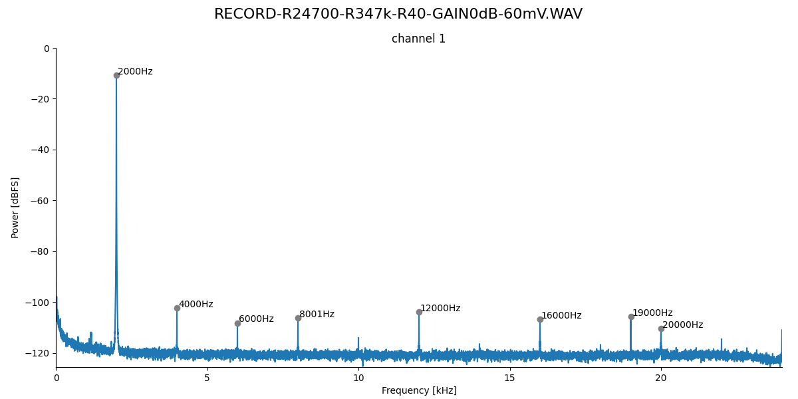

- A good compromise seems to be a lowpass filter with R4=1:

  10x gain at 0dB with R4=1 lowpass:
  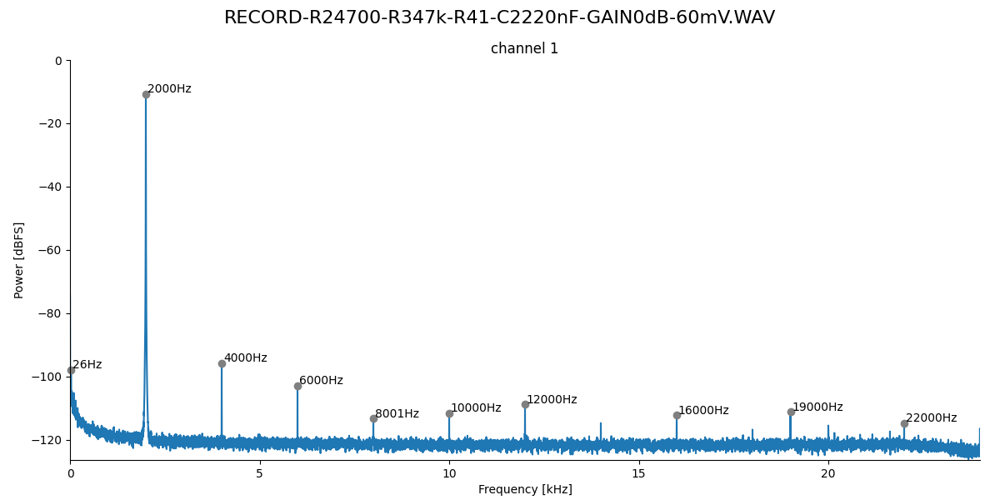

  10x gain at 40dB with R4=1 lowpass:
  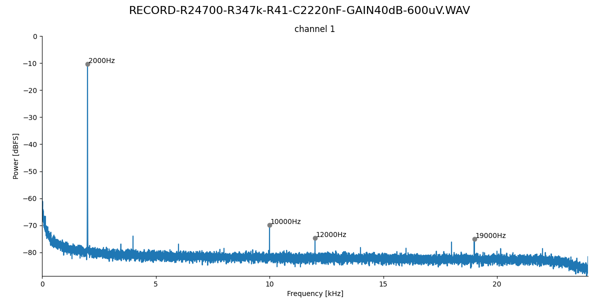

- The low-pass filter (R4, C2) is not really needed! For the following
  spectra, R4 and C2 were removed (no low-pass). First, a 1kHz signal
  was presented with a Hameg sinewave generator. It is a bit more
  noisy compared to the Minirator sinewave generator:
  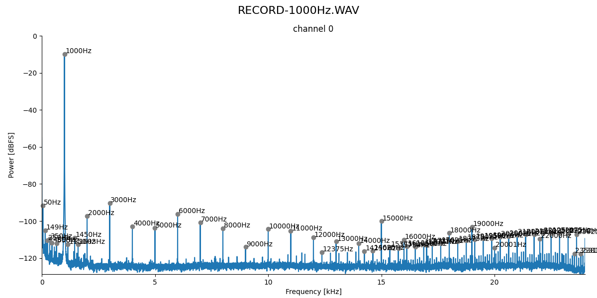.
  We record with 48kHz, Nyquist is at 24kHz. A 28.5kHz signal then
  appears at 19.5kHz. And this is already well attenuated by about 70dB:
  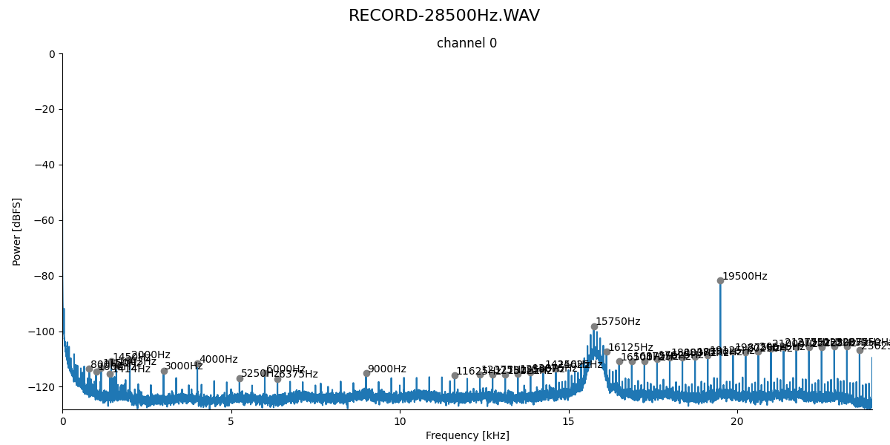

- Highpass filter with R1=220 and C1=10uF results in a cutoff at about 20Hz:
  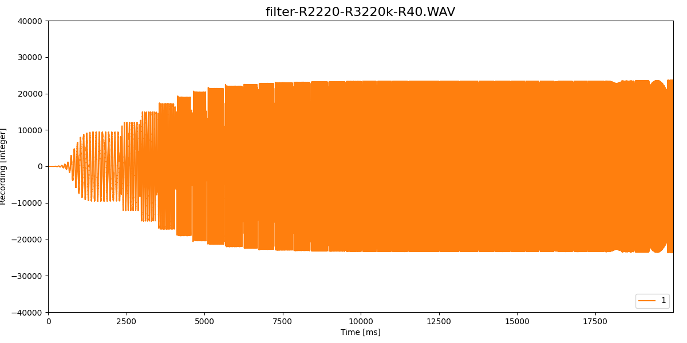

- Highpass filter with R1=47 and C1=10uF results in a cutoff at about 80Hz:
  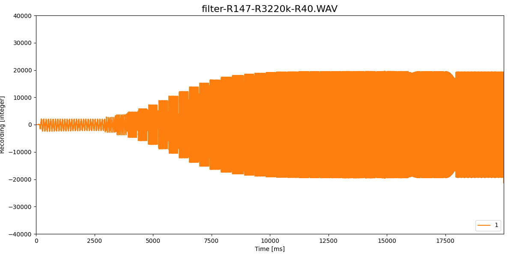

### Gains and amplitudes

On the evaluation board (AVDD = 3.3V!) the largest sine waves that can
be recorded without clipping are:

| gain  | Vrms    | Vp-p    |
| ----: | ------: | ------: |
| -12dB |   4.1V  |   11.6V |
|   0dB |     2V  |    5.7V |
|  20dB |  200mV  |   565mV |
|  32dB |   48mV  |   136mV |
|  40dB |   16mV  |    45mV |

Maximum analog gain is 32dB, but bit depth is 24bit.

### TDM audio data stream

- SCKI
- LRCK
- BCK
- DOUT

## TLV320ADC5140

[TLV320ADC5140 web site](https://www.ti.com/product/TLV320ADC5140)

### TDM

- 256bit frame
- 16 channels with each 16bit
- 2 independent TDM channels on Tensy 4.1 would allow 32 channel maximum!

### BCLK

- Teensy audio library generates LRCLK (44.1 kHz), BCLK (1.41 or 2.82
  MHz) and MCLK (11.29 MHz) for an 41kHz audio signal.
- bit clock ≥ (# channels/device) × (# devices) × (sample rate) × (word length)
- bit clock = 4 x 4 x 96kHz x 16 = 24.5MHz < 25MHz possible for the chip
- 25MHz is also the maximum for the Teensy 4.1
- bit clock = 4 x 1 x 44.1kHz x 16 = 2.82MHz default support by audio library
- higher frequencies seem to be possible

See https://www.ti.com/lit/an/sbaa383b/sbaa383b.pdf?ts=1680563663210
for configurations of multiple chips

## Power consumption

- Teensy 4.1: 100mA
- 25mA @ 3.3V for 4 channels at 96kHz for TLV320ADC5140
- 35mA @ 3.3V for 4 channels for TI PCM1865

### 8 channel
- 50mA/70mA for 4x2=8 channels
- 8 channel plus Teensy: 150mA/170mA
- 20Ah power bank / 0.15A = 133h/117h
- 8 x 8 = 64 channel plus control Teensy 200mA on 20Ah power bank: 1.4A/1.6Ah, lasts 14h/12.5h
- 1.4A/1.6A for 64 channels at 3.3V for 24h: 111/127VAh. On 12V car battery is just 9Ah/11Ah.

### 16 channel
- 100mA/140mA for 4x4=16 channels
- 16 channel plus Teensy: 200mA/240mA
- 20Ah power bank / 0.2A = 100h/83h
- 4 x 16 = 64 channel plus control Teensy 200mA on 20Ah power bank: 1A/1.2A, lasts 20h/16h
- 1A/1.2A for 64 channels at 3.3V for 24h: 80VAh/95VAh. On 12V car battery is just 7Ah/8Ah.

For power banks we need power supply switching every 24 hours on the fly (4 USB ports, 2 running, 2 new ones)!

Or just a single 20+ Ah car battery, lasting for two days!

## Storage

| channels | bits | sampling rate | per hour | per day |
| -------: | ---: | ------------: | -------: | ------: |
| 1        | 16   | 16kHz         | 115MB    | 2.8GB   |
| 2        | 16   | 16kHz         | 230MB    | 5.5GB   |
| 4        | 16   | 16kHz         | 461MB    | 11.1GB  |
| 8        | 16   | 16kHz         | 922MB    | 22.1GB  |
| 16       | 16   | 16kHz         | 1.8GB    | 44.2GB  |
| 1        | 16   | 24kHz         | 173MB    | 4.2GB   |
| 2        | 16   | 24kHz         | 346MB    | 8.4GB   |
| 4        | 16   | 24kHz         | 692MB    | 16.6GB  |
| 8        | 16   | 24kHz         | 1.4GB    | 33.2GB  |
| 16       | 16   | 24kHz         | 2.8GB    | 66.4GB  |
| 1        | 16   | 48kHz         | 346MB    |  8.4GB  |
| 2        | 16   | 48kHz         | 692MB    | 16.6GB  |
| 4        | 16   | 48kHz         | 1.4GB    | 33.2GB  |
| 8        | 16   | 48kHz         | 2.8GB    | 66.4GB  |
| 16       | 16   | 48kHz         | 5.6GB    |  133GB  |

micro SD cards (prices from 2023):

| capacity | costs | 8 channels @ 16kHz | 16 channels @ 16kHz |
| -------: | ----: | -----------------: | ------------------: |
| 128GB    | 12 €  |         5.8 days   |         2.9 days    |
| 256GB    | 25 €  |        11.6 days   |         5.8 days    |
| 500GB    | 50 €  |        23.1 days   |        11.6 days    |

| capacity | costs | 8 channels @ 24kHz | 16 channels @ 24kHz |
| -------: | ----: | -----------------: | ------------------: |
| 128GB    | 12 €  |         3.8 days   |         1.9 days    |
| 256GB    | 25 €  |         7.7 days   |         3.8 days    |
| 500GB    | 50 €  |         15.4 days  |         7.7 days    |

| capacity | costs | 8 channels @ 48kHz | 16 channels @ 48kHz |
| -------: | ----: | -----------------: | ------------------: |
| 128GB    | 12 €  |         1.9 days   |         0.9 days    |
| 256GB    | 25 €  |         3.8 days   |         1.9 days    |
| 500GB    | 50 €  |         7.7 days   |         3.8 days    |

## Design

Use 8 channels (2 chips) and a 128GB, better 256GB microSD card and a
single 50Ah car battery. That lasts for 4 days minimum.
