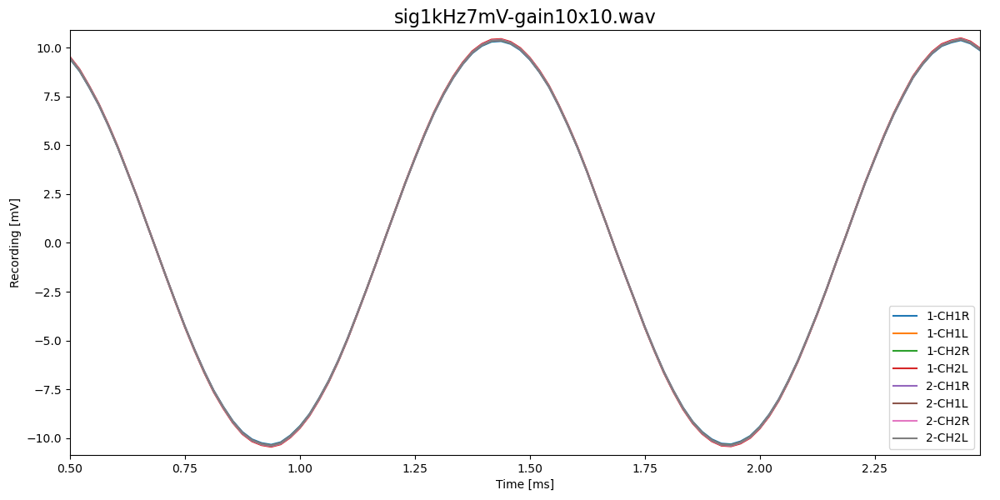
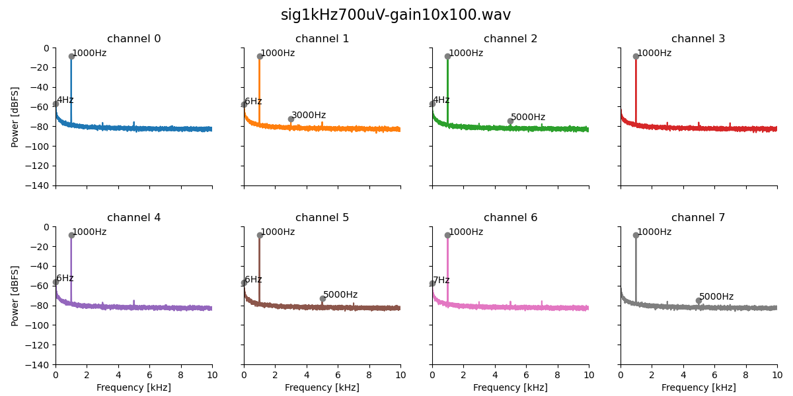

# TeensyAmp R4.0

Based on
- 2 [TI PCM1865](pcm1865.md) with ADC and adjustable gain,
- [TI OPA1622](opa1622.pdf) as inverting pre-amplifier,
- [TI TCAN330](tcan334.pdf) CAN transceiver for synchronization.

by [jlm Innovation](https://www.jlm-innovation.de/) and [Jan
Benda](https://github.com/janscience).

## Circuit

- [EAGLE schematics file](TeensyAmp_R4.0.sch)
- [EAGLE circuit board](TeensyAmp_R4.0.brd)

## Pins

| Teensy 4.1 pin |              |
| -------------: | :----------- |
| Vin            | Vin          |
| GND            | GND          |
| 3.3V           | IOVDD        |
| 18             | I2C SDA      |
| 19             | I2C SCL      |
| 21             | BCK          |
| 20             | LRCK         |
| 8              | DOUT         |
| 28             | GPIO2 chip1  |
| 35             | GPIO2 chip2  |
| 29             | GPIO1 chip1  |
| 36             | GPIO1 chip2  |
| 6              | GPIO0 chip1  |
| 32             | GPIO0 chip2  |
| 0              | CAN RX       |
| 1              | CAN TX       |
| 24             | I/O In       |
| 25             | I/O Out      |
| 30             | Push button  |
| 31             | LED inverted |

### 8 input channels

The two [TI PCM1865](https://www.ti.com/product/PCM1865) together
provide 8 input channels.

You can choose between input channel that are attached to a
pre-amplifier with gain x10, or input channels without pre-amplifier
that receive the input directly via a passive high- and low-pass
filter.

| channel | PCM1865 pins with pre-amplifier | PCM1865 pins without pre-amplifier |
| ------: | :------------------------------ | :--------------------------------- |
| 0       | 1-CH1R                          | 1-CH3R                             |
| 1       | 1-CH1L                          | 1-CH3L                             |
| 2       | 1-CH2R                          | 1-CH4R                             |
| 3       | 1-CH2L                          | 1-CH4L                             |
| 4       | 2-CH1R                          | 2-CH3R                             |
| 5       | 2-CH1L                          | 2-CH3L                             |
| 6       | 2-CH2R                          | 2-CH4R                             |
| 7       | 2-CH2L                          | 2-CH4L                             |

In the following plot a 1kHz signal was supplied to each input channel in turn:

### Pre-amplifier

Inspired by
- http://realhdaudio.de/wp-content/uploads/2018/12/A0_HSD_TMT2018_realHDaudio_V3.pdf
- https://www.akm.com/content/dam/documents/products/audio/audio-adc/ak5397eq/ak5397eq-en-datasheet.pdf
- Figure 61 of the [PCM186x data sheet](https://www.ti.com/lit/gpn/pcm1865).

For variants of the pre-amplifier see [Testing filter and gain
variants](variants1.md) and [Testing high-pass filter without
low-pass](variants2.md).

#### Noise

All input channels short-circuited to ground.

- 0dB gain:

  

- 20dB gain:

  

- 40dB gain:

  

- No SD write artifacts.
- Super low 1-bit noise at 0dB gain.
- Noise increases accordingly with gain of the PCM chip.

#### Linearity

For the spectra, the sinewave stimuli have been applied to each
channel individually.

- 0dB gain, 150mV or 70mV rms sine wave:

  

  

- 20dB gain, 7mV rms sine wave:

  

  

- 40dB gain, 700uV rms sine wave:

  

  

- In all conditions harmonics are about 100dB below the signal!
- Noise increases according to gain (every x10 by 20dB).

#### Filter

Frequencies 10Hz to 20kHz in 1/3 octaves, each for 500ms on channel 0:

- 5Hz highpass filter

### Signal-filter (without pre-amplifier)

See figure 61 of the [PCM186x data sheet](https://www.ti.com/lit/gpn/pcm1865).

For variants of the signal filter see [Testing filter and gain
variants](variants1.md) and [Testing high-pass filter without
low-pass](variants2.md).

### Reference voltage

## CAN bus

You need to terminate both ends with a 120Ohm resistance.

## Power consumption

Teensy 4.1 on R4.0 board:

| V    | rate  | CPU    | I     | P    |
| ---- | ----- | ------ | ----- | ---- |
| 5V   | 48kHz | 600MHz | 280mA | 1.4W |
| 3.7V | 48kHz | 600MHz | 280mA | 1.0W |
| 5V   | 96kHz | 600MHz | 300mA | 1.5W |
| 3.7V | 96kHz | 600MHz | 300mA | 1.1W |
| 5V   | 48kHz | 450MHz | 260mA | 1.3W |
| 3.7V | 48kHz | 450MHz | 260mA | 0.9W |
| 5V   | 96kHz | 450MHz | 270mA | 1.3W |
| 3.7V | 96kHz | 450MHz | 270mA | 1.0W |
| 5V   | 48kHz | 150MHz | 220mA | 1.1W |
| 3.7V | 48kHz | 150MHz | 220mA | 0.8W |
| 5V   | 96kHz | 150MHz | 240mA | 1.2W |
| 3.7V | 96kHz | 150MHz | 240mA | 0.9W |

Underclocking works! But power savings are small.

Teensy 4.1 *without* R4.0 board:

| V    | rate  | CPU    | I     | P    |
| ---- | ----- | ------ | ----- | ---- |
| 5V   | 48kHz | 600MHz | 180mA | 0.9W |
| 5V   | 96kHz | 600MHz | 180mA | 0.9W |
| 5V   | 48kHz | 150MHz | 120mA | 0.6W |
| 5V   | 96kHz | 150MHz | 120mA | 0.6W |

The R4.0 board draws about 100mA of power.

## Battery life times

8 channel variant assumes 220mA consumption of Teensy and R4.0 amplifier board.

64 channel variant assumes 2A consumption (8x220mA consumption of Teensy and R4.0 amplifier board plus 240mA of control Teensy).

Power banks (5V):

| Capacity | 8 channels | 64 channels |
| -------- | ---------- | ----------- |
|  5Ah     |        22h |          2h |
| 10Ah     |        45h |          5h |
| 20Ah     |        90h |         10h |

Car battery (12V):

| Capacity | 8 channels | 64 channels |
| -------- | ---------- | ----------- |
| 10Ah     |       109h |         12h |
| 20Ah     |       218h |         24h |
| 40Ah     |       436h |         48h |

## Storage

| channels | bits | sampling rate | per hour | per day |
| -------: | ---: | ------------: | -------: | ------: |
| 1        | 16   | 16kHz         |    115MB |   2.8GB |
| 2        | 16   | 16kHz         |    230MB |   5.5GB |
| 4        | 16   | 16kHz         |    461MB |  11.1GB |
| 8        | 16   | 16kHz         |    922MB |  22.1GB |
| 16       | 16   | 16kHz         |    1.8GB |  44.2GB |
| 1        | 16   | 24kHz         |    173MB |   4.2GB |
| 2        | 16   | 24kHz         |    346MB |   8.4GB |
| 4        | 16   | 24kHz         |    692MB |  16.6GB |
| 8        | 16   | 24kHz         |    1.4GB |  33.2GB |
| 16       | 16   | 24kHz         |    2.8GB |  66.4GB |
| 1        | 16   | 48kHz         |    346MB |   8.4GB |
| 2        | 16   | 48kHz         |    692MB |  16.6GB |
| 4        | 16   | 48kHz         |    1.4GB |  33.2GB |
| 8        | 16   | 48kHz         |    2.8GB |  66.4GB |
| 16       | 16   | 48kHz         |    5.6GB |   133GB |

micro SD cards (prices from 2023):

| capacity | costs | 8 channels @ 16kHz | 16 channels @ 16kHz |
| -------: | ----: | -----------------: | ------------------: |
| 128GB    | 12 €  |         5.8 days   |         2.9 days    |
| 256GB    | 25 €  |        11.6 days   |         5.8 days    |
| 512GB    | 35 €  |        23.1 days   |        11.6 days    |

| capacity | costs | 8 channels @ 24kHz | 16 channels @ 24kHz |
| -------: | ----: | -----------------: | ------------------: |
| 128GB    | 12 €  |         3.8 days   |         1.9 days    |
| 256GB    | 25 €  |         7.7 days   |         3.8 days    |
| 512GB    | 35 €  |         15.4 days  |         7.7 days    |

| capacity | costs | 8 channels @ 48kHz | 16 channels @ 48kHz |
| -------: | ----: | -----------------: | ------------------: |
| 128GB    | 12 €  |         1.9 days   |         0.9 days    |
| 256GB    | 25 €  |         3.8 days   |         1.9 days    |
| 512GB    | 35 €  |         7.7 days   |         3.8 days    |

