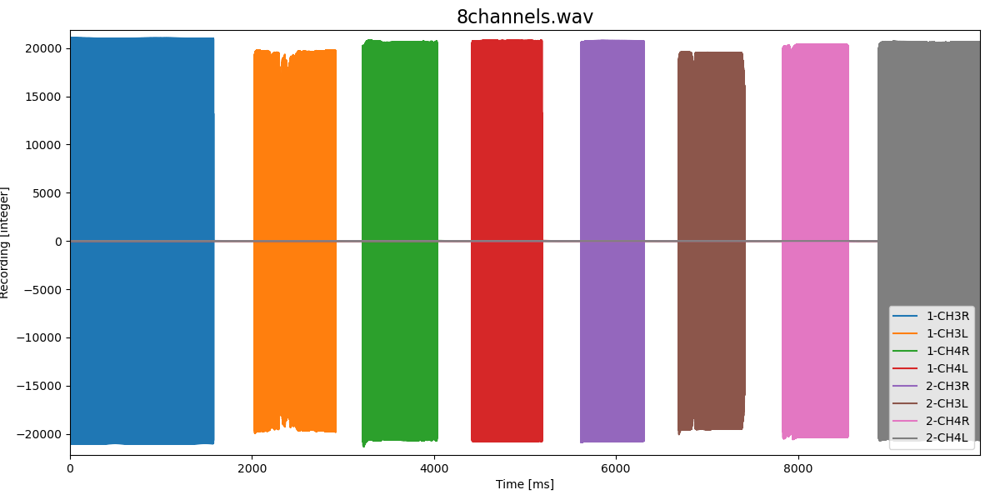
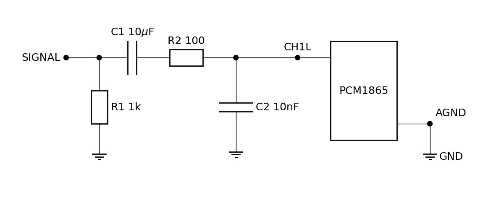
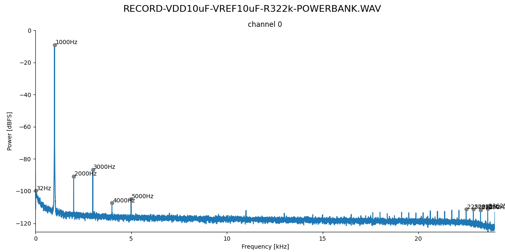

# TeensyAmp R4.0

Based on two [TI PCM1865](https://www.ti.com/product/PCM1865) with ADC and
adjustable gain.

by [jlm Innovation](https://www.jlm-innovation.de/) and [Jan
Benda](https://github.com/janscience).

## TI PCM1865

- 8 input channels
- can be routed onto 4 24bit ADCs and output channels
- upto 192kHz sampling rate
- -12 to 40dB gain!

For details, see
- [web site](https://www.ti.com/product/PCM1865)
- [PCM186x data sheet](pcm1865.pdf)
- [PCM186xEVM evalutation board](https://www.ti.com/lit/pdf/slau615)

## Circuit

- [EAGLE schematics file](teensy_amp_R4.0.sch)
- [EAGLE circuit board](teensy_amp_R4.0.brd)

### Pins

Pins of the PCM1865 - see page 11 and Fig 22 in the data sheet and
Figure 15 of the evaluation board manual:

| pin | name        | connects to | Teensy 4.1 pins | Teensy 3.5 pins |
| --: | :---------- | :---------- | --------------: | --------------: |
|  1  | VINL2/VIN1M | SIG 3       |                 |                 |
|  2  | VINR2/VIN2M | SIG 2       |                 |                 |
|  3  | VINL1/VIN1P | SIG 1       |                 |                 |
|  4  | VINR1/VIN2P | SIG 0       |                 |                 |
|  5  | Mic Bias    | unconnected |                 |                 |
|  6  | VREF        | Connect 1-μF capacitor C5 to AGND |   |   |
|  7  | AGND        | Analog ground to common ground |   |   |
|  8  | AVDD        | 3.3V power supply, Fig 70/71. Connect 0.1-μF and 10-μF capacitors C8, C9, R1 from this pin to AGND. |    |   |
|  9  | XO          | not used, open |   |   |
| 10  | XI          | not used, open |   |   |
| 11  | LDO         | Connect 0.1-μF and 10-μF capacitors from this pin to AGND? |    |   |
| 12  | DGND        | Digital ground connect to common ground |   |   |
| 13  | DVDD        | 3.3V power supply, Fig 70/71. Connect 0.1-μF and 10-μF capacitors from this pin to DGND. |    |   |
| 14  | IOVDD       | 3.3V power supply, tied to DVDD, Fig 70/71.  | From Teensy 3.3V? |   |
| 15  | SCKI        | not used, open |  |   |
| 16  | LRCK        | Audio data world clock (left right clock) input/output. | 20 | 23 |
| 17  | BCK         | Audio data bit clock input/output. | 21 |  9 |
| 18  | DOUT        | Audio data digital output.         |  chip1: 8, chip2: 8 / 9 Jumper | 13 |
| 19  | GPIO3/INTC  | not needed  |  |  |
| 20  | GPIO2/INTB/DMCLK | not needed | chip1: 28 / chip2: 35 | chip1: 28 / chip2: 35 |
| 21  | GPIO1/INTA/DMIN  | not needed | chip2: 29 / chip2: 36 | chip2: 29 / chip2: 36 |
| 22  | MISO/GPIO0/DMIN2 | needed for I2S channels 3 and 4 | chip1: 6, chip2: 32 | 38 |
| 23  | MOSI/SDA    | I2C bus SDA | 18 | 18 |
| 24  | MC/SCL      | I2C bus CLOCK | 19 | 19 |
| 25  | MS/AD       | I2C addres: first chip low, second chip high |  |   |
| 26  | MD0         | tied low for I2C communication |  |   |
| 27  | VINL4/VIN4M | SIGALT 3     |    |   |
| 28  | VINR4/VIN3M | SIGALT 2     |    |   |
| 29  | VINL3/VIN4P | SIGALT 1     |    |   |
| 30  | VINR3/VIN3P | SIGALT 0     |    |   |

Pins of the Teensy:

| Teensy 4.1 pin | Teensy 3.5 pin |              |
| -------------: | -------------: | :----------- |
| Vin            | Vin            | Vin          |
| GND            | GND            | GND          |
| 3.3V           | 3.3V           | IOVDD        |
| 18             | 18             | I2C SDA      |
| 19             | 19             | I2C SCL      |
| 21             | 9              | BCK          |
| 20             | 23             | LRCK         |
| 8              | 13             | DOUT         |
| 28             | 28             | GPIO2 chip1  |
| 35             | 35             | GPIO2 chip2  |
| 29             | 29             | GPIO1 chip1  |
| 36             | 36             | GPIO1 chip2  |
| 6              | ?              | GPIO0 chip1  |
| 32             | ?              | GPIO0 chip2  |
| 0              | 4              | CAN RX       |
| 1              | 3              | CAN TX       |
| 24             | 24             | I/O          |
| 30             | 30             | Push button  |
| 31             | 31             | LED inverted |

### 8 channels

The two [TI PCM1865](https://www.ti.com/product/PCM1865) provide 8 channels.

In the following plot a 1kHz signal was supplied to each input channel in turn:

### Noise

Inputs short circuited to ground.

- 0dB gain:

  

- 20dB gain:

  

- 40dB gain:

  

- No SD write artifacts.
- Same offset and noise in all channels.
- Super low noise at 0dB gain.
- Noise increases accordingly with gain of the PCM chip.

### Clipping

The PCM1865 clips with inversion (a 1kHz signal with 2V rms):

This can be fixed by unwrapping:

The unwrapped trace, however, is distorted:

The larger the signal amplitude, the stronger the distortion,
until the unwrapped signal eventually clips at 3.3V:

A 3V rms signal:

A 5V rms signal:

A 40dB gain (x100), a 20mV rms signal clips, but can be unwrapped:

A 50mV rms signal clips even after unwrapping:

But a 100mV rms signal cannot be fixed:

### Signal-filter

See figure 61 of the [PCM186x data sheet](https://www.ti.com/lit/gpn/pcm1865).

For variants of the signal filter see [Testing filter and gain
variants](variants1.md) and [Testing high-pass filter without
low-pass](variants2.md).

### Pre-amplifier

Inspired by
- http://realhdaudio.de/wp-content/uploads/2018/12/A0_HSD_TMT2018_realHDaudio_V3.pdf
- https://www.akm.com/content/dam/documents/products/audio/audio-adc/ak5397eq/ak5397eq-en-datasheet.pdf
- Figure 61 of the [PCM186x data sheet](https://www.ti.com/lit/gpn/pcm1865).

For variants of the pre-amplifier see [Testing filter and gain
variants](variants1.md) and [Testing high-pass filter without
low-pass](variants2.md).

- Cross talk (R1=10k, R3=220k, no low-pass) is at <60dB. Channel 0 got
  1500Hz, channel 1 630Hz, channel 2 is terminated with 50Ohm, channel
  3 is open:
  

- Both VDD and VREF from PCM1865 via capacitors C3, C4 and C5 with 10uF
  is good (R1=1k, R3=22k):
  

- Ten times larger R1 and R3 are better (R1=10k, R3=220k, even larger is bad):
  

- BUT: at a gain of 40dB, the maximum possible R3 is 47k. Higher
  values result in a recording with very low signal amplitude.

  At both 20x gain (R2 = 2.2k) and 10x gain (R2 = 4.7k), adding the
  low-pass filter (R4 and C2) substantially reduces harmonics:

  20x gain at 40dB without lowpass:
  
  
  20x gain at 40dB with lowpass:
  

- A smaller resistance R4 for the low pass improves the situation for
  high gains:

  10x gain at 40dB with R4=10 lowpass:
  

  10x gain at 20dB with R4=10 lowpass:
  

  10x gain at 0dB with R4=10 lowpass:
  

- At low gain, removing the low-pass is better:

  10x gain at 0dB without lowpass:
  

- A good compromise seems to be a lowpass filter with R4=1:

  10x gain at 0dB with R4=1 lowpass:
  

  10x gain at 40dB with R4=1 lowpass:
  

- The low-pass filter (R4, C2) is not really needed! For the following
  spectra, R4 and C2 were removed (no low-pass). First, a 1kHz signal
  was presented with a Hameg sinewave generator. It is a bit more
  noisy compared to the Minirator sinewave generator:
  .
  We record with 48kHz, Nyquist is at 24kHz. A 28.5kHz signal then
  appears at 19.5kHz. And this is already well attenuated by about 70dB:
  

- Highpass filter with R1=220 and C1=10uF results in a cutoff at about 20Hz:
  

- Highpass filter with R1=47 and C1=10uF results in a cutoff at about 80Hz:
  

### Reference voltage

### Gains and amplitudes

On the evaluation board (AVDD = 3.3V!) the largest sine waves that can
be recorded without clipping are:

| gain  | Vrms    | Vp-p    |
| ----: | ------: | ------: |
| -12dB |   4.1V  |   11.6V |
|   0dB |     2V  |    5.7V |
|  20dB |  200mV  |   565mV |
|  32dB |   48mV  |   136mV |
|  40dB |   16mV  |    45mV |

Maximum analog gain is 32dB, but bit depth is 24bit.

## Power consumption

Teensy 4.1 on R4.0 board:

| V    | rate  | CPU    | I     | P    |
| ---- | ----- | ------ | ----- | ---- |
| 5V   | 48kHz | 600MHz | 280mA | 1.4W |
| 3.7V | 48kHz | 600MHz | 280mA | 1.0W |
| 5V   | 96kHz | 600MHz | 300mA | 1.5W |
| 3.7V | 96kHz | 600MHz | 300mA | 1.1W |
| 5V   | 48kHz | 450MHz | 260mA | 1.3W |
| 3.7V | 48kHz | 450MHz | 260mA | 0.9W |
| 5V   | 96kHz | 450MHz | 270mA | 1.3W |
| 3.7V | 96kHz | 450MHz | 270mA | 1.0W |
| 5V   | 48kHz | 150MHz | 220mA | 1.1W |
| 3.7V | 48kHz | 150MHz | 220mA | 0.8W |
| 5V   | 96kHz | 150MHz | 240mA | 1.2W |
| 3.7V | 96kHz | 150MHz | 240mA | 0.9W |

Underclocking works! But power savings are small.

Teensy 4.1 *without* R4.0 board:

| V    | rate  | CPU    | I     | P    |
| ---- | ----- | ------ | ----- | ---- |
| 5V   | 48kHz | 600MHz | 180mA | 0.9W |
| 5V   | 96kHz | 600MHz | 180mA | 0.9W |
| 5V   | 48kHz | 150MHz | 120mA | 0.6W |
| 5V   | 96kHz | 150MHz | 120mA | 0.6W |

The R4.0 board draws about 100mA of power.

## Battery life times

8 channel variant assumes 220mA consumption of Teensy and R4.0 amplifier board.

64 channel variant assumes 2A consumption (8x220mA consumption of Teensy and R4.0 amplifier board plus 240mA of control Teensy).

Power banks (5V):

| Capacity | 8 channels | 64 channels |
| -------- | ---------- | ----------- |
|  5Ah     |        22h |          2h |
| 10Ah     |        45h |          5h |
| 20Ah     |        90h |         10h |

Car battery (12V):

| Capacity | 8 channels | 64 channels |
| -------- | ---------- | ----------- |
| 10Ah     |       109h |         12h |
| 20Ah     |       218h |         24h |
| 40Ah     |       436h |         48h |

## Storage

| channels | bits | sampling rate | per hour | per day |
| -------: | ---: | ------------: | -------: | ------: |
| 1        | 16   | 16kHz         |    115MB |   2.8GB |
| 2        | 16   | 16kHz         |    230MB |   5.5GB |
| 4        | 16   | 16kHz         |    461MB |  11.1GB |
| 8        | 16   | 16kHz         |    922MB |  22.1GB |
| 16       | 16   | 16kHz         |    1.8GB |  44.2GB |
| 1        | 16   | 24kHz         |    173MB |   4.2GB |
| 2        | 16   | 24kHz         |    346MB |   8.4GB |
| 4        | 16   | 24kHz         |    692MB |  16.6GB |
| 8        | 16   | 24kHz         |    1.4GB |  33.2GB |
| 16       | 16   | 24kHz         |    2.8GB |  66.4GB |
| 1        | 16   | 48kHz         |    346MB |   8.4GB |
| 2        | 16   | 48kHz         |    692MB |  16.6GB |
| 4        | 16   | 48kHz         |    1.4GB |  33.2GB |
| 8        | 16   | 48kHz         |    2.8GB |  66.4GB |
| 16       | 16   | 48kHz         |    5.6GB |   133GB |

micro SD cards (prices from 2023):

| capacity | costs | 8 channels @ 16kHz | 16 channels @ 16kHz |
| -------: | ----: | -----------------: | ------------------: |
| 128GB    | 12 €  |         5.8 days   |         2.9 days    |
| 256GB    | 25 €  |        11.6 days   |         5.8 days    |
| 512GB    | 35 €  |        23.1 days   |        11.6 days    |

| capacity | costs | 8 channels @ 24kHz | 16 channels @ 24kHz |
| -------: | ----: | -----------------: | ------------------: |
| 128GB    | 12 €  |         3.8 days   |         1.9 days    |
| 256GB    | 25 €  |         7.7 days   |         3.8 days    |
| 512GB    | 35 €  |         15.4 days  |         7.7 days    |

| capacity | costs | 8 channels @ 48kHz | 16 channels @ 48kHz |
| -------: | ----: | -----------------: | ------------------: |
| 128GB    | 12 €  |         1.9 days   |         0.9 days    |
| 256GB    | 25 €  |         3.8 days   |         1.9 days    |
| 512GB    | 35 €  |         7.7 days   |         3.8 days    |

### Evalutation board

We used the [PCM186xEVM evalutation
board](https://www.ti.com/lit/pdf/slau615) to figure out how to
control and use the PCM186x chips by a Teensy 4.1:

1. Connect it straight to USB and open PurePath console. On the first
   tab select 'mode=2' for operating the PCM186x in slave mode. Use an
   audio recording software (e.g. audacity) to record the I2S audio
   stream (you need to select the right input source). This way you
   can play around with various input sources, gains, and channel
   configurations. Save register settings.

2. Read I2S stream with Teensy:
   - Remove R3, R20, R21, R22.
   - Replace standoffs by header pins.
   - Connect BCK, LRCK and DOUT to Teensy I2S bus.
   - Only the first two channels are transmitted via DOUT.
   - The last two channels are transmitted via DOUT2, use AudioInputI2CQuad.
   - Configure BCK input slave PLL mode
     (section 9.3.9.4.4, Figure 66 in data sheet) via PurePath console:
     - Set MST_MODE to slave (default anyways).
     - Enable CLKDET_EN ! All clocks and dividers are then automatically
       configured.
     - No need to set MST_SCK_SRC etc. (see Figure 33, Master mode only).
   - Works!

3. Control I2C from Teensy:
   - Connect Teensy I2C via J7.
   - Coded in TeeRec::ControlPCM186x
   - See section 9.3.9.8 for how to change sampling rates.
   - Works!

