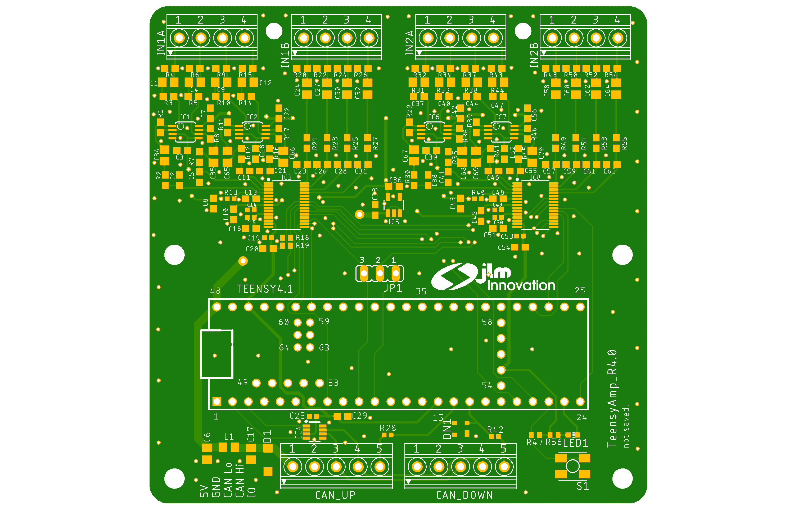
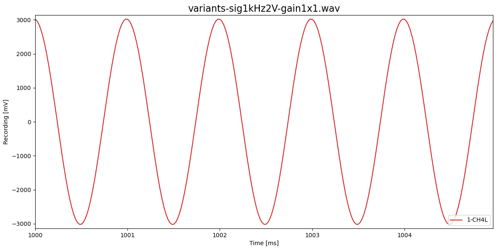
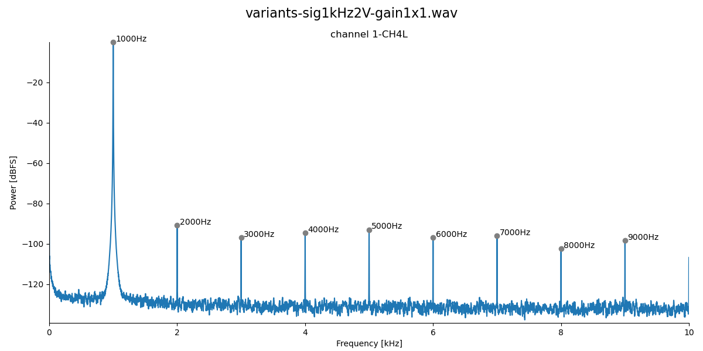
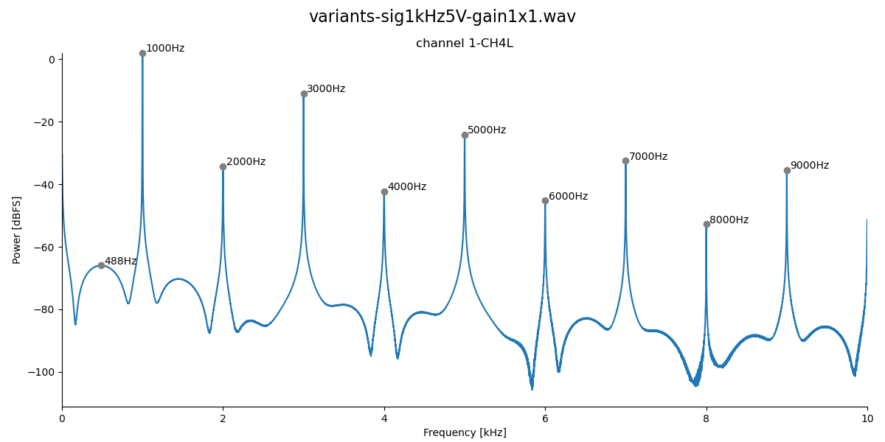
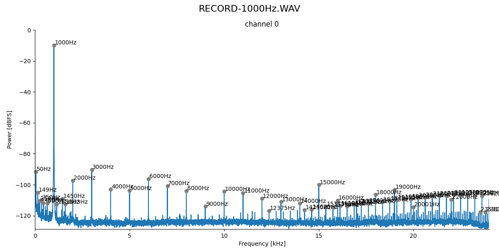

# TI PCM1865

- 8 input channels
- can be routed onto 4 24bit ADCs and output channels
- upto 192kHz sampling rate
- -12 to 40dB gain!

For details, see
- [web site](https://www.ti.com/product/PCM1865)
- [PCM186x data sheet](pcm1865.pdf)
- [PCM186xEVM evalutation board](https://www.ti.com/lit/pdf/slau615)

### Pins

Pins of the PCM1865 - see page 11 and Fig 22 in the data sheet and
Figure 15 of the evaluation board manual:

| pin | name        | connects to | Teensy 4.1 pins 
| --: | :---------- | :---------- | --------------: 
|  1  | VINL2/VIN1M | SIG 3       |                 
|  2  | VINR2/VIN2M | SIG 2       |                 
|  3  | VINL1/VIN1P | SIG 1       |                 
|  4  | VINR1/VIN2P | SIG 0       |                 
|  5  | Mic Bias    | unconnected |                 
|  6  | VREF        | Connect 1-μF capacitor C5 to AGND |   |
|  7  | AGND        | Analog ground to common ground |   |
|  8  | AVDD        | 3.3V power supply, Fig 70/71. Connect 0.1-μF and 10-μF capacitors C8, C9, R1 from this pin to AGND. |    |
|  9  | XO          | not used, open |   |
| 10  | XI          | not used, open |   |
| 11  | LDO         | Connect 0.1-μF and 10-μF capacitors from this pin to AGND? |    |
| 12  | DGND        | Digital ground connect to common ground |   |
| 13  | DVDD        | 3.3V power supply, Fig 70/71. Connect 0.1-μF and 10-μF capacitors from this pin to DGND. |    |
| 14  | IOVDD       | 3.3V power supply, tied to DVDD, Fig 70/71.  | From Teensy 3.3V? |
| 15  | SCKI        | not used, open |  |
| 16  | LRCK        | Audio data world clock (left right clock) input/output. | 20 |
| 17  | BCK         | Audio data bit clock input/output. | 21 |
| 18  | DOUT        | Audio data digital output.         |  chip1: 8, chip2: 8 / 9 Jumper |
| 19  | GPIO3/INTC  | not needed  |  |
| 20  | GPIO2/INTB/DMCLK | not needed | chip1: 28 / chip2: 35 |
| 21  | GPIO1/INTA/DMIN  | not needed | chip2: 29 / chip2: 36 |
| 22  | MISO/GPIO0/DMIN2 | needed for I2S channels 3 and 4 | chip1: 6, chip2: 32 |
| 23  | MOSI/SDA    | I2C bus SDA | 18 |
| 24  | MC/SCL      | I2C bus CLOCK | 19 |
| 25  | MS/AD       | I2C addres: first chip low, second chip high |  |
| 26  | MD0         | tied low for I2C communication |  |
| 27  | VINL4/VIN4M | SIGALT 3     |    |
| 28  | VINR4/VIN3M | SIGALT 2     |    |
| 29  | VINL3/VIN4P | SIGALT 1     |    |
| 30  | VINR3/VIN3P | SIGALT 0     |    |

## Gains and amplitudes

On the evaluation board (AVDD = 3.3V!) the largest sine waves that can
be recorded without clipping are:

| gain  | Vrms    | Vp-p    |
| ----: | ------: | ------: |
| -12dB |   4.1V  |   11.6V |
|   0dB |     2V  |    5.7V |
|  20dB |  200mV  |   565mV |
|  32dB |   48mV  |   136mV |
|  40dB |   16mV  |    45mV |

Maximum analog gain is 32dB, but bit depth is 24bit.

## Clipping

The PCM1865 clips with inversion (a 1kHz signal with 2V rms):

This can be fixed by unwrapping:

The unwrapped trace, however, is distorted:

The larger the signal amplitude, the stronger the distortion,
until the unwrapped signal eventually clips at 3.3V:

A 3V rms signal:

A 5V rms signal:

A 40dB gain (x100), a 20mV rms signal clips, but can be unwrapped:

A 50mV rms signal clips even after unwrapping:

But a 100mV rms signal cannot be fixed:

## Low-pass filter (old stuff)

- The low-pass filter (R4, C2) is not really needed! For the following
  spectra, R4 and C2 were removed (no low-pass). First, a 1kHz signal
  was presented with a Hameg sinewave generator. It is a bit more
  noisy compared to the Minirator sinewave generator:
  .
  We record with 48kHz, Nyquist is at 24kHz. A 28.5kHz signal then
  appears at 19.5kHz. And this is already well attenuated by about 70dB:
  

- Highpass filter with R1=220 and C1=10uF results in a cutoff at about 20Hz:
  

- Highpass filter with R1=47 and C1=10uF results in a cutoff at about 80Hz:
  

## Evalutation board

We used the [PCM186xEVM evalutation
board](https://www.ti.com/lit/pdf/slau615) to figure out how to
control and use the PCM186x chips by a Teensy 4.1:

1. Connect it straight to USB and open PurePath console. On the first
   tab select 'mode=2' for operating the PCM186x in slave mode. Use an
   audio recording software (e.g. audacity) to record the I2S audio
   stream (you need to select the right input source). This way you
   can play around with various input sources, gains, and channel
   configurations. Save register settings.

2. Read I2S stream with Teensy:
   - Remove R3, R20, R21, R22.
   - Replace standoffs by header pins.
   - Connect BCK, LRCK and DOUT to Teensy I2S bus.
   - Only the first two channels are transmitted via DOUT.
   - The last two channels are transmitted via DOUT2, use AudioInputI2CQuad.
   - Configure BCK input slave PLL mode
     (section 9.3.9.4.4, Figure 66 in data sheet) via PurePath console:
     - Set MST_MODE to slave (default anyways).
     - Enable CLKDET_EN ! All clocks and dividers are then automatically
       configured.
     - No need to set MST_SCK_SRC etc. (see Figure 33, Master mode only).
   - Works!

3. Control I2C from Teensy:
   - Connect Teensy I2C via J7.
   - Coded in TeeRec::ControlPCM186x
   - See section 9.3.9.8 for how to change sampling rates.
   - Works!

