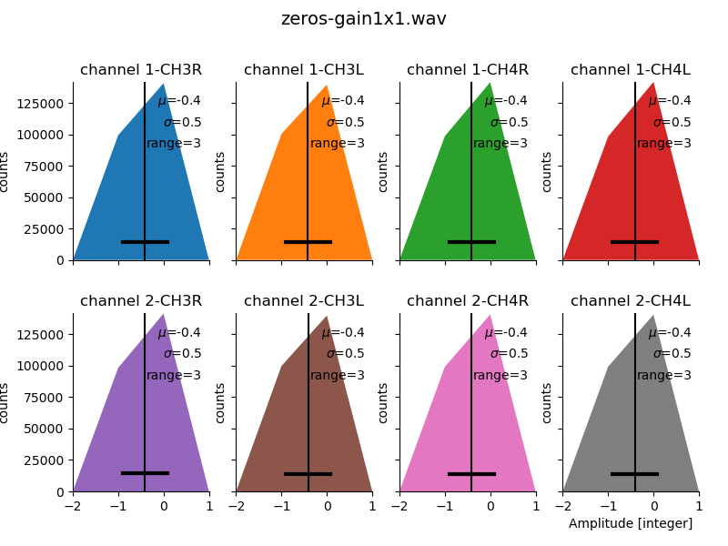
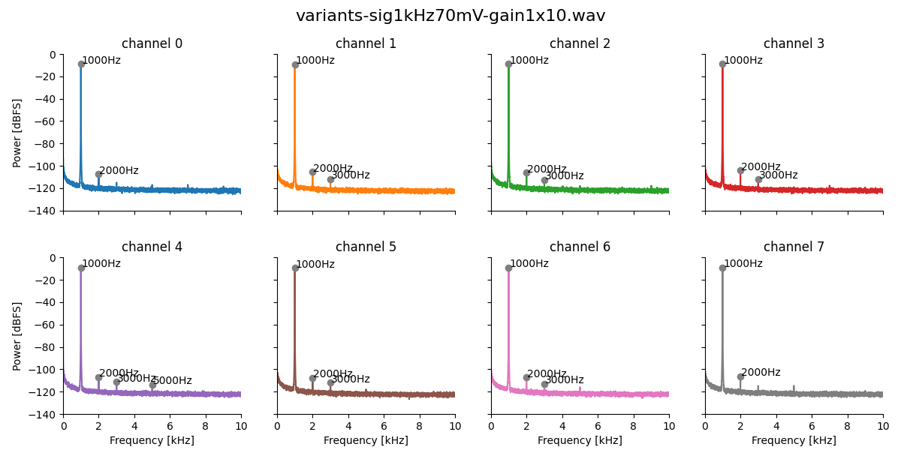

# Testing filter and gain variants

## Signal-filter

| Component | 1-CH3R | 1-CH3L | 1-CH4L | 1-CH4R | 2-CH3L | 2-CH3R | 2-CH4L | 2-CH4R | Comment |
| --------- | ----- | ----- | ----- | ----- | ----- | ----- | ----- | ----- | ------- |
| R1        | -     | 220   |    1k |  2.2k | -     | 220   |    1k |  2.2k | 20Hz, 5Hz, 2Hz highpass |
| R2        | 0     | 0     | 0     | 0     | 100   | 100   | 100   | 100   | TP       | 
| C2        | -     | -     | -     | -     | 10nF  | 10nF  | 10nF  | 10nF  | TP

### Noise

Inputs short circuited to ground.

- 0dB gain:

  

- 20dB gain:

  

- 40dB gain:

  

- Same offset and noise in all channels and variants.

### Linearity

1 kHz sine wave (Minirator) applied to each channel individually:

- 0dB gain, 700mV rms sine wave:

  

- 20dB gain, 70mV rms sine wave:

  

- 40dB gain, 7mV rms sine wave:

  

- in all conditions harmonics ar at least 90 to 100dB below the signal!
- with the low-pass filter (lower row) higher harmonics are stronger than
  without low-pass filter (upper row).
- the 2Hz and 5Hz high-pass filters (two rightmost columns) have the smalles harmonics.
- at higher gains the differences are marginally.

## Pre-amplifier

| Component | 1-CH1R | 1-CH1L | 1-CH2L | 1-CH2R | 2-CH1L | 2-CH1R | 2-CH2L | 2-CH2R | Comment |
| --------- | ----- | ----- | ----- | ----- | ----- | ----- | ----- | ----- | ------- |
| R1        | -     | -     | -     | -     | 1k    | 1k    | 1k    | 1k    | 5Hz highpass |
| R2        | 1k    | 1k    |  4.7k |  4.7k | 1k    | 1k    |  4.7k |  4.7k | 20x gain |
| R3        | 22k   | 22k   | 100k  | 100k  | 22k   | 22k   | 100k  | 100k  | 20x gain |
| R4        | 100   | 0     | 100   | 0     | 100   | 0     | 100   | 0     | TP       |
| C3        | 10nF  | -     | 10nF  | -     | 10nF  | -     | 10nF  | -     | TP

### Noise

Inputs short circuited to ground.

- 0dB gain:

  

- 20dB gain:

  

- 40dB gain:

  

- More noise with low pass and 22k gain.

### Linearity

1 kHz sine wave (Minirator) applied to each channel individually:

- 0dB gain, 30mV rms sine wave:

  

- 20dB gain, 3mV rms sine wave:

  

- 40dB gain, 300uV rms sine wave:

  

