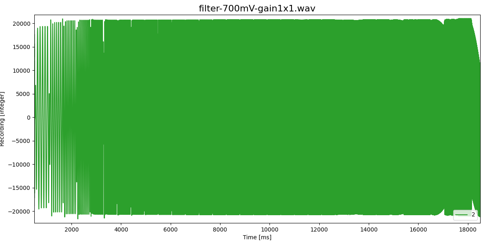
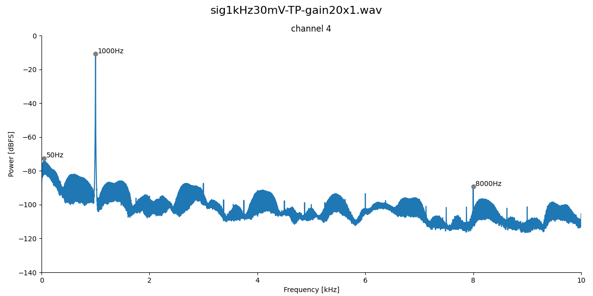

# Testing filter and gain variants

If not noted otherwise, all measurements at 48kHz sampling rate.

## Signal-filter

| Component | 1-CH3R | 1-CH3L | 1-CH4R | 1-CH4L | 2-CH3R | 2-CH3L | 2-CH4R | 2-CH4L | Comment |
| --------- | ----- | ----- | ----- | ----- | ----- | ----- | ----- | ----- | ------- |
| R1        | -     | 220   |    1k |  2.2k | -     | 220   |    1k |  2.2k | 20Hz, 5Hz, 2Hz highpass |
| R2        | 0     | 0     | 0     | 0     | 100   | 100   | 100   | 100   | TP       | 
| C2        | -     | -     | -     | -     | 10nF  | 10nF  | 10nF  | 10nF  | TP

### Noise

Inputs short circuited to ground.

- 0dB gain:

  

- 20dB gain:

  

- 40dB gain:

  

- Same offset and noise in all channels and variants.
- Noise increases according to gain.

### Linearity

1 kHz sine wave (Minirator) applied to each channel individually:

- 0dB gain, 700mV rms sine wave:

  

- 20dB gain, 70mV rms sine wave:

  

- 40dB gain, 7mV rms sine wave:

  

- In all conditions harmonics ar at least 90 to 100dB below the signal!
- With the low-pass filter (lower row) higher harmonics are stronger than
  without low-pass filter (upper row).
- The 2Hz and 5Hz high-pass filters (two rightmost columns) have the smalles harmonics.
- At higher gains the differences are marginally.
- Noise increases according to gain (every x10 by 20dB).

### Low-pass filter

A 8.8kHz signal without low-pass filter:

and with low-pass filter:

A 39.2kHz signal also appears at 8.8kHz.

Without low-pass filter:

With low-pass filter:

- Low-pass filter is not really needed.

### High-pass filter

All measurements with frequencies 10Hz to 20kHz in 1/3 octaves, each for 500ms.

Without highpass filter:

With R1=220 we get a 30Hz high-pass filter with strange behavior at
lower freqencies:

With R1=1k we get a 5Hz high-pass filter:

With R1=2.2k we get a 2Hz high-pass filter:

- Let's use R1=1k for a 5Hz high-pass filter.

## Pre-amplifier

| Component | 1-CH1R | 1-CH1L | 1-CH2R | 1-CH2L | 2-CH1R | 2-CH1L | 2-CH2R | 2-CH2L | Comment |
| --------- | ----- | ----- | ----- | ----- | ----- | ----- | ----- | ----- | ------- |
| R1        | -     | -     | -     | -     | 1k    | 1k    | 1k    | 1k    | 5Hz highpass |
| R2        | 1k    | 1k    |  4.7k |  4.7k | 1k    | 1k    |  4.7k |  4.7k | 20x gain |
| R3        | 22k   | 22k   | 100k  | 100k  | 22k   | 22k   | 100k  | 100k  | 20x gain |
| R4        | 100   | 0     | 100   | 0     | 100   | 0     | 100   | 0     | TP       |
| C3        | 10nF  | -     | 10nF  | -     | 10nF  | -     | 10nF  | -     | TP

### Noise

Inputs short circuited to ground.

- 0dB gain:

  

- 20dB gain:

  

- 40dB gain:

  

- Twice as much noise with the 100k gain.
- At 20dB gain, amounting to x200 overall gain, the noise standard
  deviation is three times smaller than 40dB gain (x100) without preamp.

### Linearity

1 kHz sine wave (Minirator) applied to each channel individually:

- 0dB gain, 30mV rms sine wave:

  

- 20dB gain, 3mV rms sine wave:

  

- 40dB gain, 300uV rms sine wave:

  

- Low-pass filter introduces stronger 2nd harmonics at 0dB gain.
- Effect of high-pass filter is small.
- Effect of 22k versus 100k gain is small. 
- Noise floor is similar in all variants (in contrast to the noise measurement).
- At comparable gains, preamp introduces slightly more harmonics.
- Let's take variant 2-CH1L (R1=1k, R2=1k, R3=22k, R4=0, C3=-).

### Low-pass filter

An 1kHz signal without low-pass filter:

and with low-pass filter:

With a sampling rate of 48kHz a 47kHz signal will appear also at 1kHz.

Without low-pass filter:

With low-pass filter:

The same for a 8.8kHz signal - a bit closer to the Nyquist frequency:

A 39.2kHz signal also appears at 8.8kHz.

Without low-pass filter:

With low-pass filter:

- Low-pass filter is not really needed!

### High-pass filter

All measurements with frequencies 10Hz to 20kHz in 1/3 octaves, each for 500ms.

With R1=1k we get a 30Hz high-pass filter (R2=1kHz and R3=22kHz):

Without R1 we still have a 25Hz high-pass filter (R2=1kHz and R3=22kHz):

Without R1 and R2=4.7kHz and R3=100kHz,  we still have a 5Hz high-pass filter:

