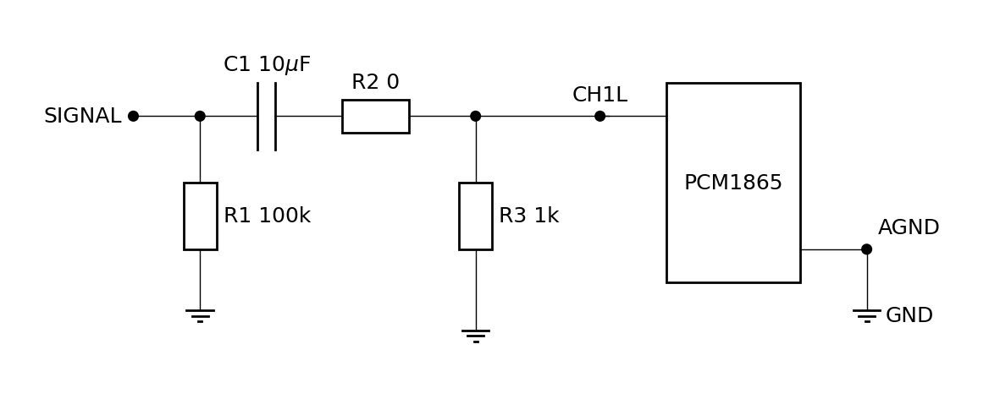
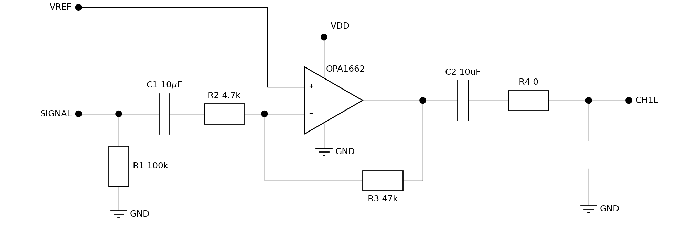

# Testing high-pass filter without low-pass

If not noted otherwise, all measurements at 48kHz sampling rate.

## Signal-filter

| Component | 1-CH* | 2-CH* |
| --------- | ----- | ----- |
| R1        | 1k    | 1k    |
| R2        | 0     | 0     |
| C2        | -     | -     |

### Linearity

1 kHz sine wave (Minirator) applied to each channel individually:

### High-pass filter

All measurements with frequencies 10Hz to 20kHz in 1/3 octaves, each for 500ms.

## Pre-amplifier

| Component | 1-CH* | 2-CH* |
| --------- | ----- | ----- |
| R1        | -     | -     |
| R2        | 4.7k  | 4.7k  |
| R3        | 47k   | 47k   |
| R4        | 0     | 0     |
| C3        | -     | -     |

### Linearity

### High-pass filter
