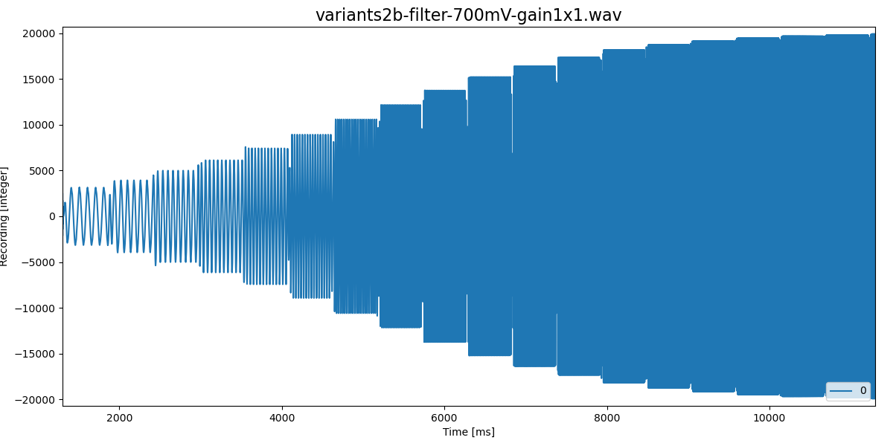
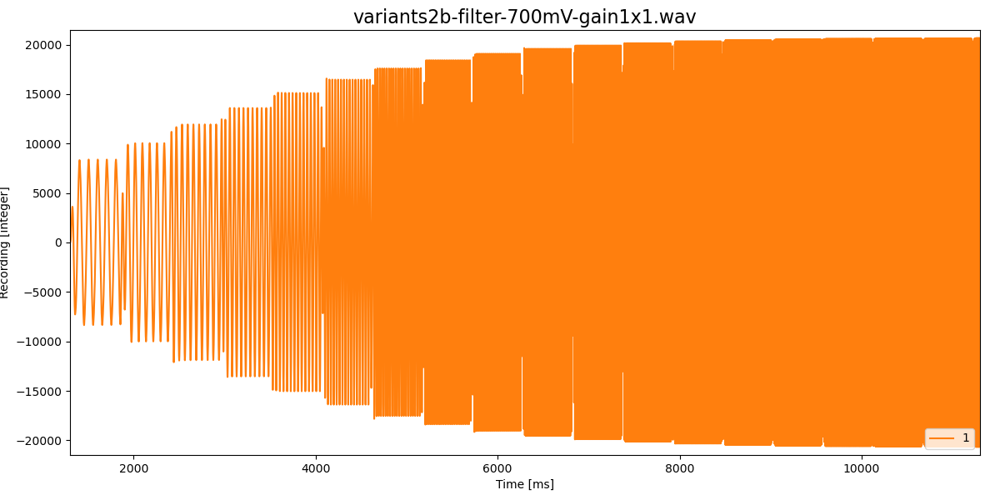
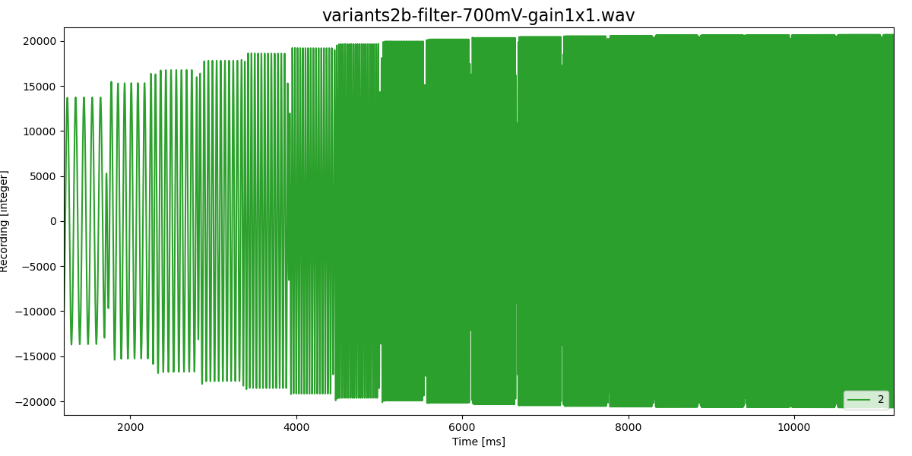
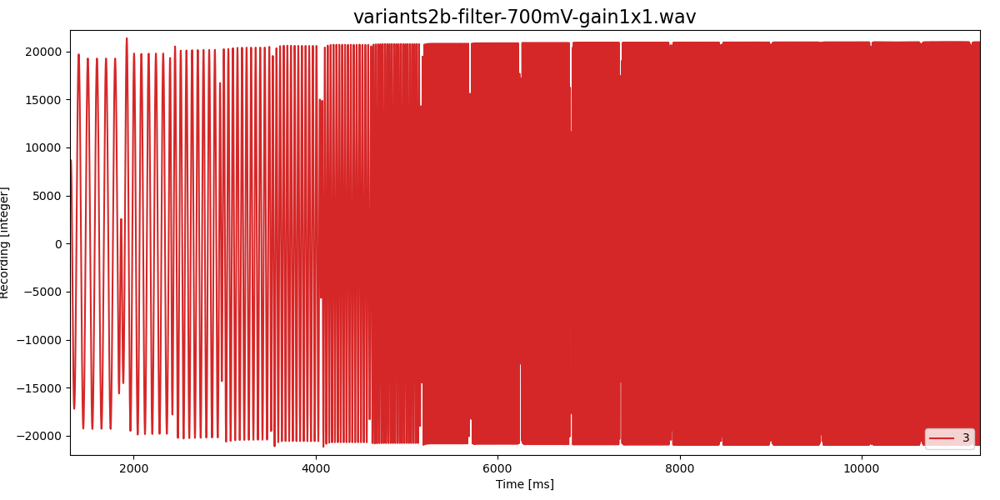
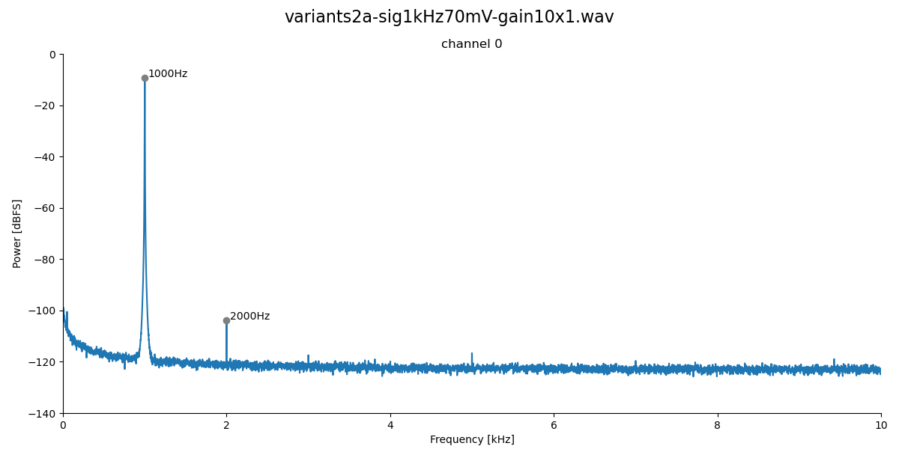
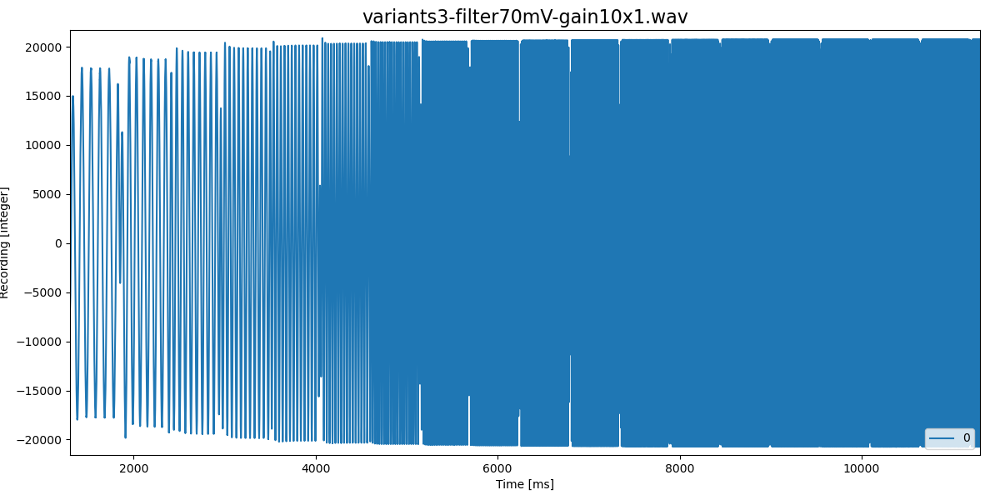

# Testing high-pass filter without low-pass

If not noted otherwise, all measurements at 48kHz sampling rate.

## Signal-filter

| Component | 1-CH3R | 1-CH3L | 1-CH4R | 1-CH4L | 2-CH* |
| --------- | ------ | ------ | ------ | ------ | ----- |
| R1        | 1k     | 1k     | 1k     | 1k     | 1k    |
| R2        | 0      | 0      | 0      | 0      | 0     |
| C2=R3     | 330    | 1k     | 2.2k   | 10     | -     |
| fcutoff   |        |        |        |        | 5Hz   |

| Component | 1-CH3R | 1-CH3L | 1-CH4R | 1-CH4L |
| --------- | ------ | ------ | ------ | ------ |
| R1        | 100k   | 100k   | 100k   | 100k   |
| R2        | 0      | 0      | 0      | 0      |
| C2=R3     | 330    | 1k     | 2.2k   | 10     |
| fcutoff   | 80Hz   | 30Hz   | 15Hz   | 3Hz    |

### Linearity

1 kHz sine wave (Minirator) applied to each channel individually:

- R1=1k, no C2, 0dB gain, 700mV rms sine wave:

  

- R1=1k, no C2, 20dB gain, 70mV rms sine wave:

  

- R1=1k, no C2, 40dB gain, 7mV rms sine wave:

  

### High-pass filter

Measurement with frequencies 10Hz to 20kHz in 1/3 octaves, each for 500ms.

- R1=1k, no C2, 0dB gain, 700mV rms sine wave:

- R1=100k, R3=330, 0dB gain, 700mV rms sine wave:

- R1=100k, R3=1k, 0dB gain, 700mV rms sine wave:

- R1=100k, R3=2.2k, 0dB gain, 700mV rms sine wave:

- R1=100k, R3=10k, 0dB gain, 700mV rms sine wave:

## Pre-amplifier

| Component | 1-CH* | 2-CH* |
| --------- | ----- | ----- |
| R1        | 100k  | -     |
| R2        | 4.7k  | 4.7k  |
| R3        | 47k   | 47k   |
| R4        | 0     | 0     |
| C3        | -     | -     |

### Linearity

1 kHz sine wave (Minirator) applied to each channel individually:

- R1=1k, 0dB gain, 70mV rms sine wave:

  

- R1=1k, 20dB gain, 7mV rms sine wave:

  

- R1=1k, 40dB gain, 700uV rms sine wave:

  

- R1=100k, 0dB gain, 70mV rms sine wave:

  

### High-pass filter

Measurement with frequencies 10Hz to 20kHz in 1/3 octaves, each for 500ms.

- R1=1k, 0dB gain, 70mV rms sine wave:

- R1=100k, 0dB gain, 70mV rms sine wave:

### Conclusion

- R1=100k for grounding the signal
- R2=4.7k for a 5Hz high-pass filter
- R3=47k for a 10x gain
- no low-pass filter 

