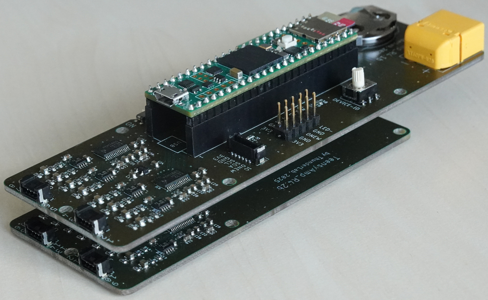
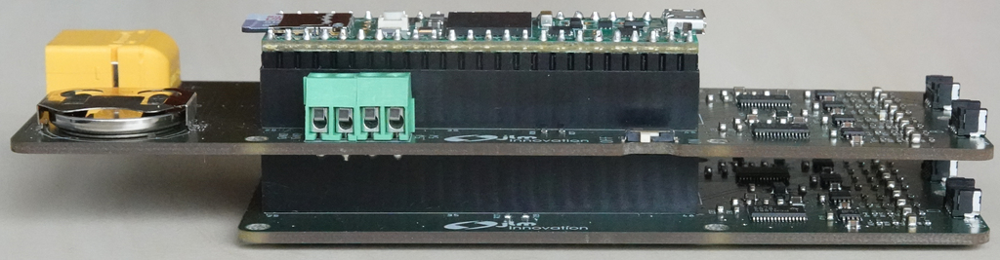

# TeensyAmp R4.1 + R4.2

The [TeensyAmp R4.1](../R4.1) can be stacked on top of the [TeensyAmp
R4.2](../R4.2):

For the first version of PCB boards, see [R4.1 + R4.2](r4142.md).

## Connectors

molex [Micro-Lock Plus](https://www.molex.com/en-us/products/connectors/wire-to-board-connectors/micro-lock-plus-connectors) with [1.25mm pitch](https://www.molex.com/content/dam/molex/molex-dot-com/en_us/pdf/datasheets/987652-6322.pdf). See [application specification](https://www.molex.com/content/dam/molex/molex-dot-com/products/automated/en-us/applicationspecificationspdf/505/505565/5055650000-AS-000.pdf) for an overview and part numbers.

Here we use right-angle SMT male connectors, 4 pins, part number 5055670471, [datasheet](../R4.1/molex5055670471_sd.pdf) for
the 8 input channels.

Use the precrimped cables from the cable assembly 45111 series for connecting your electrodes (30cm female/female 26 AWG cable, 7mm wide, part number 451110403).

## 16 channels

The two boards together provide 16 input channels.

## Power consumption

- Powering directly from an 3.6V LiIon battery is way more efficient
  that using a power bank.  The power bank transforms the 3.6V from
  the LiPo battery up to 5V and the Teensy reduces this back to
  3.3V. Resulting in an efficieny of 75% (approx 86% squared) compared
  to using the LiIon battery directly.

- Power consumption can be dramatically reduced by reducing CPU
  speed. For 48kHz sampling rate, 24MHz is sufficient, this extends
  the recording duration by 15%. 96kHz sampling rate requires 48MHz
  (because of higher data rates required for the SD card).

See also the [first version](r4142.md#power-consumption) for power consumption measurements and insights.

All measurements reported here with shutdown USB and 24MHz CPU speed.

### KeepPower Li-Ion battery

[Keeppower 26650 - 5500mAh, 3.6V Li-Ion protected battery](https://www.akkushop.de/de/keeppower-26650-li-ion-akku-5500mah-36v-bis-37v-masse-699x265mm-pcb-geschuetzt/?_gl=1*3tpsz6*_up*MQ..*_gs*MQ..&gclid=Cj0KCQiAo5u6BhDJARIsAAVoDWt3GoXz8Iy4VtOCWRfemFEa7uiMu-8cfNHHLCeWJMEUk6c8qhZRTr8aAmmdEALw_wcB)

| capacity | voltage | duration | channels | sampling rate | CPU speed| Sensors-V1       | comment        |
| -------: | ------: | -------- | -------: | ------------: | --------:| :--------------- | :------------- |
|  3x5.5Ah |    3.6V | 46h15min |       16 |         48kHz |     24MHz| 30s, with 3 LEDs |                |
|  3x5.5Ah |    3.6V | 47h00min |       16 |         48kHz |     24MHz| 30s, with 3 LEDs |                |
|  3x5.5Ah |    3.6V | 44h25min |       16 |         48kHz |     24MHz| 30s, with 3 LEDs |                |
|  3x5.5Ah |    3.6V | 43h50min |       16 |         48kHz |     24MHz| 30s, with 3 LEDs | RC Plus Duo Power 100, 4.1V |
|  3x5.5Ah |    3.6V | 44h55min |       16 |         48kHz |     24MHz| 30s, with 3 LEDs | RC Plus Duo Power 100, 4.1V |

### Battery pack

Charging time with the RC Plus Duo Power 100 on 10A is about 4h.

| capacity | voltage | duration | channels | sampling rate | CPU speed| Sensors-V1       | comment        |
| -------: | ------: | -------- | -------: | ------------: | --------:| :--------------- | :------------- |
|  7x3.5Ah |    3.6V | 54h35min |       16 |         48kHz |     24MHz| 30s, with 3 LEDs | RC Plus Duo Power 100, 4.1V |
|  7x3.5Ah |    3.6V | 54h50min |       16 |         48kHz |     24MHz| 30s, with 3 LEDs | RC Plus Duo Power 100, 4.1V |
|  7x3.5Ah |    3.6V | 54h55min |       16 |         48kHz |     24MHz| 30s, with 3 LEDs | RC Plus Duo Power 100, 4.1V |
|  7x3.5Ah |    3.6V | 55h15min |       16 |         48kHz |     24MHz| 30s, with 3 LEDs | RC Plus Duo Power 100, 4.1V |
|  7x3.5Ah |    3.6V | 56h25min |       16 |         48kHz |     24MHz| no sensors       | RC Plus Duo Power 100, 4.1V |
|  7x3.5Ah |    3.6V | 55h00min |       16 |         48kHz |     24MHz| no sensors       | RC Plus Duo Power 100, 4.1V |
|  7x3.5Ah |    3.6V | 65h20min |       16 |         48kHz |     24MHz| no sensors       | SkyRC Q100neo, 4.2V |
|  7x3.5Ah |    3.6V | 64h55min |       16 |         48kHz |     24MHz| no sensors       | SkyRC Q100neo, 4.2V |

## Battery charger

By means of the maximum charge voltage you can control the actual
capacity of the battery. However, the higher the voltage the less life
cycles you get. The numbers you can find in the internet are about 300
to 500 life cycles when charging to 4.2V.  The capacity is reduced to
90% when charging to 4.1V, but life cycles are doubled. For our
applications a couple of 100 cycles should be more than enough, so we
can easily go for 4.2V. Not all chargers support this!

All chargers in the following table have

- XT60 output
- support 1S LiIon battery packs
- mains power input (no separate power supply necessary).

| name         | channels | max charge current | max voltage | price | comment |
| :----------- | -------: | -----------------: | ----------: | ----: | :------ |
| [ToolkitRC Q6AC](https://www.toolkitrc.com/q6ac/) | 4 | 15A | | 220€ | Display broke |
| [RC Plus - Power Quad 100](https://promodels.be/en/product/RC-CHA-214/rc-plus-power-quad-100-charger-ac-100w-dc-4x-100w-4x-4s-lixx-8-nixx-16v-pb) | 4 | 10A | | 100€ | |
| [SkyRC Q100neo](https://www.skyrc.com/q100neo) | 4 | 6A | 4.05V - 4.25V | 82€ | |
| [SkyRC D200neo](https://www.skyrc.com/d200neo) | 2 | 20A | | 120€ | |
| [Gens Ace iMars D300 G-Tech Channel](https://gensace.de/de/collections/d300/products/gens-ace-imars-d300-g-tech-channel-ac-dc-300w-700w-rc-battery-charger-eu-black) | 2 | 16A | 3.90V - 4.15V | 120€ | |
| [ToolkitRC M6DAC](https://www.toolkitrc.com/m6dac/) | 2 | 15A | | 120€ | |
| [SkyRC D100neo](https://www.skyrc.com/d100neo) | 2 | 10A | | 90€ | |
| [RC Plus Duo Power 100](https://promodels.be/en/product/RC-CHA-213/rc-plus-power-duo-100-charger-ac-100w-dc-2x-100w-2x-4s-lixx-8-nixx-16v-pb) | 2 | 10A | 4.1V fixed | 60€ | refuses charging... |
| [ToolkitRC M7AC](https://www.toolkitrc.com/m7ac/) | 1 | 15A | | 90€ | |
| [SkyRC B6ACneo](https://www.skyrc.com/b6acneo) | 1 | 10A | | 60€ | |
| [SkyRC S100 Neo](https://www.skyrc.com/s100neo) | 1 | 10A | | 50€ | |

## Software

Use
[ControlPCM186x.h](https://github.com/janscience/TeeRec/blob/main/src/ControlPCM186x.h) of the [TeeRec library](https://github.com/janscience/TeeRec) for setting up the [TI PCM1865](../R4.0/pcm1865.md) chips. The TDM data stream can then be read in via [InputTDM.h](https://github.com/janscience/TeeRec/blob/main/src/InputTDM.h).

Use [ESensors](https://github.com/janscience/ESensors) library for communication with sensors connected to the OneWire and I2C bus.

## Applications

- [R4-sensors-logger](https://github.com/janscience/TeeGrid/tree/main/examples/R4-sensors-logger) 
- [R4-logger](https://github.com/janscience/TeeGrid/tree/main/examples/R4-logger) 
