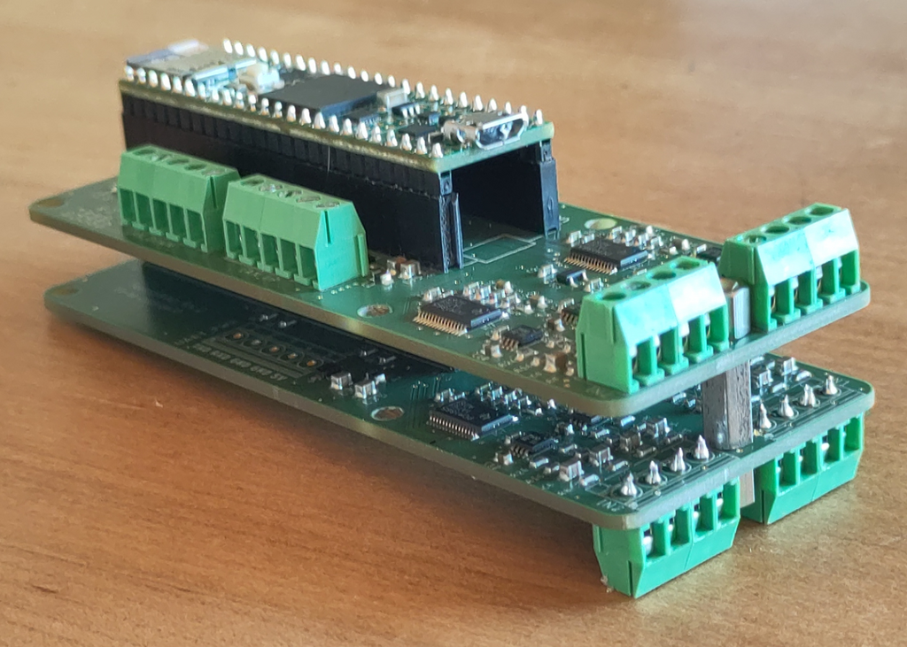
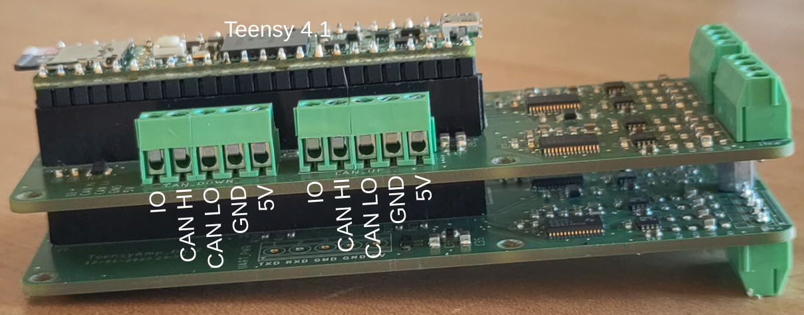
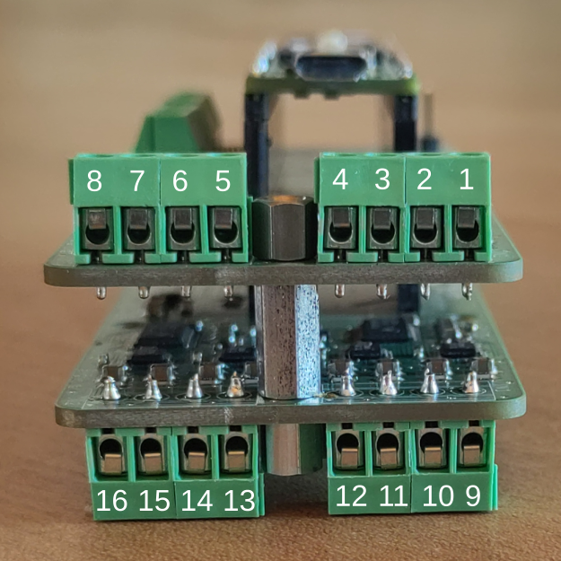
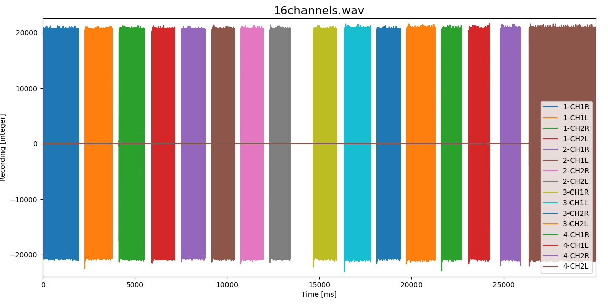
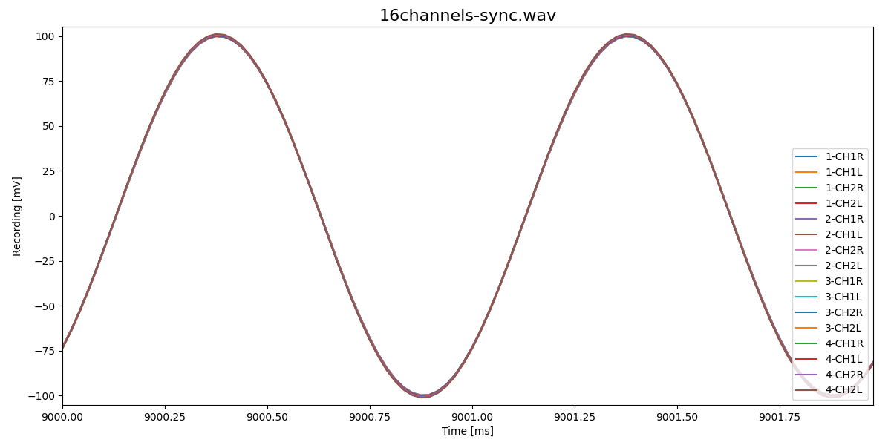

# TeensyAmp R4.1 + R4.2

The [TeensyAmp R4.1](../R4.1) can be stacked on top of the [TeensyAmp
R4.2](../R4.2):

### 16 channels

The two PCBs provide 16 input channels.

In the following plot a 1kHz signal was supplied to each input channel in turn:

The 16 channels are all in sync (same 1kHz signal on all channels):

### Power consumption

- Powering directly from an 3.6V LiIon battery is way more efficient
  that using a power bank.  The power bank transforms the 3.6V from
  the LiPo battery up to 5V and the Teensy reduces this back to
  3.3V. Resulting in an efficieny of 75% (approx 86% squared) compared
  to the LiIon battery.

- Power consumption can be dramatically reduced by reducing CPU
  speed. For 48kHz sampling rate, 24MHz is sufficient, this extends
  the recording duration by 15%. 96kHz sampling rate requires 48MHz
  (because of data rats for the SD card).

- Writing an additional backup SD card requires a higher CPU speed and
  consumes about 50mA more current. This is not a good idea.

- 16 channels draw in total 385mA of current (at 48kHz sampling rate): 169mA for the Teensy and
  54mA per pcm chip (4 channels).

- 8 channels (R4.1 only) draw 270mA of current (at 48kHz sampling rate).

- A sampling rate of 96kHz with 16channels draws 439mA of current.

- Shutting down the USB interface spares additional 3mA.

#### KeepPower Li-Ion battery

[Keeppower 26650 - 5500mAh, 3.6V Li-Ion protected battery](https://www.akkushop.de/de/keeppower-26650-li-ion-akku-5500mah-36v-bis-37v-masse-699x265mm-pcb-geschuetzt/?_gl=1*3tpsz6*_up*MQ..*_gs*MQ..&gclid=Cj0KCQiAo5u6BhDJARIsAAVoDWt3GoXz8Iy4VtOCWRfemFEa7uiMu-8cfNHHLCeWJMEUk6c8qhZRTr8aAmmdEALw_wcB)

##### Channels

| capacity | voltage | duration | channels | sampling rate | CPU speed | comment        |
| -------: | ------: | -------- | -------: | ------------: | --------: | :------------- |
|  2x5.5Ah |    3.6V | 33h05min |       16 |         48kHz |     24MHz |                |
|  2x5.5Ah |    3.6V | 33h00min |       16 |         48kHz |     24MHz |                |
|  2x5.5Ah |    3.6V | 32h35min |       16 |         48kHz |     24MHz | shutdown_usb(), setTeensySpeed(24) |
|  2x5.5Ah |    3.6V | 49h00min |        8 |         48kHz |     24MHz |                |

Teensy microcontroller draws 115mA of current.
At a sampling rate of 48kHz, each pcm chip (including additional SD card activity) draws 55mA of current.
16 channels draw in total 334mA of current (1.10W).

##### CPU speed

| capacity | voltage | duration | channels | sampling rate | CPU speed | comment        |
| -------: | ------: | -------- | -------: | ------------: | --------: | :------------- |
|  2x5.5Ah |    3.6V | 31h25min |       16 |         48kHz |    150MHz |                |
|  2x5.5Ah |    3.6V | 45h15min |        8 |         48kHz |    150MHz |                |

Better reduce CPU speed to 24MHz, that gives almost 3 to 4 hours more recording time.

##### Sampling rate

| capacity | voltage | duration | channels | sampling rate | CPU speed | comment        |
| -------: | ------: | -------- | -------: | ------------: | --------: | :------------- |
|  2x5.5Ah |    3.6V | 49h15min |        8 |         24kHz |     24MHz | shutdown_usb(), setTeensySpeed(24) |
|  2x5.5Ah |    3.6V | 33h05min |       16 |         24kHz |     24MHz | shutdown_usb(), setTeensySpeed(24) |
|  2x5.5Ah |    3.6V | 29h00min |       16 |         96kHz |     48MHz | shutdown_usb(), setTeensySpeed(48) |

A sampling rate of 96kHz requires a higher CPU speed and thus consumes 45mA more current (4h recording time).
Reducing the sampling rate to 24kHz seems not to spare any power.

#### Anker PowerCore PD 10000 Redux

[Anker PowerCore PD 10000 Redux](https://support.anker.com/s/product/a085g000004x2B1AAI/powercore-10000-pd-redux)

10Ah power bank with a small diameter.

##### CPU speed

| capacity | voltage | duration | channels | sampling rate | CPU speed |
| -------: | ------: | -------- | -------: | ------------: | --------: |
|     10Ah |      5V | 16h45min |       16 |         48kHz |    600MHz |
|     10Ah |      5V | 18h25min |       16 |         48kHz |    150MHz |
|     10Ah |      5V | 19h35min |       16 |         48kHz |     24MHz |
|     10Ah |      5V | 19h35min |       16 |         48kHz |     24MHz |

Reducing CPU speed spares about 1.1mA/10MHz. A reduction of at maximum
66mA is possible from the 600MHz.

##### Channels

| capacity | voltage | duration | channels | sampling rate | CPU speed |
| -------: | ------: | -------- | -------: | ------------: | --------: |
|     10Ah |      5V | 19h35min |       16 |         48kHz |     24MHz |
|     10Ah |      5V | 19h35min |       16 |         48kHz |     24MHz |
|     10Ah |      5V | 22h30min |       12 |         48kHz |     24MHz |
|     10Ah |      5V | 21h50min |       12 |         48kHz |     24MHz |
|     10Ah |      5V | 22h25min |       12 |         48kHz |     24MHz |
|     10Ah |      5V | 27h35min |        8 |         48kHz |     24MHz |
|     10Ah |      5V | 28h05min |        8 |         48kHz |     24MHz |
|     10Ah |      5V | 28h05min |        8 |         48kHz |     24MHz |
|     10Ah |      5V | 32h50min |        4 |         48kHz |     24MHz |
|     10Ah |      5V | 32h45min |        4 |         48kHz |     24MHz |

Teensy microcontroller draws 169mA of current.
At a sampling rate of 48kHz, each pcm chip (4 channels, including additional SD card activity) draws 54mA of current.
16 channels draw in total 385mA of current (1.27W).

##### USB interface power savings

| capacity | voltage | duration | channels | sampling rate | CPU speed | comment        |
| -------: | ------: | -------- | -------: | ------------: | --------: | :------------- |
|     10Ah |      5V | 19h35min |       16 |         48kHz |     24MHz |                |
|     10Ah |      5V | 19h35min |       16 |         48kHz |     24MHz |                |
|     10Ah |      5V | 19h20min |       16 |         48kHz |     24MHz | Serial.end()   |
|     10Ah |      5V | 19h40min |       16 |         48kHz |     24MHz | Serial.end(), setTeensySpeed(24)   |
|     10Ah |      5V | 19h55min |       16 |         48kHz |     24MHz | shutdown_usb() |
|     10Ah |      5V | 20h00min |       16 |         48kHz |     24MHz | shutdown_usb(), setTeensySpeed(24) |
|     10Ah |      5V | 19h40min |       16 |         48kHz |     24MHz | shutdown_usb(), setTeensySpeed(24) |
|     10Ah |      5V | 19h10min |       16 |         48kHz |     24MHz | shutdown_usb(), setTeensySpeed(24) |
|     10Ah |      5V | 19h45min |       16 |         48kHz |     24MHz | shutdown_usb(), setTeensySpeed(24) |
|     10Ah |      5V | 19h25min |       16 |         48kHz |     24MHz | shutdown_usb(), setTeensySpeed(24) |

Shutting down the USB serial interface spares about 3mA. Just ending the serial interface is not noticable.

##### Sampling rate

| capacity | voltage | duration | channels | sampling rate | CPU speed | comment        |
| -------: | ------: | -------- | -------: | ------------: | --------: | :------------- |
|     10Ah |      5V | 19h50min |       16 |         24kHz |     24MHz | shutdown_usb(), setTeensySpeed(24) |
|     10Ah |      5V | 19h45min |       16 |         24kHz |     24MHz | shutdown_usb(), setTeensySpeed(24) |
|     10Ah |      5V | 19h40min |       16 |         24kHz |     24MHz | shutdown_usb(), setTeensySpeed(24) |
|     10Ah |      5V | 17h25min |       16 |         96kHz |     48MHz | shutdown_usb(), setTeensySpeed(48) |
|     10Ah |      5V | 17h10min |       16 |         96kHz |     48MHz | shutdown_usb(), setTeensySpeed(48) |
|     10Ah |      5V | 17h10min |       16 |         96kHz |     48MHz | shutdown_usb(), setTeensySpeed(48) |
|     10Ah |      5V | 17h25min |       16 |         96kHz |     48MHz | shutdown_usb(), setTeensySpeed(48) |

A sampling rate of 96kHz requires a higher CPU speed and thus consumes 54mA more current.
Reducing the sampling rate to 24kHz seems not to spare any power.

##### Backup SD card on SPI bus

| capacity | voltage | duration | channels | sampling rate | CPU speed | comment        |
| -------: | ------: | -------- | -------: | ------------: | --------: | :------------- |
|     10Ah |      5V | 16h40min |       16 |         48kHz |    150MHz | plus backup SD |
|     10Ah |      5V | 16h30min |       16 |         48kHz |    150MHz | plus backup SD |
|     10Ah |      5V | 18h20min |       16 |         48kHz |    150MHz |   no backup SD |
|     10Ah |      5V | 18h55min |       16 |         48kHz |    150MHz |   no backup SD |

Additional backup SD card on SPI bus draws about 50mA of current.
And CPU speed cannot be 24MHz.

#### Realpower

10Ah power bank

| capacity | voltage | duration | channels | sampling rate | CPU speed |
| -------: | ------: | -------- | -------: | ------------: | --------: |
|     10Ah |      5V | 17h20min |       16 |         48kHz |    600MHz |
|     10Ah |      5V | 16h50min |       16 |         48kHz |    600MHz |
|     10Ah |      5V | 23h35min |       12 |         48kHz |     24MHz |

