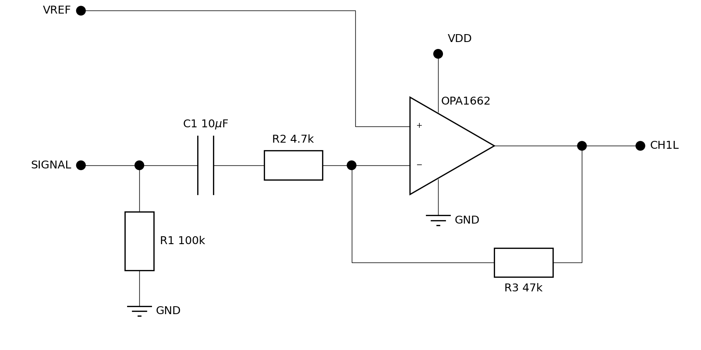
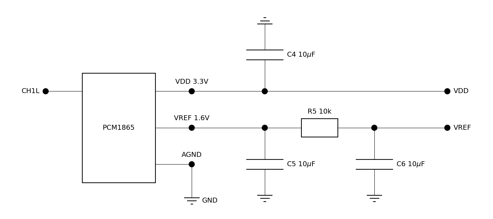
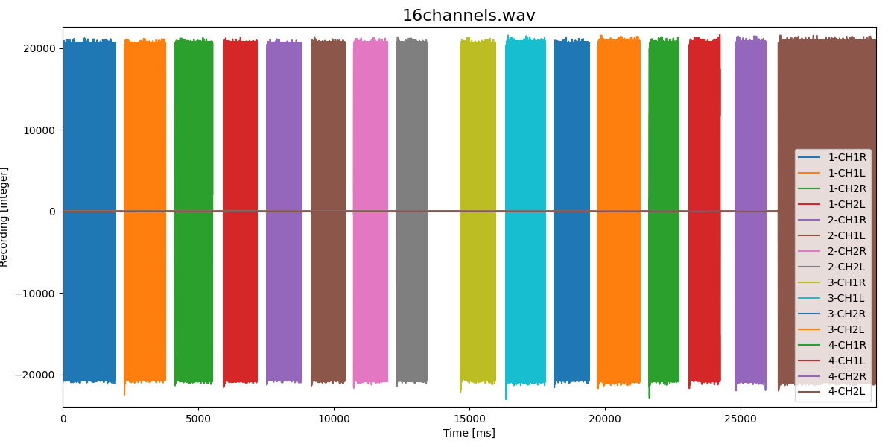
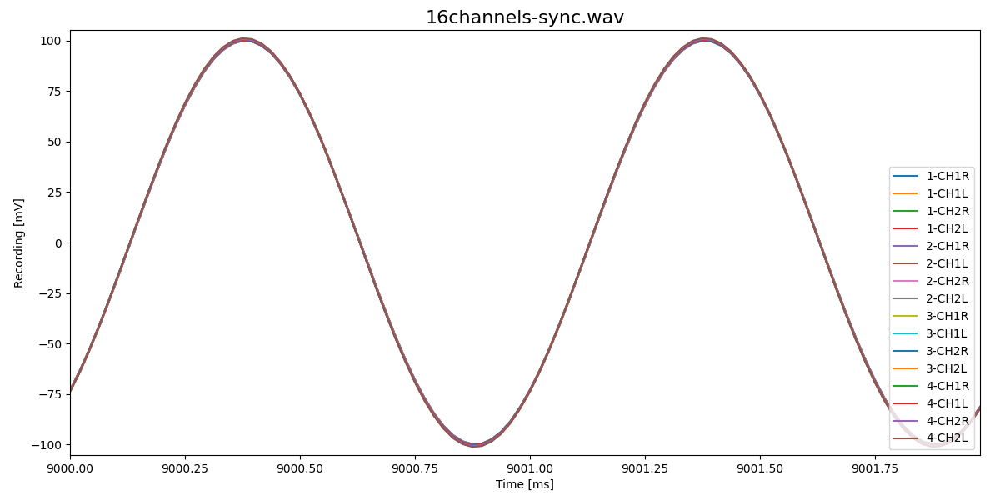

# TeensyAmp R4.1

If not noted otherwise, all measurements at 48kHz sampling rate.

## Pre-amplifier

- R1=100k for grounding the signal
- C1=10uF and R2=4.7k for a 5Hz high-pass filter
- R2=4.7k and R3=47k for a 10x gain (gain=R3/R2)
- no low-pass filter 

### Reference voltage

- the voltage reference needs to be really stable!

### Pins

Pins of the PCM1865 - see page 11 and Fig 22 in the data sheet and
Figure 15 of the evaluation board manual:

| pin | name        | connects to | Teensy 4.1 pins |
| --: | :---------- | :---------- | --------------: |
|  1  | VINL2/VIN1M | SIG 1       |                 |
|  2  | VINR2/VIN2M | SIG 0       |                 |
|  3  | VINL1/VIN1P |             |                 |
|  4  | VINR1/VIN2P |             |                 |
|  5  | Mic Bias    | unconnected |                 |
|  6  | VREF        | Connect 1-μF capacitor C5 to AGND |   |
|  7  | AGND        | Analog ground to common ground |   |
|  8  | AVDD        | 3.3V power supply, Fig 70/71. Connect 0.1-μF and 10-μF capacitors C8, C9, R1 from this pin to AGND. |    |
|  9  | XO          | not used, open |   |
| 10  | XI          | not used, open |   |
| 11  | LDO         | Connect 0.1-μF and 10-μF capacitors from this pin to AGND? |    |
| 12  | DGND        | Digital ground connect to common ground |   |
| 13  | DVDD        | 3.3V power supply, Fig 70/71. Connect 0.1-μF and 10-μF capacitors from this pin to DGND. |    |
| 14  | IOVDD       | 3.3V power supply, tied to DVDD, Fig 70/71.  | Teensy 3.3V |
| 15  | SCKI        | not used, open |  |
| 16  | LRCK        | Audio data world clock (left right clock) input/output. | 20 |
| 17  | BCK         | Audio data bit clock input/output. | 21 |
| 18  | DOUT        | Audio data digital output.         |  8 |
| 19  | GPIO3/INTC  | not needed  | chip1: 40, chip2: 41 |
| 20  | GPIO2/INTB/DMCLK | not needed |  |
| 21  | GPIO1/INTA/DMIN  | not needed |  |
| 22  | MISO/GPIO0/DMIN2 | not needed |  |
| 23  | MOSI/SDA    | I2C bus SDA   | 18 |
| 24  | MC/SCL      | I2C bus CLOCK | 19 |
| 25  | MS/AD       | I2C addres: chip1 low, chip2 high |  |
| 26  | MD0         | tied low for I2C communication |  |
| 27  | VINL4/VIN4M | -            |    |
| 28  | VINR4/VIN3M | -            |    |
| 29  | VINL3/VIN4P | SIG 3        |    |
| 30  | VINR3/VIN3P | SIG 2        |    |

Pins of the Teensy on the main board:

| Teensy 4.1 pin | Main board   | Extension board |
| -------------: | :----------- | :-------------- |
| Vin            | Vin          | Vin             |
| GND            | GND          | GND             |
| 3.3V           | IOVDD        | IOVDD           |
| 18             | I2C SDA      | -               |
| 19             | I2C SCL      | -               |
| 17             | -            | I2C SDA         |
| 16             | -            | I2C SCL         |
| 21             | BCK          | -               |
| 20             | LRCK         | -               |
| 8              | DIN          | -               |
| 4              | -            | BCK             |
| 3              | -            | LRCK            |
| 5              | -            | DIN             |
| 14             | GPIO3 chip1  | -               |
| 15             | GPIO3 chip2  | -               |
| 6              | -            | GPIO3 chip1     |
| 9              | -            | GPIO3 chip2     |
| 0              | CAN RX       | -               |
| 1              | CAN TX       | -               |
| 6              | I/O          | -               |
| 22             | LED extern   | -               |

### 16 channels

In the following plot a 1kHz signal was supplied to each input channel in turn, on two R4.0 boards connected to a single Teensy 4.1:

The 16 channels are all in sync (same 1kHz signal on all channels):

