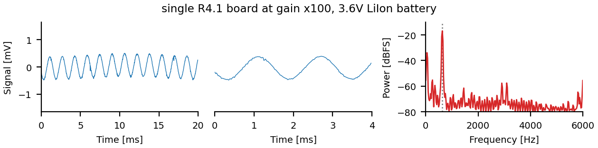
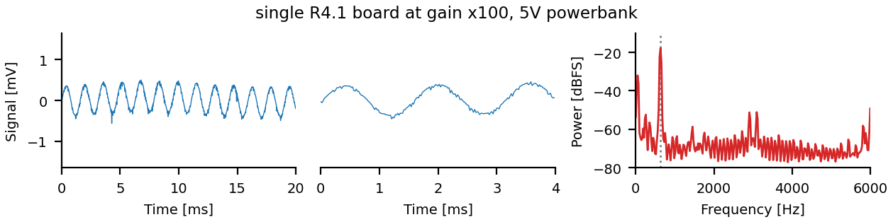
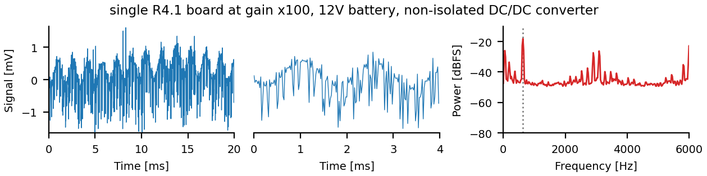
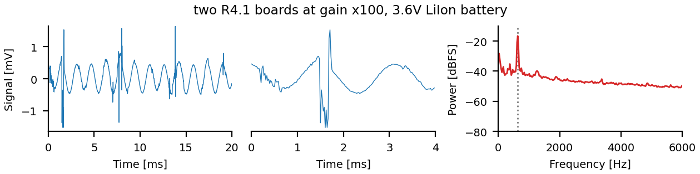
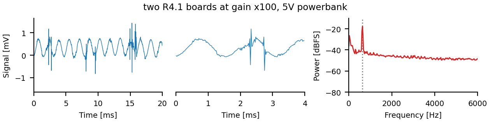
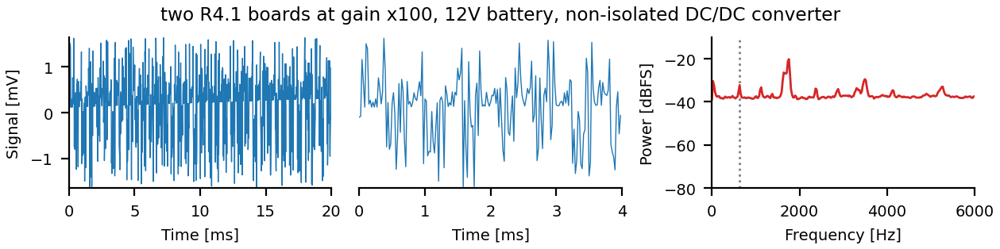

# Power tests

Signal delivered via battery-driven signal-generator into water with
electrodes.

All measurements at x1000 gain (x10 fixed pregain, x100 gain on
PCM1865 chip).

## Single R4.1 board powered directly by a battery

LiIon battery is the gold-standard:

This is as good as it gets in this setting.

Power bank is almost as good:

12V battery via non-isolated DC/DC converter to 5V is really bad:

This problem we should fix! Looks like we need to improve the
quality of the DC input.

## Two R4.1 boards powered directly by single battery

Signal is mostly ok, but is corrupted by frequent spikes.
How can we fix this?

No signal anymore with the 12V battery. 
This is the problem we need to fix!

## Conclusion

- The primary problem is the quality of the power supply!
  The output of the 12V DC/DC converters is not good enough,
  it introduces most of the noise.

- Improve power supply by adding some low-pass filtering.  $$f_c = (2
  \pi \tau)^{-1} \Leftrightarrow \tau = (2 \pi f_c)^{-1}$$  With $f_c
  = 10$Hz we get $\tau=16$ms. Let's aim for 5ms.

  $$\tau = RC \Leftrightarrow C = \tau/R$$
  The voltage drop over the resistance is $V=RI$.
  With $I=500$mA and $R=1$Ohm this is 500mV.
  And for the capacitance we then get 10mF.

- The secondary problem is that when two or more R4.1 boards are
  connected, then we still get noise spikes probably from SD card
  writes or other digital noise from the other board.

  This also requires to improve the power input.
  
  
  