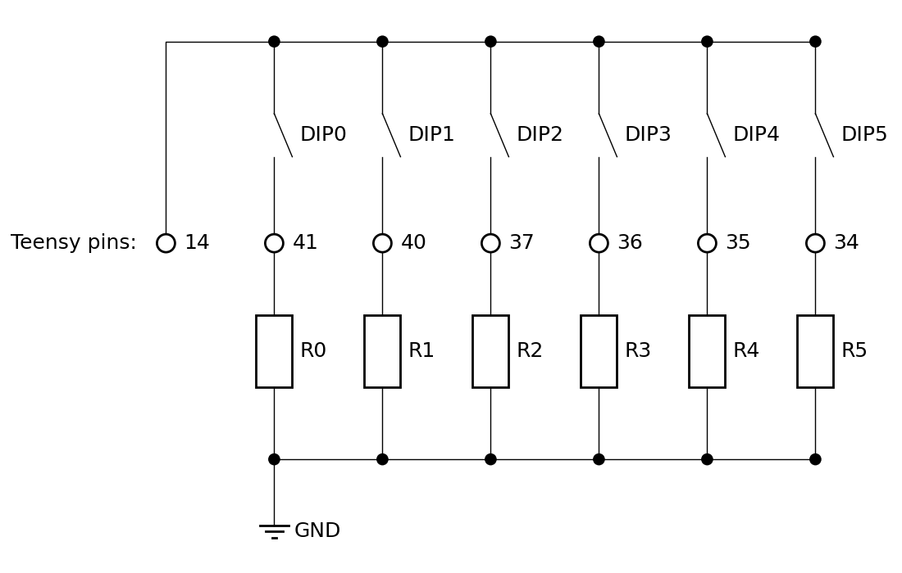

# TeensyAmp R4.1b

Based on

- 2 [TI PCM1865](../R4.0/pcm1865.md) with ADC and adjustable gain,
- [TI OPA1622](../R4.0/opa1622.pdf) as inverting pre-amplifier

by [jlm Innovation](https://www.jlm-innovation.de/) and [Jan
Benda](https://github.com/janscience).

## Pins

## Layout

## PCM1865

Pins of the PCM1865 - see page 11 and Fig 22 in the data sheet and
Figure 15 of the evaluation board manual:

| pin | name        | connects to | Teensy 4.1 pins |
| --: | :---------- | :---------- | --------------: |
|  1  | VINL2/VIN1M | SIG 1       |                 |
|  2  | VINR2/VIN2M | SIG 0       |                 |
|  3  | VINL1/VIN1P |             |                 |
|  4  | VINR1/VIN2P |             |                 |
|  5  | Mic Bias    | unconnected |                 |
|  6  | VREF        | Connect 1-μF capacitor C5 to AGND |   |
|  7  | AGND        | Analog ground to common ground |   |
|  8  | AVDD        | 3.3V power supply, Fig 70/71. Connect 0.1-μF and 10-μF capacitors C8, C9, R1 from this pin to AGND. |    |
|  9  | XO          | not used |   |
| 10  | XI          | not used |   |
| 11  | LDO         | Connect 0.1-μF and 10-μF capacitors from this pin to AGND? |    |
| 12  | DGND        | Digital ground connect to common ground |   |
| 13  | DVDD        | 3.3V power supply, Fig 70/71. Connect 0.1-μF and 10-μF capacitors from this pin to DGND. | Teensy 3.3V |
| 14  | IOVDD       | 3.3V power supply, tied to DVDD, Fig 70/71.  | Teensy 3.3V |
| 15  | SCKI        | not used |  |
| 16  | LRCK        | Audio data world clock (left right clock) input/output. | 20 |
| 17  | BCK         | Audio data bit clock input/output. | 21 |
| 18  | DOUT        | Audio data digital output.         |  8 |
| 19  | GPIO3/INTC  | not needed | |
| 20  | GPIO2/INTB/DMCLK | MCLK | 23 |
| 21  | GPIO1/INTA/DMIN  | not needed |  |
| 22  | MISO/GPIO0/DMIN2 | not needed |  |
| 23  | MOSI/SDA    | I2C bus SDA   | 18 |
| 24  | MC/SCL      | I2C bus CLOCK | 19 |
| 25  | MS/AD       | I2C addres: chip1 low, chip2 high |  |
| 26  | MD0         | tied low for I2C communication |  |
| 27  | VINL4/VIN4M | -            |    |
| 28  | VINR4/VIN3M | -            |    |
| 29  | VINL3/VIN4P | SIG 3        |    |
| 30  | VINR3/VIN3P | SIG 2        |    |

### Teensy pins connecting to TI PCM1865

| Teensy 4.1 pin | Teensy_Amp R4.1b | Teensy_Amp R4.2b |
| -------------: | :--------------- | :--------------- |
| Vin            | Vin +5V          | Vin +5V          |
| GND            | GND              | GND              |
| 3.3V           | VDD              | VDD              |
| 18             | I2C SDA          | -                |
| 19             | I2C SCL          | -                |
| 17             | -                | I2C SDA          |
| 16             | -                | I2C SCL          |
| 21             | BCK              | -                |
| 20             | LRCK             | -                |
| 8              | DIN              | -                |
| 4              | -                | BCK              |
| 3              | -                | LRCK             |
| 5              | -                | DIN              |
| 14             | -                | -                |
| 15             | GPIO3_1 chip1    | -                |
| 22             | GPIO3_2 chip2    | -                |
| (0) remove     | -                | (GPIO3 chip1)    |
| (1) remove     | -                | (GPIO3 chip2)    |

### Pre-amplifier

Let's have by default a 1x preamp gain.

R2 = R3 = 4.7kOhm.

## Status LED

| Teensy 4.1 pin | Teensy_Amp R4.1b | Teensy_Amp R4.2b |
| -------------: | :--------------- | :--------------- |
| 28 (was 26)    | LED extern       | -                |
| 29 (was 27)    | -                | LED extern       |

## CAN bus

[TI TCAN334 D](../R4.0/tcan334.pdf) CAN-FD transceiver for synchronization.

| Teensy 4.1 pin | Teensy_Amp R4.1b |
| -------------: | :--------------- |
| GND            | GND              |
| 3.3V           | VDD              |
| 36             | CAN SHDN         |
| 37             | CAN STB          |
| 30             | CAN RX           |
| 31             | CAN TX           |
| 40             | I/O UP           |
| 41             | I/O DOWN         |

The CAN high and low lines and the I/O lines are isolated.
The isolated side is powered externally.

See:
- [power and signal isolation](https://www.digikey.com/en/articles/how-to-implement-power-and-signal-isolation-for-reliable-operation-of-can-buses)
- [TJA1052i](https://www.nxp.com/docs/en/data-sheet/TJA1052I.pdf)
- [TI isolators](https://www.ti.com/de-de/isolation/digital-isolators/overview.html?utm_source=google&utm_medium=cpc&utm_campaign=asc-int-null-58700008175625223_digital_isolator_rsa-cpc-pp-google-de_de_int&utm_content=digital_isolator&ds_k=Digital-Isolator-IC&DCM=yes&gad_source=1&gclid=Cj0KCQjwmOm3BhC8ARIsAOSbapX_hDXOC9la8KQA2-44YpI0a8vUqTesS6QEvMo7SBzuVmTXmtb92tYaAgyhEALw_wcB&gclsrc=aw.ds)

## Real-time clock

The onboard real-time clock of the Teensy needs power via a coin
battery connected to the VBAT pin:

| Teensy 4.1 pin | Teensy_Amp R4.1b         |
| -------------: | :----------------------- |
| GND            | GND                      |
| VBAT           | Coin battery ((CR 2032)) |

Place a coin-battery holder (CR 2032) on the PCB.

## Backup SD card

We might want to write the data to two SD cards, so that we
immediately have a backup of the data. We communicate with the second
SD card over the SPI1 bus with alternate MISO pin:

| Teensy 4.1 pin | Teensy_Amp R4.1b | micro SD card |
| -------------: | :--------------- | ------------: |
| GND            | GND              | 6             |
| 3.3V           | VDD              | 4             |
| 27             | SCK1             | 5             |
| 26             | MOSI1            | 3             |
| 39             | MISO1            | 7             |
| 38             | CS1              | 2             |
| -              | unused           | 1             |
| -              | unused           | 8             |

See [wikipedia](https://en.wikipedia.org/wiki/SD_card#Transfer_modes)
for pinout of micro SD cards.

The [Micro SD Card Adaptor](https://www.pjrc.com/store/sd_adaptor.html)
uses a 74LCX125 level shifter for SCK1, MOSI1 and CS1:

Do we really need this? We operate at 3.3V anyways.

MISO has a 10k pullup resistance to VDD.

## Device identifier DIPs

For setting a device identifier that can be used to name the recorded
files, for example, 6 DIP switches are connected to Teensy pins . Only
when the device ID is read in, 3.3V are supplied to the dip switches
via Teensy pin 0. The pull-down resistances have about 7kOhm. When a
switch is closed, this makes 0.5mA. Six switches closed makes then
3mA, which is just below the maximum possible 4mA:

R0 - R5 = 7kOhm

The bit pattern read in on Teensy pins can be transformed into a
number between 0-63.

| Teensy 4.1 pin | Teensy_Amp R4.1b |
| -------------: | :--------------- |
| GND            | GND              |
| 0              | Power to DIPs    |
| 1,2,6,7,9,14   | Device ID DIPs with pull-down 7k resistance  |

## Power

Add two USB power inputs with on/off switch.

Change power supply on the fly-

## Push-button

One push-button for starting and stopping data acquisition in a
controlled way.

| Teensy 4.1 pin | Teensy_Amp R4.1b |
| -------------: | :--------------- |
| 34             | Push button      |

## On-board temperatur sensor

Place a temperature sensor on the PCB. Control it over the I2C2 bus:

| Teensy 4.1 pin | Teensy_Amp R4.1b |
| -------------: | :--------------- |
| GND            | GND              |
| 3.3V           | VDD              |
| 24             | I2C2 SCL         |
| 25             | I2C2 SDA         |

This bus is also used for external sensors (see next section).

## External sensors and devices

Potential external sensors and devices to be connected to the R4.1b:

- One-wire bus (GND, 3.3V, data with 4.7kOhm pull-up resistor): e.g. Dallas DS18x20 temperature sensor.
- I2C bus: temperature and illumination sensors.
- SPI bus: Display?

| Teensy 4.1 pin | Teensy_Amp R4.1b |
| -------------: | :--------------- |
| GND            | GND              |
| 3.3V           | VDD              |
| 35             | OneWire data + 4.7kOhm to 3.3V |
| 24             | I2C2 SCL         |
| 25             | I2C2 SDA         |
| 10             | SPI CS           |
| 11             | SPI MOSI         |
| 12             | SPI MISO         |
| 13             | SPI SCK          |

## Improvements

- Default x1 pre-amp gain (R2 = R3 = 4.7kOhm).
- Replace CAN bus by isolated CAN bus.
- Add a coin-battery holder (CR 2032) connected to Vbat for the Teensy real-time clock.
- Replace signal screw-terminals by ENRI MiniBridge (right angle male SMT type A with 4 contacts on PCB, Female with 180 cable outlet, Koshiri variant, see https://www.mouser.de/datasheet/2/418/9/ENG_DS_erni_minibridge_1_27mm_connectors_ds_2206-3355850.pdf).
- Add on-board temperature sensor.
- Add one-wire pins (GND, 3.3V, data) for Dallas DS18x20 temperature sensor with 4.7kOhm pull-up resistor.
- Add I2C pins (GND, 3.3V, SDA, SCL) pins for light sensor, etc.
- LED pin close to I2C pins.
- Add SPI pins.
- Add GND pins (for electrode cable shield, etc.).
- Add 4 to 6-bit dip switch for device identification.
- Add one external SD card for backups.
- Add two USB power inputs for replacing power banks on the fly, with on/off switch.
