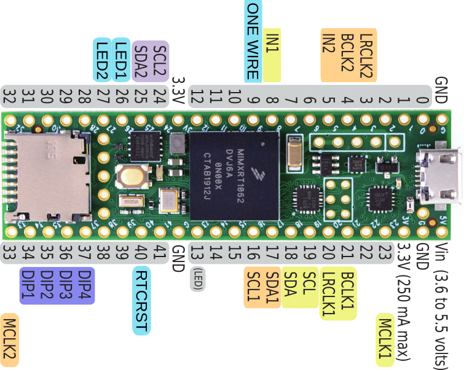

# TeensyAmp R4.1b

Based on

- 2 [TI PCM1865](../R4.0/pcm1865.md) with ADC and adjustable gain,
- [TI OPA1662](../R4.0/opa1662.pdf) as inverting pre-amplifier

by [jlm Innovation](https://www.jlm-innovation.de/) and [Jan
Benda](https://github.com/janscience).

## Pins

## Layout

- The width of the PCB can be increased to 50mm, maximum 56mm.
- The length is not limited.

## PCM1865

Pins of the PCM1865 - see page 11 and Fig 22 in the data sheet and
Figure 15 of the evaluation board manual:

| pin | name        | connects to | Teensy 4.1 pins |
| --: | :---------- | :---------- | --------------: |
|  1  | VINL2/VIN1M | SIG 1       |                 |
|  2  | VINR2/VIN2M | SIG 0       |                 |
|  3  | VINL1/VIN1P |             |                 |
|  4  | VINR1/VIN2P |             |                 |
|  5  | Mic Bias    | unconnected |                 |
|  6  | VREF        | Connect 1-μF capacitor C5 to AGND |   |
|  7  | AGND        | Analog ground to common ground |   |
|  8  | AVDD        | 3.3V power supply, Fig 70/71. Connect 0.1-μF and 10-μF capacitors C8, C9, R1 from this pin to AGND. |    |
|  9  | XO          | not used |   |
| 10  | XI          | not used |   |
| 11  | LDO         | Connect 0.1-μF and 10-μF capacitors from this pin to AGND? |    |
| 12  | DGND        | Digital ground connect to common ground |   |
| 13  | DVDD        | 3.3V power supply, Fig 70/71. Connect 0.1-μF and 10-μF capacitors from this pin to DGND. | Teensy 3.3V |
| 14  | IOVDD       | 3.3V power supply, tied to DVDD, Fig 70/71.  | Teensy 3.3V |
| 15  | SCKI        | not used |  |
| 16  | LRCK        | Audio data world clock (left right clock) input/output. | 20 |
| 17  | BCK         | Audio data bit clock input/output. | 21 |
| 18  | DOUT        | Audio data digital output.         |  8 |
| 19  | GPIO3/INTC  | not needed | |
| 20  | GPIO2/INTB/DMCLK | MCLK | 23 |
| 21  | GPIO1/INTA/DMIN  | not needed |  |
| 22  | MISO/GPIO0/DMIN2 | not needed |  |
| 23  | MOSI/SDA    | I2C bus SDA   | 18 |
| 24  | MC/SCL      | I2C bus CLOCK | 19 |
| 25  | MS/AD       | I2C addres: chip1 low, chip2 high |  |
| 26  | MD0         | tied low for I2C communication |  |
| 27  | VINL4/VIN4M | -            |    |
| 28  | VINR4/VIN3M | -            |    |
| 29  | VINL3/VIN4P | SIG 3        |    |
| 30  | VINR3/VIN3P | SIG 2        |    |

Signal input via molex 4 pin right-angle connecors.

### Teensy pins connecting to TI PCM1865

| Teensy 4.1 pin | Teensy_Amp R4.1b | Teensy_Amp R4.2b |
| -------------: | :--------------- | :--------------- |
| Vin            | Vin +5V          | Vin +5V          |
| GND            | GND              | GND              |
| 3.3V           | VDD              | VDD              |
| 18             | I2C SDA          | -                |
| 19             | I2C SCL          | -                |
| 17             | -                | I2C SDA          |
| 16             | -                | I2C SCL          |
| 21             | BCK              | -                |
| 20             | LRCK             | -                |
| 8              | DIN              | -                |
| 4              | -                | BCK              |
| 3              | -                | LRCK             |
| 5              | -                | DIN              |
| 14             | -                | -                |
| (15) remove    | (GPIO3_1 chip1)  | -                |
| (22) remove    | (GPIO3_2 chip2)  | -                |
| (0) remove     | -                | (GPIO3 chip1)    |
| (1) remove     | -                | (GPIO3 chip2)    |

We do not need to access the GPIO pins of the PCM1865.

### Pre-amplifier

Let's have by default a 1x preamp gain.

R2 = R3 = 47kOhm.

## Status LED

| Teensy 4.1 pin | Teensy_Amp R4.1b | Teensy_Amp R4.2b |
| -------------: | :--------------- | :--------------- |
| 26             | LED1             | -                |
| 27             | LED2             | -                |

- 2 pins (GND, signal) in 2.54mm spacing

## Real-time clock

Add the [MAX31328](max31328.pdf) temperature compensated real-time clock to the PCB. It is a modernized and apparently software compatible [DS3231](https://www.analog.com/media/en/technical-documentation/data-sheets/ds3231.pdf).

Use a CR2032 3V Battery to power the real-time clock with the SMD/SMT coin cell battery holder:
- [TE connectivity BAT-HLD-001](https://www.mouser.de/ProductDetail/TE-Connectivity-Linx-Technologies/BAT-HLD-001?qs=K5ta8V%252BWhta7hbVGfm4dqA%3D%3D)

Fancier, but higher:
- [Harwin S8421-45R](https://www.mouser.de/ProductDetail/Harwin/S8421-45R?qs=Qom7kyPojXY6z0Gmx3V3RQ%3D%3D)
- [Keystone 1070](https://www.mouser.de/ProductDetail/Keystone-Electronics/1070?qs=1Og3oR3ILyBv3PN%252BkoDXLw%3D%3D)

Note that the RTC default implementation works only for the first I2C bus.

| Teensy 4.1 pin  | MAX31328   |
| --------------: | :--------- |
| 3.3V            |  2 VCC     |
| GND             |  7 GND     |
| 19 SDA          |  9 SDA     |
| 18 SCL          | 10 SCL     |
| open            |  1 32kHz   |
| open            |  3 INT     |
| 40              |  4 RST     |
| GND             |  5 N.C.    |
| GND             |  6 N.C.    |
| -               |  8 VBAT    |

## Device identifier DIPs

For setting a device identifier that can be used to name the recorded
files, a 4-bit rotary DIP switch is connected to Teensy pins.

- [cts rotary dip switch 220AD_16 with shaft through hole](cts220.pdf)

| Teensy 4.1 pin    | Teensy_Amp R4.1b  |
| ----------------: | :---------------- |
| GND               | GND               |
| 34, 35, 36, 37    | DIP bits 0 - 3    |

## Power

- Add an [XT60 male connector](https://www.tme.eu/de/details/xt60pw-m/dc-steckverbinder/amass/)
- And 3.5mm pitch Klemmblock.

With on/off switch closer to the analog side: [CUS-12TB](cus2604293.pdf) 300mA

## External sensors and devices

Potential external sensors and devices to be connected to the R4.1b:

- One-wire bus (GND, 3.3V, data with 4.7kOhm pull-up resistor): e.g. Dallas DS18x20 temperature sensor.
- I2C bus: temperature and illumination sensors.

| Teensy 4.1 pin | Teensy_Amp R4.1b |
| -------------: | :--------------- |
| GND            | GND              |
| 3.3V           | VDD              |
| 9              | OneWire data + 4.7kOhm to 3.3V |
| 24             | I2C2 SCL         |
| 25             | I2C2 SDA         |

Both
- molex vertical connector with 6 contacts (GND, 3.3V, SCL, SDA. OneWire, LED2)
- 2x5 Jumper pins

## Connectors

Let's go for the molex [Micro-Lock Plus](https://www.molex.com/en-us/products/connectors/wire-to-board-connectors/micro-lock-plus-connectors) with [1.25mm pitch](https://www.molex.com/content/dam/molex/molex-dot-com/en_us/pdf/datasheets/987652-6322.pdf). See [application specification](https://www.molex.com/content/dam/molex/molex-dot-com/products/automated/en-us/applicationspecificationspdf/505/505565/5055650000-AS-000.pdf) for an overview and part numbers.

- Right-angle SMT male connector, 4 pins, part number 5055670471, [datasheet](molex5055670471_sd.pdf)
- Vertical-angle SMT male connector, 6 pins, part number 5055680671, [datasheet]()
- Cable assembly 45111 series: 30cm female/female 26 AWG cable, 7mm wide, part number 451110403

### ERNI

- ERNI MiniBridge (right angle male SMT type A with 4 contacts on PCB, Female with 180 cable outlet, Koshiri variant, see https://www.mouser.de/datasheet/2/418/9/ENG_DS_erni_minibridge_1_27mm_connectors_ds_2206-3355850.pdf).

## Improvements overview

- Default x1 pre-amp gain (R2 = R3 = 47kOhm).
- Remove CAN bus (replace CAN bus by isolated CAN bus).
- Add [MAX31328](max31328.pdf) real-time clock and coin battery holder.
- Replace signal screw-terminals by molex micro-lock-plus connectors.
- Add one-wire pins (GND, 3.3V, data) for Dallas DS18x20 temperature sensor with 4.7kOhm pull-up resistor.
- Add I2C pins (GND, 3.3V, SDA, SCL) pins for light sensor, etc.
- Add GND pins (for electrode cable shield, etc.).
- Add 4 pin rotary dip switch for device identification.
- Add XT60 connector for power input from LiIon battery pack.
