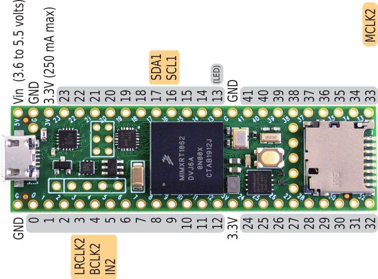

# TeensyAmp R4.2b

Based on

- 2 [TI PCM1865](../R4.0/pcm1865.md) with ADC and adjustable gain,
- [TI OPA1622](../R4.0/opa1622.pdf) as inverting pre-amplifier

by [jlm Innovation](https://www.jlm-innovation.de/) and [Jan
Benda](https://github.com/janscience).

Use the R4.2b to extend the [R4.1](../R4.1) to a [16-channel logger](../R4.1-R4.2).

See [R4.2](r42.md) for the first version.

## Circuit

- [EAGLE schematics file](TeensyAmp_R4.2b.sch)
- [EAGLE circuit board](TeensyAmp_R4.2b.brd)

## Connectors

molex [Micro-Lock Plus](https://www.molex.com/en-us/products/connectors/wire-to-board-connectors/micro-lock-plus-connectors) with [1.25mm pitch](https://www.molex.com/content/dam/molex/molex-dot-com/en_us/pdf/datasheets/987652-6322.pdf). See [application specification](https://www.molex.com/content/dam/molex/molex-dot-com/products/automated/en-us/applicationspecificationspdf/505/505565/5055650000-AS-000.pdf) for an overview and part numbers.

Here we use two right-angle SMT male connectors, 4 pins, part number 5055670471, [datasheet](../R4.1/molex5055670471_sd.pdf)

Use the precrimped cables from the cable assembly 45111 series for connecting your electrodes (30cm female/female 26 AWG cable, 7mm wide, part number 451110403).

## Pre-amplifier

- R1=100k for referencing the floating signal
- C1=10uF and R2=47k for a <5Hz high-pass filter
- R2=47k and R3=47k for a 1x gain (gain=R3/R2)
- no low-pass filter 

## Pins of the PCM1865

See page 11 and Fig 22 in the data sheet and
Figure 15 of the evaluation board manual:

| pin | name        | connects to | Teensy 4.1 pins |
| --: | :---------- | :---------- | --------------: |
|  1  | VINL2/VIN1M | SIG 1       |                 |
|  2  | VINR2/VIN2M | SIG 0       |                 |
|  3  | VINL1/VIN1P | -           |                 |
|  4  | VINR1/VIN2P | -           |                 |
|  5  | Mic Bias    | unconnected |                 |
|  6  | VREF        | Connect 1-μF capacitor C5 to AGND |   |
|  7  | AGND        | Analog ground to common ground |   |
|  8  | AVDD        | 3.3V power supply, Fig 70/71. Connect 0.1-μF and 10-μF capacitors from this pin to AGND. |    |
|  9  | XO          | not used |   |
| 10  | XI          | not used |   |
| 11  | LDO         | Connect 0.1-μF and 10-μF capacitors from this pin to AGND |    |
| 12  | DGND        | Digital ground connect to common ground |   |
| 13  | DVDD        | 3.3V power supply, Fig 70/71. Connect 0.1-μF and 10-μF capacitors from this pin to DGND. | Teensy 3.3V |
| 14  | IOVDD       | 3.3V power supply, tied to DVDD, Fig 70/71.  | Teensy 3.3V |
| 15  | SCKI        | not used |  |
| 16  | LRCK        | Audio data world clock (left right clock) input/output. | 20 |
| 17  | BCK         | Audio data bit clock input/output. | 21 |
| 18  | DOUT        | Audio data digital output.         |  8 |
| 19  | GPIO3/INTC  | not needed |  |
| 20  | GPIO2/INTB/DMCLK | not needed |  |
| 21  | GPIO1/INTA/DMIN  | not needed |  |
| 22  | MISO/GPIO0/DMIN2 | not needed |  |
| 23  | MOSI/SDA    | I2C bus SDA   | 18 |
| 24  | MC/SCL      | I2C bus CLOCK | 19 |
| 25  | MS/AD       | I2C addres: chip1 low, chip2 high |  |
| 26  | MD0         | tied low for I2C communication |  |
| 27  | VINL4/VIN4M | -            |    |
| 28  | VINR4/VIN3M | -            |    |
| 29  | VINL3/VIN4P | SIG 3        |    |
| 30  | VINR3/VIN3P | SIG 2        |    |

## Teensy pinout

| Teensy 4.1 pin | Teensy_Amp R4.1b | Teensy_Amp R4.2b |
| -------------: | :----------- | :-------------- |
| Vin            | Vin +5V      | Vin +5V         |
| GND            | GND          | GND             |
| 3.3V           | VDD          | VDD             |
| 18             | I2C SDA      | -               |
| 19             | I2C SCL      | -               |
| 17             | -            | I2C SDA         |
| 16             | -            | I2C SCL         |
| 21             | BCK          | -               |
| 20             | LRCK         | -               |
| 8              | DIN          | -               |
| 4              | -            | BCK             |
| 3              | -            | LRCK            |
| 5              | -            | DIN             |

## Software

Use
[ControlPCM186x.h](https://github.com/janscience/TeeRec/blob/main/src/ControlPCM186x.h) of the [TeeRec library](https://github.com/janscience/TeeRec) for setting up the [TI PCM1865](../R4.0/pcm1865.md) chips. The TDM data stream can then be read in via [InputTDM.h](https://github.com/janscience/TeeRec/blob/main/src/InputTDM.h).

## Applications

- [R4-sensors-logger](https://github.com/janscience/TeeGrid/tree/main/examples/R4-sensors-logger) 
- [R4-logger](https://github.com/janscience/TeeGrid/tree/main/examples/R4-logger) 

