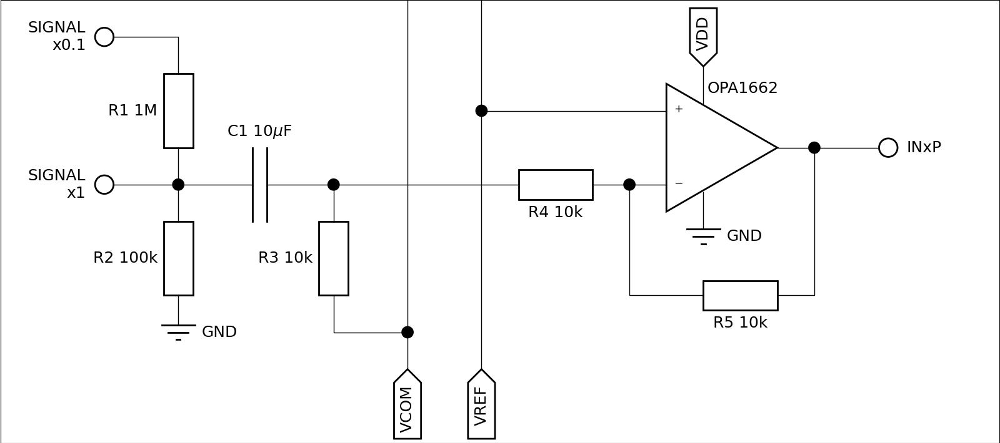
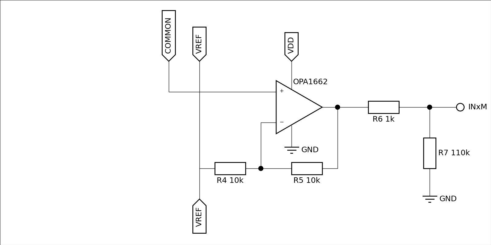

# TeensyAmp R5.0

Work in progress.

With digitaly adjustable gain and filter settings.

Based on
- 2 [TI TLV320ADC5140](tlv320adc5140.pdf) with 4-channel ADC and adjustable gain
- [TI OPA1622](../R4.0/opa1622.pdf) as inverting pre-amplifier.

## TLV320ADC5140

- [TI web site](https://www.ti.com/product/TLV320ADC5140)
- [data sheet](tlv320adc5140.pdf)
- [Multiple devices with shared TDM bus](sbaa383c.pdf)
- [Sampling rates](sbaa381b.pdf)
- [Power consumption](sbaa379.pdf)

### Pins

Pins of the TLV320ADC5140 - see page 4 in the data sheet:

| pin | name        | connects to | Teensy 4.1 pins |
| --: | :---------- | :---------- | --------------: |
|  1  | AVDD        | 3.3V power supply. Connect 0.1-μF and 1-μF capacitors to GND and 3.3V supply. See Fig. 172. |    |
|  2  | AREG        | Analog on-chip regulator output voltage for analog supply. Connect 0.1-μF and 10-μF capacitors to GND. |   |
|  3  | VREF        | Analog reference voltage filter output. Connect min. 1uF to AVSS |   |
|  4  | AVSS        | Analog ground. Short this pin directly to the board ground plane. All ground pins (AVSS and VSS) must be tied together. |   |
|  5  | MICBIAS     | unconnected |                 |
|  6  | IN1P_GPI1   | SIG 1P      |                 |
|  7  | IN1M_GPO1   | SIG COMMON  |                 |
|  8  | IN2P_GPI2   | SIG 2P      |                 |
|  9  | IN2M_GPO2   | SIG COMMON  |                 |
| 10  | IN3P_GPI3   | SIG 3P      |                 |
| 11  | IN3M_GPO3   | SIG COMMON  |                 |
| 12  | IN4P_GPI4   | SIG 4P      |                 |
| 13  | IN4M_GPO4   | SIG COMMON  |                 |
| 14  | SHDNZO      | Device hardware shutdown and reset (active low) | Some digital Pin  |
| 15  | ADDR1_MISO  | I2C slave address A1 pin. Connect to GND. |  |
| 16  | ADDR0_SCLK  | I2C slave address A0 pin. Connect to GND. |  |
| 17  | SCL_MOSI    | clock pin for I2C control bus | 19 |
| 18  | SDA_SSZ     | data pin for I2C control bus | 18 |
| 19  | IOVDD       | Digital I/O 3.3V power supply. See Fig. 172. | Teensy 3.3V |
| 20  | GPIO1       | General purpose digital input/output 1 (e.g. MCLK) |   |
| 21  | SDOUT       | Audio serial data bus output    |  8 |
| 22  | BCLK        | Audio serial data bus bit clock | 21 |
| 23  | FSYNC       | Audio serial data bus frame synchronization signal (LRCLK) | 20 |
| 24  | DREG        | Digital regulator output voltage for digital core supply. Connect 0.1-μF and 10-μF capacitors to GND. |   |
|     | VSS | Thermal pad is device ground. Short the thermal pad directly to the board ground plane. |   |

For layout instructions of the PCB see page 116 and Fig. 179 of the [TI TLV320ADC5140 data sheet](tlv320adc5140.pdf).

Teensy pins:

| Teensy 4.1 pin | Teensy_Amp R5.1 | Teensy_Amp R5.2 |
| -------------: | :----------- | :-------------- |
| Vin            | Vin +5V      | Vin +5V         |
| GND            | GND          | GND             |
| 3.3V           | VDD          | VDD             |
| 18             | I2C SDA      | -               |
| 19             | I2C SCL      | -               |
| 17             | -            | I2C SDA         |
| 16             | -            | I2C SCL         |
| 21             | BCK          | -               |
| 20             | FSYNC        | -               |
| 8              | DIN          | -               |
| 4              | -            | BCK             |
| 3              | -            | FSYNC           |
| 5              | -            | DIN             |
| 14             | -            | -               |
| 15             | GPIO3_1 chip1 | -              |
| 22             | GPIO3_2 chip2 | -              |
| 0              | -            | GPIO3 chip1     |
| 1              | -            | GPIO3 chip2     |
| 30             | -            | -               |
| 31             | -            | -               |
| 36             | -            | -               |
| 37             | -            | -               |
| 40             | -            | -               |
| 41             | -            | -               |
| 26             | LED extern   | -               |
| 27             | -            | LED extern      |

- Add data pin for Tempeature sensor
- Add I2C pins for sensors

### Programming instructions

For programming instructions see page 109 of the [TI TLV320ADC5140 data sheet](tlv320adc5140.pdf).

### Pre-amplifiers

- R1=100k for referencing the floating signal.
- C1=10uF and R3=10k for a <5Hz high-pass filter.
- R3=10k and R4=10k for a 1x gain (gain=R4/R3).
- no low-pass filter, this is handled by the TLV chip.
- each signal is amplified relative to VREF from the TLV chip.
- the COMMON reference measures the average of all the signals.

### Common-amplifier

- the COMMON reference is amplified in the same way as each signal
- the amplified output provides the negative input against which the
  TLV measures the amplified signals in differential mode.

## Improvements needed over R4.x

- Add GND pin for electrode cable shield (2 times)
