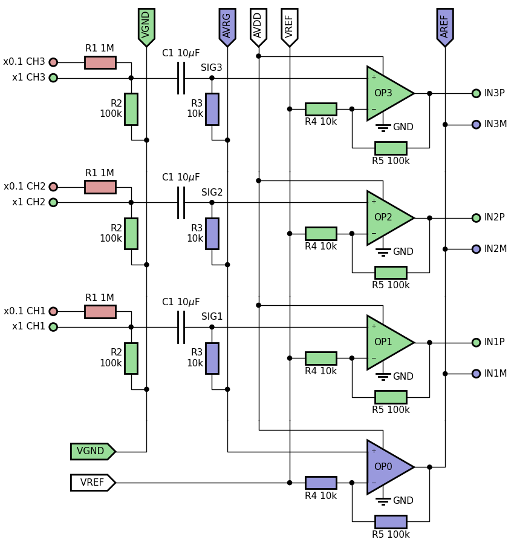

# TeensyAmp R5.0

Work in progress.

With digitaly adjustable gain and filter settings.

Based on
- 2 [TI TLV320ADC5140](tlv320adc5140.pdf) with 4-channel ADC and adjustable gain
- 4 [TI OPA1662](opa1662.pdf) as pre-amplifier

## TLV320ADC5140

- [TI web site](https://www.ti.com/product/TLV320ADC5140)
- [data sheet](tlv320adc5140.pdf)
- [Multiple devices with shared TDM bus](sbaa383c.pdf)
- [Sampling rates](sbaa381b.pdf)
- [Power consumption](sbaa379.pdf)

### Pins

Pins of the TLV320ADC5140 - see page 4 in the data sheet:

| pin | name        | connects to | Teensy 4.1 pins |
| --: | :---------- | :---------- | --------------: |
|  1  | AVDD        | 3.3V power supply. Connect 0.1-μF and 1-μF capacitors to GND and 3.3V supply. See Fig. 172. |    |
|  2  | AREG        | Analog on-chip regulator output voltage for analog supply. Connect 0.1-μF and 10-μF capacitors to GND. |   |
|  3  | VREF        | Analog reference voltage filter output. Connect min. 1uF to AVSS |   |
|  4  | AVSS        | Analog ground. Short this pin directly to the board ground plane. All ground pins (AVSS and VSS) must be tied together. |   |
|  5  | MICBIAS     | unconnected |                 |
|  6  | IN1P_GPI1   | SIG 1P      |                 |
|  7  | IN1M_GPO1   | SIG COMMON  |                 |
|  8  | IN2P_GPI2   | SIG 2P      |                 |
|  9  | IN2M_GPO2   | SIG COMMON  |                 |
| 10  | IN3P_GPI3   | SIG 3P      |                 |
| 11  | IN3M_GPO3   | SIG COMMON  |                 |
| 12  | IN4P_GPI4   | SIG 4P      |                 |
| 13  | IN4M_GPO4   | SIG COMMON  |                 |
| 14  | SHDNZO      | Device hardware shutdown and reset (active low) | Some digital Pin  |
| 15  | ADDR1_MISO  | I2C slave address A1 pin. Connect to GND. |  |
| 16  | ADDR0_SCLK  | I2C slave address A0 pin. Connect to GND. |  |
| 17  | SCL_MOSI    | clock pin for I2C control bus | 19 |
| 18  | SDA_SSZ     | data pin for I2C control bus | 18 |
| 19  | IOVDD       | Digital I/O 3.3V power supply. See Fig. 172. | Teensy 3.3V |
| 20  | GPIO1       | General purpose digital input/output 1 (e.g. MCLK) |   |
| 21  | SDOUT       | Audio serial data bus output    |  8 |
| 22  | BCLK        | Audio serial data bus bit clock | 21 |
| 23  | FSYNC       | Audio serial data bus frame synchronization signal (LRCLK) | 20 |
| 24  | DREG        | Digital regulator output voltage for digital core supply. Connect 0.1-μF and 10-μF capacitors to GND. |   |
|     | VSS | Thermal pad is device ground. Short the thermal pad directly to the board ground plane. |   |

For layout instructions of the PCB see page 116 and Fig. 179 of the [TI TLV320ADC5140 data sheet](tlv320adc5140.pdf).

Teensy pins:

| Teensy 4.1 pin | Teensy_Amp R5.1 | Teensy_Amp R5.2 |
| -------------: | :----------- | :-------------- |
| Vin            | Vin +5V      | Vin +5V         |
| GND            | GND          | GND             |
| 3.3V           | VDD          | VDD             |
| 18             | I2C SDA      | -               |
| 19             | I2C SCL      | -               |
| 17             | -            | I2C SDA         |
| 16             | -            | I2C SCL         |
| 21             | BCK          | -               |
| 20             | FSYNC        | -               |
| 8              | DIN          | -               |
| 4              | -            | BCK             |
| 3              | -            | FSYNC           |
| 5              | -            | DIN             |
| 14             | -            | -               |
| 15             | GPIO3_1 chip1 | -              |
| 22             | GPIO3_2 chip2 | -              |
| 0              | -            | GPIO3 chip1     |
| 1              | -            | GPIO3 chip2     |
| 30             | -            | -               |
| 31             | -            | -               |
| 36             | -            | -               |
| 37             | -            | -               |
| 40             | -            | -               |
| 41             | -            | -               |
| 26             | LED extern   | -               |
| 27             | -            | LED extern      |

- Add data pin for Tempeature sensor
- Add I2C pins for sensors

## Pre-amplifiers

### Power supply

- All opamps and the ADC are supplied by AVDD=3.3V relative to GND=0V.
- AVDD is provided by [onsemi NCP164CSN330T1G](ncp164c.pdf) 3.3V LDO with 300mA.

### Virtual ground and reference voltage

- All signals oscillate around VGND=AVDD/2=1.6V
- The opamps get VREF=AVDD/2=1.6V as a reference voltage
- VREF is provided by voltage reference (e.g. [MAX6018AEUR16+T](max6018.pdf))
- How to implement VGND?

### Voltage divider

- R1=1M for a voltage divider with R2=100k attenuating strong signals by a factor of 10 (gain=0.1x, red).
- Alternatively, channels can be fed in directly.
- Have two connectors, one for each option.

### Pre-amplifier

- R2 ties the input channels to VGND.
  VGND is the average of the input signals CHx: VGND = mean(CHx) = AVVD/2.
- C1=10uF decoupling capacitor.
- The [TI OPA1662](opa1662.pdf) non-inverting opamps (green) operate on
  virtual ground given by VREF.
  They return the amplified SIGx (=CHx) relative to VREF:
  gain*(CHx-VREF)+VREF.
  The full-range output is then between GND and AVDD.
  Because of the common mode rejection (see below) non-inverting amplifiers
  are the only possibility.
- gain=1+R5/R4. For changing gain change R5.
  For R4=10k and R5=100k we get a x11 gain.
  For R4=10k and R5=10k we get a x2 gain.
- In single-ended mode we measure at INxP CHx - mean(CHx),
  the difference between the actual potential CHx and
  the average over all signals.
- The subtraction of the average introduces
  fake signals on channels without input, resembling the negative input
  on another channel. Also the average over all recorded signals is zero:
  mean(CHx - mean(CHx)) = mean(CHx) - mean(CHx) = 0.
  The larger the number of input channels, the more channels might
  have no signal, the closer mean(CHx) to zero.
- VREF and VGND are not only set by the common mode of the signal, but
  also by other loads in the system (?). The latter is still present
  in the single ended measurement. See below for improved common mode rejection.

What we want, however, is a monopolar measurement of CHx. We would get this with
a fixed VREF that is independent of the input potentials. Thus, we somehow
need to stabilize VREF:

- Somehow make VREF less dependent on signals by means of an opamp????
- Electrodes in a tank: connect VREF to ground of building. Test it!
- Otherwise: use a reference electrode on VREF.
  Again... Details? Could be optional!

### Common mode rejection:

- Via R3 we get the common mode signal AVRG=mean(CHx) as an input to OP0,
  which is not contaminated by other sources.
- This is amplified in the same way against VREF as the signals.
- Only in this non-inverting configuration do we get an average signal
  independent of the number of input channels!
- This cleans up the measurements, because GND and thus VREF is mean(CHx)
  plus noise from other sources:
  - pre-amplified signals: CHx - VREF
  - pre-amplified common mode: mean(CHx) - VREF
  - differential measurement: CHx - mean(CHx) -> without external noise!
- This does not result in a monopolar measurement!

We can easily switch between single-ended and differential measurements
by configuring the TLV320ADC appropriately.

### Input ranges:

#### ADC

[TI TLV320ADC5140](tlv320adc5140.pdf)

- single ended, AC coupled, with decoupling: saturates at +-1.375V  (p-p amplitude of 2.75V!)
- single ended, AC coupled, without decoupling: saturates at 0V - 2.75V, DC offset at 1.375V, not so tolerant against offsets.
- single ended, DC coupled, without decoupling: saturates at 0V - 2.75V, DC offset at 1.375V, it tolerates negative inputs but they are distorted. DC offset can be quite positive, but not negative.

#### OpAmps

[TI OPA1662](opa1662.pdf)

We have negative supply V- = GND and positive supply V+ = AVDD = 3.3V
for the non-inverting opamp.

The output of the OPA1662 is always clipped at GND and V+: GND < OUTx < V+
(the datasheet actually says V- + 0.6V < OUTx < V+ - 0.6V).
With VREF=AVDD/2=1.6V any signal centered around VREF is properly mapped onto
gain*(CHx-VREF)+VREF.

#### OpAmp with ADC

For best results (full range from GND to 2.75V measurements) we need

- positive supply of opamps at AVDD=3.3V (not 2.75V!)
- VREF = 1.6V (neither 2.75V nor 2.75V/2 or 1.8V!) produces best results with lowest THD
  for full scale signals.
- VREF draws less than 0.1mA of current for a single channel.

- TODO: position of decoupling capacitor! Could got before R2 to fom a proper high-pass filter?

Options:

- [onsemi NCP164CSN330T1G](ncp164c.pdf) 3.3V LDO with 300mA
  for supplying both the TLV320ADC and the opamps.
- 1.6V voltage reference for the opamps (e.g. [MAX6018AEUR16+T](max6018.pdf)).

## Improvements over R4.x

- 32 channel with 4PCBs!
- Properly clipping.
- Alternative 0.1x input (2x 4pin molex connectors for x1 plus 2x 4pin molex connectors for x0.1).
- Add GND pin for electrode cable shield
  (2-4 times, 1-2 at each side of the main PCB).
- Add VREF pin for externel reference.
- Add voltage-divider with 2x 100kOhm for measuring supply power voltage.
- Add eeprom for storing PCB version and potential calibration values,
  and all the configuration. 
  e.g. microchip 24FC16T-E/OT36KVAO with 16kbit at I2C bus
