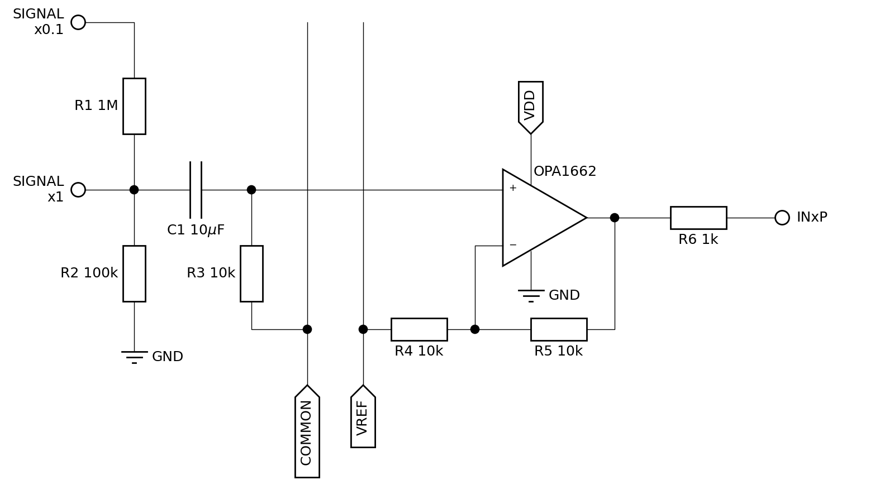
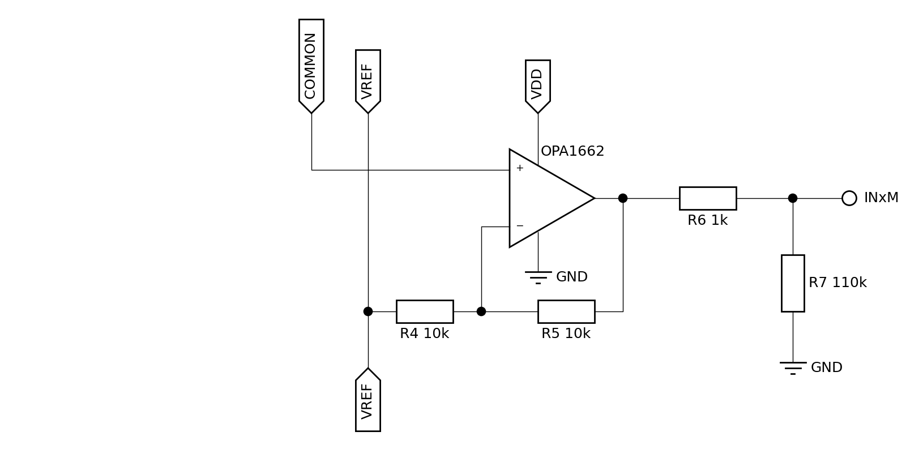

# TeensyAmp R5.0

Work in progress.

With digitaly adjustable gain and filter settings.

Based on
- 2 [TI TLV320ADC5140](tlv320adc5140.pdf) with 4-channel ADC and adjustable gain
- 4 [TI OPA1662](opa1662.pdf) as pre-amplifier

## TLV320ADC5140

- [TI web site](https://www.ti.com/product/TLV320ADC5140)
- [data sheet](tlv320adc5140.pdf)
- [Multiple devices with shared TDM bus](sbaa383c.pdf)
- [Sampling rates](sbaa381b.pdf)
- [Power consumption](sbaa379.pdf)

### Pins

Pins of the TLV320ADC5140 - see page 4 in the data sheet:

| pin | name        | connects to | Teensy 4.1 pins |
| --: | :---------- | :---------- | --------------: |
|  1  | AVDD        | 3.3V power supply. Connect 0.1-μF and 1-μF capacitors to GND and 3.3V supply. See Fig. 172. |    |
|  2  | AREG        | Analog on-chip regulator output voltage for analog supply. Connect 0.1-μF and 10-μF capacitors to GND. |   |
|  3  | VREF        | Analog reference voltage filter output. Connect min. 1uF to AVSS |   |
|  4  | AVSS        | Analog ground. Short this pin directly to the board ground plane. All ground pins (AVSS and VSS) must be tied together. |   |
|  5  | MICBIAS     | unconnected |                 |
|  6  | IN1P_GPI1   | SIG 1P      |                 |
|  7  | IN1M_GPO1   | SIG COMMON  |                 |
|  8  | IN2P_GPI2   | SIG 2P      |                 |
|  9  | IN2M_GPO2   | SIG COMMON  |                 |
| 10  | IN3P_GPI3   | SIG 3P      |                 |
| 11  | IN3M_GPO3   | SIG COMMON  |                 |
| 12  | IN4P_GPI4   | SIG 4P      |                 |
| 13  | IN4M_GPO4   | SIG COMMON  |                 |
| 14  | SHDNZO      | Device hardware shutdown and reset (active low) | Some digital Pin  |
| 15  | ADDR1_MISO  | I2C slave address A1 pin. Connect to GND. |  |
| 16  | ADDR0_SCLK  | I2C slave address A0 pin. Connect to GND. |  |
| 17  | SCL_MOSI    | clock pin for I2C control bus | 19 |
| 18  | SDA_SSZ     | data pin for I2C control bus | 18 |
| 19  | IOVDD       | Digital I/O 3.3V power supply. See Fig. 172. | Teensy 3.3V |
| 20  | GPIO1       | General purpose digital input/output 1 (e.g. MCLK) |   |
| 21  | SDOUT       | Audio serial data bus output    |  8 |
| 22  | BCLK        | Audio serial data bus bit clock | 21 |
| 23  | FSYNC       | Audio serial data bus frame synchronization signal (LRCLK) | 20 |
| 24  | DREG        | Digital regulator output voltage for digital core supply. Connect 0.1-μF and 10-μF capacitors to GND. |   |
|     | VSS | Thermal pad is device ground. Short the thermal pad directly to the board ground plane. |   |

For layout instructions of the PCB see page 116 and Fig. 179 of the [TI TLV320ADC5140 data sheet](tlv320adc5140.pdf).

Teensy pins:

| Teensy 4.1 pin | Teensy_Amp R5.1 | Teensy_Amp R5.2 |
| -------------: | :----------- | :-------------- |
| Vin            | Vin +5V      | Vin +5V         |
| GND            | GND          | GND             |
| 3.3V           | VDD          | VDD             |
| 18             | I2C SDA      | -               |
| 19             | I2C SCL      | -               |
| 17             | -            | I2C SDA         |
| 16             | -            | I2C SCL         |
| 21             | BCK          | -               |
| 20             | FSYNC        | -               |
| 8              | DIN          | -               |
| 4              | -            | BCK             |
| 3              | -            | FSYNC           |
| 5              | -            | DIN             |
| 14             | -            | -               |
| 15             | GPIO3_1 chip1 | -              |
| 22             | GPIO3_2 chip2 | -              |
| 0              | -            | GPIO3 chip1     |
| 1              | -            | GPIO3 chip2     |
| 30             | -            | -               |
| 31             | -            | -               |
| 36             | -            | -               |
| 37             | -            | -               |
| 40             | -            | -               |
| 41             | -            | -               |
| 26             | LED extern   | -               |
| 27             | -            | LED extern      |

- Add data pin for Tempeature sensor
- Add I2C pins for sensors

## Pre-amplifiers

- R1=1M for a voltage divider attenuating strong signals by a factor of 10.
- J1 short circuits voltage divider for x1 input signals (as 4x2 jumper pins).
- R2=100k for referencing the floating signal.
- C1=10uF decoupling capacitor.
- [TI OPA1662](opa1662.pdf) audio opamp.
- Differential amplifiers with output voltage gain*(VREF - SIGx)
- R4=R6=47k and R5=R7=47k for a 1x gain (gain=R5/R4=R7/R6).
- C1 and R4 form a high-pass filter of the differential amplification
  with cutoff frequency 1/(2 pi R4 C1) = 0.34Hz.
- Via R3 the AVRG reference measures the average of all the input signals
  (common mode = mean(SIGx)).
- the AVRG reference is amplified in the same way as each signal.
- the TLV chip amplifies the pre-amplified signals against the pre-amplified common mode AVRG.
- High-pass and low-pass filtering is handled by the TLV320ADC chip.

### Working principle

- Via R2, the ground is the average of the input signals CHx: GND = mean(CHx).
- The TLV320ADC provides VREF at some voltage VR above ground: VREF = mean(CHx) + VR
- The opamps return the difference between VREF and SIGx (=CHx):
  mean(CHx) + VR - CHx relative to GND = mean(CHx).
- In single-ended mode we measure at INxP exactly mean(CHx) + VR - CHx,
  the difference between the actual potential CHx and
  the average over all signals.
- The subtraction of the average introduces
  fake signals on channels without input, resembling the negative input
  on another channel. Also the average over all recorded signals is zero:
  mean(CHx - mean(CHx)) = mean(CHx) - mean(CHx) = 0.
  The larger the number of input channels, the closer mean(CHx) to zero.
- The ground will not only be set by the common mode of the signal, but
  also by other loads in the system. The latter will still be present
  in the single ended measurement. See below for improved common mode rejection.

What we want, however, is a measurement of CHx. We would get this with
a fixed GND that is independent of the input potentials. We somehow
need to stabilize the ground.

- electrodes in a tank: connect amplifier ground to ground of building. Test it!
- otherwise: use a reference electrode. Again... Details? Could be optional!

Common mode rejection could be improved like this:

- Via R3 we get the common mode signal mean(CHx) as an input to OP0,
  which is not contaminated by other sources.
- This is amplified in the same way as the signals: GND + VR - mean(CHx)
- In an inverted differential measurement we then get
  VR - mean(CHx) - VR + CHx = CHx - mean(CHx), the signals minus common mode.
- This does not result in a monopolar measurement!
- But it might clean up the measurements, because GND is mean(CHx)
  plus noise from other sources:
  - signals: mean(CHx) + noise + VR - CHx
  - common mode: mean(CHx) + noise + VR - mean(CHx)
  - differential measurement: mean(CHx) + CHx
  - without external noise!

We can easily switch between single-ended and differntial measurements
by configuring the TLV320ADC appropriately.

### Input ranges:

#### OpAmps

[TI OPA1662](opa1662.pdf)

We have V- = GND and V+ = AVDD = 3.3V.

The output of the OPA1662 is always clipped at GND and V+: GND < OUTx < V+
(the datasheet actually says V- + 0.6V < OUTx < V+ - 0.6V).
Then in our setting with unit gain, the output OUTx = VREF - SIGx, thus VREF - V+ < SIGx < VREF:
- VREF = V+: GND < SIGx < V+
- VREF = V+/2: -V+/2 < SIGx < V+/2  this is what we want for bipolar symmetric input signals!
- VREF = GND: -V+ < SIGx < GND

The datasheet says V- + 0.5V < common mode < V+ - 1V.
In  our setting with unit gain this is 1V - VREF < SIGx < 2*V+ - 2V - VREF:
- VREF = V+: 1V - V+ < SIGx < V+ - 2V , i.e. -2.3V < SIGx < 1.3V
- VREF = V+/2: 1V - V+/2 < SIGx < 3/2*V+ - 2V, i.e. -0.65V < SIGx < 2.95V
- VREF = GND: 1V < SIGx < 2*V+ - 2V, i.e. 1V < SIGx < 4.6V

#### ADC

[TI TLV320ADC5140](tlv320adc5140.pdf)

### TODO

- Make shure that VREF in the circuit is AVDD/2 !
- measure input of TLV320ADC in DC and AC: how does it deal with negative inputs?

#### Non-inverting pre-amplifiers

- R4=10k and R5=10k for a 2x gain (gain=1+R5/R4).
- R6 should already part of the differential amplifier?
- but then what is R7?

## Improvements needed over R4.x

- Add GND pin for electrode cable shield (2 times)
- Add voltage-divider for measuring supply power voltage
