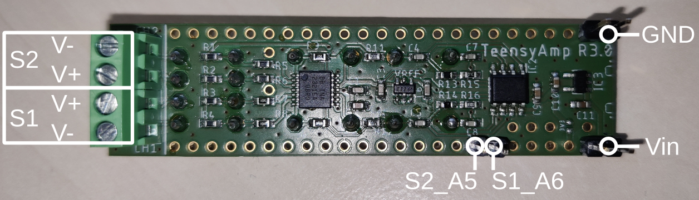

# Teensy_Amp

Amplifiers for the [Teensy](https://www.pjrc.com/teensy/) development boards.

- [R1.0](R1.0)
  
  A two-channel differential amplifier with band-pass filter.

- [R2.0](R2.0)
  An improved two-channel differential amplifier with band-pass filter
  (never developed...).

- [R3.0](R3.0)
  
  A stackable two-channel differential amplifier with band-pass filter.

- [R4.0](R4.0)
  
  An eight-channel single-ended amplifier with analog-digital converter
  based on [TI PCM1865](https://www.ti.com/product/PCM1865)
  together with CAN bus communication on an 80x80mm PCB.

- [R4.1](R4.1)
  
  Similar to the [R4.0](R4.0) circuit, but on a 110x40mm PCB.

- [R4.2](R4.2)
  
  Similar to the [R4.1](R4.1) board, but using the secondary TDM of the
  Teensy and without CAN bus. Can be used as a standalone 8-channel
  logger, or as an expansion of the [R4.1](R4.1) board, making it a 16 channel
  recording unit: [read more](R4.1-R4.2).

- [R5.0](R5.0)
  Some still to be developed amplifier based on
  [TI TLV320ADC5140](https://www.ti.com/product/TLV320ADC5140).

## Comparison

| Model        | Channels | Reference | Vin | ADC    | Amplifier | High-pass | Low-pass | Gains | Communication | Size (mm) |     |
| ------------ | -------- | --------- | --- | ------ | --------- | --------- | -------- | ----- | --- | --- | --- |
| [R1.0](R1.0) | 2 | differential | 5V | [Teensy 3.5](https://www.pjrc.com/teensy/pinout.html#Teensy_3.5) | [AD8224HACPZ-WP](https://www.analog.com/media/en/technical-documentation/data-sheets/AD8224.pdf) | 0.1Hz, 100Hz, 300Hz switch | 10kHz, 33kHz switch | x5, x30, x180 switch | - | 94x35 | |
| [R3.0](R3.0) | 2 - 8 | differential | 3.3 - 5.5V | [Teensy 3.5](https://www.pjrc.com/teensy/pinout.html#Teensy_3.5) | [TI INA2321-EA](https://www.ti.com/product/INA2321) | plug-in capacitors | plug-in resistances | plug-in resistances | - | 69x18 | stackable up to 8 channels |
| [R4.0](R4.0) | 8 | single ended | 3.3 - 5.5V | [TI PCM1865](https://www.ti.com/product/PCM1865) | [TI OPA1662](https://www.ti.com/product/OPA1662) | 5Hz fixed | according to sampling rate | x1 - x100, x10 - x1000 | CAN | 80x80 | [Teensy 4.1](https://www.pjrc.com/teensy/pinout.html#Teensy_4.1) TDM1 |
| [R4.1](R4.1) | 8 | single ended | 3.3 - 5.5V | [TI PCM1865](https://www.ti.com/product/PCM1865) | [TI OPA1662](https://www.ti.com/product/OPA1662) | 5Hz fixed | according to sampling rate | x10 - x1000 | CAN FD | 110x35 | [Teensy 4.1](https://www.pjrc.com/teensy/pinout.html#Teensy_4.1) TDM1 |
| [R4.2](R4.2) | 8 | single ended | 3.3 - 5.5V | [TI PCM1865](https://www.ti.com/product/PCM1865) | [TI OPA1662](https://www.ti.com/product/OPA1662) | 5Hz fixed | according to sampling rate | x10 - x1000 | UART | 110x35 | [Teensy 4.1](https://www.pjrc.com/teensy/pinout.html#Teensy_4.1) TDM2 |

## Use cases

- [EOD-Logger](https://github.com/muchaste/EOD-Logger): 2-channel
  logger for recording EODs of electric fish.
  

- [8-channel
  logger](https://github.com/janscience/TeeGrid/blob/main/8channel-logger):
  A mini electrode-array for recording electric fish behaviors.
  

- [FishFinder](https://github.com/janscience/FishFinder): A
  replacement for the usual and horrible RadioShack/MP3 player
  combination for recording electric fish EODs in their natural
  habitats with lot's of additional features (display, online
  analysis, acoustiv feedabck, environmental parameters).
  analysis, environmental parameters).
